# RECOVERY SYSTEM ERD (Entity Relationship Diagram)

```mermaid
erDiagram
    WORKSPACES {
        uuid id PK
        text name
        text description
        uuid user_id
        text status
        text goal
        jsonb budget
        integer total_recovery_attempts
        integer successful_recoveries
        timestamptz last_recovery_check_at
        timestamptz created_at
        timestamptz updated_at
    }
    
    AGENTS {
        uuid id PK
        uuid workspace_id FK
        text name
        text role
        text seniority
        text description
        text system_prompt
        text status
        jsonb health
        integer consecutive_failures
        jsonb llm_config
        jsonb tools
        boolean can_create_tools
        timestamptz created_at
        timestamptz updated_at
    }
    
    TASKS {
        uuid id PK
        uuid workspace_id FK
        uuid goal_id FK
        uuid agent_id FK
        text name
        text description
        text status
        text task_type
        text priority
        jsonb context_data
        integer recovery_count
        text last_failure_type
        timestamptz last_recovery_attempt_at
        boolean auto_recovery_enabled
        text semantic_hash
        text trace_id
        timestamptz created_at
        timestamptz updated_at
    }
    
    TASK_EXECUTIONS {
        uuid id PK
        uuid task_id FK
        uuid agent_id FK
        uuid workspace_id FK
        text status
        timestamptz started_at
        timestamptz completed_at
        float execution_time_seconds
        jsonb result
        text logs
        jsonb token_usage
        text error_message
        text error_type
        integer retry_count
        text openai_trace_id
        timestamptz created_at
        timestamptz updated_at
    }
    
    FAILURE_PATTERNS {
        uuid id PK
        uuid workspace_id FK
        uuid task_id FK
        text pattern_signature
        text failure_type
        text error_message_hash
        text error_message
        text error_type
        text root_cause_category
        integer occurrence_count
        timestamptz first_detected_at
        timestamptz last_detected_at
        boolean is_transient
        float confidence_score
        text pattern_source
        text execution_stage
        uuid agent_id FK
        jsonb context_metadata
        timestamptz created_at
        timestamptz updated_at
    }
    
    RECOVERY_ATTEMPTS {
        uuid id PK
        uuid task_id FK
        uuid workspace_id FK
        text recovery_strategy
        uuid failure_pattern_id FK
        integer attempt_number
        text triggered_by
        text recovery_reason
        timestamptz started_at
        timestamptz completed_at
        text status
        boolean success
        text recovery_outcome
        text error_message
        jsonb recovery_context
        uuid agent_id FK
        interval estimated_resolution_time
        interval actual_resolution_time
        float confidence_score
        text ai_reasoning
        timestamptz created_at
        timestamptz updated_at
    }
    
    RECOVERY_EXPLANATIONS {
        uuid id PK
        uuid task_id FK
        uuid workspace_id FK
        uuid recovery_attempt_id FK
        text failure_summary
        text root_cause
        text retry_decision
        text confidence_explanation
        text user_action_required
        text estimated_resolution_time
        text severity_level
        text display_category
        jsonb technical_details
        text error_pattern_matched
        text failure_category
        text recovery_strategy
        boolean ai_analysis_used
        text explanation_source
        text generation_model
        float generation_confidence
        timestamptz failure_time
        timestamptz explanation_generated_at
        timestamptz created_at
        timestamptz updated_at
    }
    
    EXECUTION_LOGS {
        uuid id PK
        uuid workspace_id FK
        uuid agent_id FK
        uuid task_id FK
        text level
        text message
        text type
        jsonb content
        jsonb metadata
        text trace_id
        timestamptz created_at
    }
    
    %% Relationships
    WORKSPACES ||--o{ AGENTS : "contains"
    WORKSPACES ||--o{ TASKS : "organizes"
    WORKSPACES ||--o{ FAILURE_PATTERNS : "tracks_failures"
    WORKSPACES ||--o{ RECOVERY_ATTEMPTS : "manages_recovery"
    WORKSPACES ||--o{ RECOVERY_EXPLANATIONS : "provides_explanations"
    WORKSPACES ||--o{ EXECUTION_LOGS : "logs_activities"
    
    AGENTS ||--o{ TASKS : "assigned_to"
    AGENTS ||--o{ TASK_EXECUTIONS : "executes"
    AGENTS ||--o{ FAILURE_PATTERNS : "associated_with"
    AGENTS ||--o{ RECOVERY_ATTEMPTS : "handles_recovery"
    AGENTS ||--o{ EXECUTION_LOGS : "generates_logs"
    
    TASKS ||--o{ TASK_EXECUTIONS : "has_executions"
    TASKS ||--o{ FAILURE_PATTERNS : "generates_patterns"
    TASKS ||--o{ RECOVERY_ATTEMPTS : "requires_recovery"
    TASKS ||--o{ RECOVERY_EXPLANATIONS : "needs_explanation"
    TASKS ||--o{ EXECUTION_LOGS : "creates_logs"
    
    FAILURE_PATTERNS ||--o{ RECOVERY_ATTEMPTS : "triggers_recovery"
    
    RECOVERY_ATTEMPTS ||--o{ RECOVERY_EXPLANATIONS : "explains_decision"
```

## Table Relationships Summary

### Core System Tables
- **WORKSPACES**: Central organizing entity
- **AGENTS**: AI agents that perform tasks
- **TASKS**: Work units assigned to agents
- **TASK_EXECUTIONS**: Individual execution attempts

### Recovery System Tables (New)
- **FAILURE_PATTERNS**: ML-driven failure pattern detection
- **RECOVERY_ATTEMPTS**: Complete recovery attempt tracking  
- **RECOVERY_EXPLANATIONS**: Human-readable decision explanations

### Support Tables
- **EXECUTION_LOGS**: System-wide logging and monitoring

## Key Relationships

### Primary Flows
1. **WORKSPACES** organize **TASKS** assigned to **AGENTS**
2. **TASKS** generate **TASK_EXECUTIONS** for tracking
3. **Failed executions** create **FAILURE_PATTERNS**
4. **FAILURE_PATTERNS** trigger **RECOVERY_ATTEMPTS**
5. **RECOVERY_ATTEMPTS** generate **RECOVERY_EXPLANATIONS**

### Data Flows
- **Failure Detection**: TASK_EXECUTIONS → FAILURE_PATTERNS
- **Recovery Triggering**: FAILURE_PATTERNS → RECOVERY_ATTEMPTS  
- **Explanation Generation**: RECOVERY_ATTEMPTS → RECOVERY_EXPLANATIONS
- **Metrics Updates**: RECOVERY_ATTEMPTS → WORKSPACES (via trigger)

### Foreign Key Constraints
- All tables reference **WORKSPACES** for multi-tenancy
- **TASKS** can reference **AGENTS** (nullable for unassigned)
- **Recovery tables** form a dependency chain for data integrity
- **Soft references** used where appropriate to prevent cascading deletes

## Indexing Strategy

### High-Performance Indexes
- **Pattern Matching**: `failure_patterns.pattern_signature`, `error_message_hash`
- **Status Filtering**: All tables have status column indexes
- **Time-based Queries**: All timestamp columns indexed
- **Foreign Key Performance**: All FK columns indexed

### Query Optimization
- **Composite Indexes**: Multi-column indexes for common query patterns
- **Partial Indexes**: For status-specific queries
- **GIN Indexes**: For JSONB columns with frequent searches

## Data Integrity

### Referential Integrity
- **CASCADE DELETE**: Child records deleted with parents
- **SET NULL**: Optional references handled gracefully  
- **CHECK Constraints**: Enum values enforced at DB level

### Business Rules
- **Recovery Count**: Auto-incremented via triggers
- **Workspace Metrics**: Auto-updated via triggers
- **Timestamp Management**: Auto-updated via triggers

## Performance Considerations

### Scalability
- **Partitioning Ready**: Large tables can be partitioned by time
- **Archive Strategy**: Old data automatically cleaned up
- **Read Replicas**: Analytics queries can use dedicated replicas

### Monitoring
- **Index Usage**: Regular analysis of index effectiveness
- **Query Performance**: Slow query monitoring and optimization
- **Storage Growth**: Automated alerts for table growth

This ERD represents a comprehensive, scalable, and maintainable database design for the auto-recovery system with full observability and explainability support.