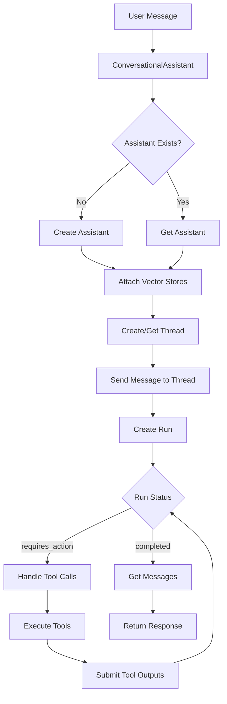

# OpenAI Assistants API RAG Architecture Design

## Executive Summary
This document outlines the architectural design and implementation plan for integrating OpenAI Assistants API to provide proper RAG (Retrieval-Augmented Generation) functionality in the AI Team Orchestrator system.

## Current State Analysis

### Problems Identified
1. **Custom FileSearchTool Limitations**: Current implementation uses a custom FileSearchTool that performs basic keyword searches instead of semantic vector search
2. **Vector Stores Not Utilized**: Documents are uploaded to OpenAI vector stores but never actually queried through Assistants API
3. **PDF Content Not Searchable**: PDF content extraction shows "[Extracted: 523 chars, 1 chunks]" but content is not retrievable
4. **Fallback Search Returns Generic Messages**: Searches return generic fallback messages instead of actual document content

### Existing Components
- **document_manager.py**: Handles document upload, creates vector stores, extracts PDF content
- **conversational_simple.py**: Current conversational agent using custom tools
- **openai_sdk_tools.py**: Custom FileSearchTool with fallback search

## Proposed Architecture

### Core Components

#### 1. OpenAI Assistant Manager Service
**File**: `backend/services/openai_assistant_manager.py`

```python
class OpenAIAssistantManager:
    """
    Manages OpenAI Assistants lifecycle for workspace-based RAG
    
    Key responsibilities:
    - Create/update assistants per workspace
    - Manage assistant-vector store associations
    - Handle thread creation and message processing
    - Execute tools through Assistants API
    """
    
    async def get_or_create_assistant(workspace_id: str) -> Assistant
    async def update_assistant_vector_stores(assistant_id: str, vector_store_ids: List[str])
    async def create_thread(workspace_id: str) -> Thread
    async def send_message(thread_id: str, message: str) -> Run
    async def process_run(thread_id: str, run_id: str) -> MessageResponse
    async def handle_tool_calls(run_id: str, tool_calls: List[ToolCall])
```

#### 2. Assistant Registry
**File**: `backend/services/assistant_registry.py`

```python
class AssistantRegistry:
    """
    Maintains workspace-to-assistant mappings
    
    Database table: workspace_assistants
    - workspace_id (PK)
    - assistant_id
    - thread_id
    - vector_store_ids (JSON)
    - last_updated
    """
    
    async def register_assistant(workspace_id: str, assistant_id: str)
    async def get_assistant_id(workspace_id: str) -> Optional[str]
    async def update_vector_stores(workspace_id: str, vector_store_ids: List[str])
```

#### 3. Enhanced Conversational Agent
**File**: `backend/ai_agents/conversational_assistant.py`

```python
class ConversationalAssistant:
    """
    Replaces SimpleConversationalAgent with Assistants API integration
    
    Features:
    - Native file_search through Assistants API
    - Persistent conversation threads
    - Automatic vector store attachment
    - Tool execution through OpenAI
    """
    
    def __init__(self, workspace_id: str):
        self.assistant_manager = OpenAIAssistantManager()
        self.assistant = await self.assistant_manager.get_or_create_assistant(workspace_id)
        self.thread = await self.assistant_manager.create_thread(workspace_id)
    
    async def process_message(self, user_message: str) -> ConversationResponse:
        # Send message through Assistants API
        run = await self.assistant_manager.send_message(self.thread.id, user_message)
        response = await self.assistant_manager.process_run(self.thread.id, run.id)
        return response
```

### Database Schema Updates

```sql
-- Migration 018: Add OpenAI Assistants support
CREATE TABLE workspace_assistants (
    workspace_id UUID PRIMARY KEY REFERENCES workspaces(id),
    assistant_id VARCHAR(255) NOT NULL,
    thread_id VARCHAR(255),
    vector_store_ids JSONB DEFAULT '[]',
    configuration JSONB DEFAULT '{}',
    created_at TIMESTAMP DEFAULT NOW(),
    last_updated TIMESTAMP DEFAULT NOW()
);

CREATE INDEX idx_workspace_assistants_assistant_id ON workspace_assistants(assistant_id);
CREATE INDEX idx_workspace_assistants_thread_id ON workspace_assistants(thread_id);
```

### Integration Flow



## Implementation Plan

### Phase 1: Core Infrastructure (Week 1)
1. Create `openai_assistant_manager.py` service
2. Implement assistant lifecycle management
3. Add database migration for `workspace_assistants` table
4. Create assistant registry service

### Phase 2: Integration (Week 2)
1. Create `conversational_assistant.py` as new agent
2. Integrate with existing document_manager
3. Update vector store associations on document upload
4. Implement thread management

### Phase 3: Migration (Week 3)
1. Create feature flag for gradual rollout
2. Add fallback to existing SimpleConversationalAgent
3. Migrate workspace configurations
4. Update API endpoints

### Phase 4: Testing & Optimization (Week 4)
1. End-to-end testing with real documents
2. Performance optimization
3. Error handling and recovery
4. Documentation and training

## Technical Implementation Details

### Assistant Configuration
```python
assistant_config = {
    "name": f"Workspace {workspace_id} Assistant",
    "instructions": """You are an AI assistant for a software development team.
    You have access to uploaded documents and can search through them to answer questions.
    Use the file_search tool to find relevant information in documents.
    Provide specific, actionable answers based on the content you find.""",
    "tools": [
        {"type": "file_search"},
        {"type": "code_interpreter"}
    ],
    "model": "gpt-4-turbo-preview",
    "file_search": {
        "max_num_results": 10
    }
}
```

### Vector Store Attachment
```python
async def attach_vector_stores_to_assistant(assistant_id: str, workspace_id: str):
    """Attach all workspace vector stores to assistant"""
    
    # Get vector store IDs from document_manager
    vector_store_ids = await document_manager.get_vector_store_ids_for_agent(
        workspace_id, 
        agent_id=None  # Get all team-wide stores
    )
    
    # Update assistant with vector stores
    client.beta.assistants.update(
        assistant_id,
        tool_resources={
            "file_search": {
                "vector_store_ids": vector_store_ids
            }
        }
    )
```

### Message Processing
```python
async def process_message_with_assistant(message: str, thread_id: str, assistant_id: str):
    """Process user message through Assistants API"""
    
    # Add message to thread
    client.beta.threads.messages.create(
        thread_id=thread_id,
        role="user",
        content=message
    )
    
    # Create and poll run
    run = client.beta.threads.runs.create_and_poll(
        thread_id=thread_id,
        assistant_id=assistant_id
    )
    
    # Handle different run statuses
    if run.status == 'completed':
        messages = client.beta.threads.messages.list(thread_id=thread_id)
        return messages.data[0].content[0].text.value
    
    elif run.status == 'requires_action':
        # Handle tool calls
        tool_outputs = []
        for tool_call in run.required_action.submit_tool_outputs.tool_calls:
            output = await handle_tool_call(tool_call)
            tool_outputs.append({
                "tool_call_id": tool_call.id,
                "output": output
            })
        
        # Submit tool outputs and continue
        run = client.beta.threads.runs.submit_tool_outputs_and_poll(
            thread_id=thread_id,
            run_id=run.id,
            tool_outputs=tool_outputs
        )
        
        # Get final response
        messages = client.beta.threads.messages.list(thread_id=thread_id)
        return messages.data[0].content[0].text.value
```

## Migration Strategy

### Step 1: Parallel Implementation
- Keep existing `conversational_simple.py` operational
- Implement new `conversational_assistant.py` alongside
- Use environment variable `USE_OPENAI_ASSISTANTS=true` to toggle

### Step 2: Gradual Rollout
```python
# In routes/conversational.py
if os.getenv("USE_OPENAI_ASSISTANTS", "false").lower() == "true":
    agent = ConversationalAssistant(workspace_id)
else:
    agent = SimpleConversationalAgent(workspace_id)
```

### Step 3: Data Migration
```python
async def migrate_workspace_to_assistants(workspace_id: str):
    """Migrate a workspace to use OpenAI Assistants"""
    
    # Create assistant for workspace
    assistant = await create_workspace_assistant(workspace_id)
    
    # Get existing vector stores
    vector_stores = await get_workspace_vector_stores(workspace_id)
    
    # Attach vector stores to assistant
    await attach_vector_stores_to_assistant(assistant.id, vector_stores)
    
    # Register in database
    await register_assistant(workspace_id, assistant.id)
    
    return assistant
```

## Benefits of This Architecture

### 1. Native RAG Capabilities
- Semantic search through OpenAI's vector search
- Automatic chunking and embedding
- Relevance ranking and citation

### 2. Persistent Context
- Conversation threads maintain context
- No need to rebuild context each message
- Better conversation continuity

### 3. Reduced Complexity
- Eliminate custom FileSearchTool
- Use OpenAI's proven infrastructure
- Simplify codebase

### 4. Enhanced Features
- Multi-turn conversations
- Code interpreter integration
- Function calling through assistants

### 5. Scalability
- Offload compute to OpenAI
- Reduce local processing requirements
- Better rate limit management

## Environment Configuration

```bash
# Add to .env
USE_OPENAI_ASSISTANTS=true
OPENAI_ASSISTANT_MODEL=gpt-4-turbo-preview
OPENAI_ASSISTANT_MAX_TOKENS=4096
OPENAI_ASSISTANT_TEMPERATURE=0.7
OPENAI_FILE_SEARCH_MAX_RESULTS=10
OPENAI_THREAD_RETENTION_DAYS=7
```

## Success Metrics

### Technical Metrics
- **Search Accuracy**: >90% relevant results for document queries
- **Response Time**: <3 seconds for RAG queries
- **Vector Store Utilization**: 100% of uploaded documents searchable
- **Error Rate**: <1% failed searches

### Business Metrics
- **User Satisfaction**: Improved document discovery
- **Query Resolution**: Higher first-response accuracy
- **System Reliability**: Reduced custom code maintenance

## Risk Mitigation

### Risk 1: API Rate Limits
**Mitigation**: Implement caching, request batching, and fallback to simple search

### Risk 2: Cost Management
**Mitigation**: Monitor usage, implement per-workspace limits, use appropriate models

### Risk 3: Migration Complexity
**Mitigation**: Phased rollout, comprehensive testing, rollback capability

### Risk 4: Data Privacy
**Mitigation**: Workspace isolation, secure thread management, data retention policies

## Monitoring and Observability

```python
# Metrics to track
metrics = {
    "assistant_creation_count": Counter,
    "thread_creation_count": Counter,
    "message_processing_time": Histogram,
    "tool_execution_count": Counter,
    "search_success_rate": Gauge,
    "api_errors": Counter
}

# Logging
logger.info({
    "event": "assistant_message_processed",
    "workspace_id": workspace_id,
    "thread_id": thread_id,
    "run_id": run_id,
    "status": run.status,
    "duration_ms": processing_time
})
```

## Next Steps

1. **Review and Approval**: Technical review of this architecture
2. **Prototype Development**: Build proof-of-concept for one workspace
3. **Testing**: Validate with real documents and queries
4. **Implementation**: Follow phased implementation plan
5. **Documentation**: Update user and developer documentation
6. **Training**: Train team on new capabilities

## Conclusion

This architecture provides a robust, scalable solution for RAG functionality using OpenAI's native Assistants API. It eliminates current limitations, reduces custom code complexity, and provides superior document search capabilities while maintaining compatibility with the existing system.