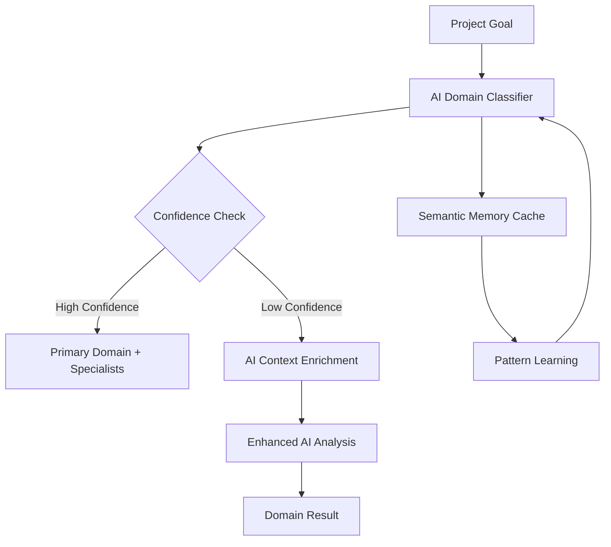

# AI-Driven Domain Classification Transformation Plan

## 📋 Executive Summary

The current system still relies on hard-coded keyword lists in environment variables, violating the AI-driven principles. This comprehensive plan outlines the transformation to a **100% AI-driven semantic understanding system** that eliminates all hard-coded domain detection.

## 🚨 Current Issues (Critical Violations)

### 1. **Hard-Coded Keywords in Environment Variables**
```python
# Current anti-pattern in ai_domain_classifier.py:251
learning_keywords = os.getenv("LEARNING_DETECTION_KEYWORDS", "course,curriculum,education,learning,training,teaching,academic,skill").split(",")
```

**Violations:**
- ❌ **Pillar 3**: Not truly domain-agnostic (limited to predefined keywords)
- ❌ **Pillar 11**: Hard-coded logic instead of AI-driven intelligence
- ❌ **Pillar 1**: Not using AI capabilities effectively

### 2. **Director Still Using Keyword Detection**
```python
# director.py:1742-1745
from services.ai_domain_classifier import detect_domain_keywords
domain_flags = detect_domain_keywords(project_goal)
```

**Issue**: Director bypasses AI classification, directly using keyword fallback

### 3. **Environment Variable Dependency**
The system expects configuration like:
- `B2B_DETECTION_KEYWORDS`
- `CONTENT_DETECTION_KEYWORDS`
- `TECHNICAL_DETECTION_KEYWORDS`
- `LEARNING_DETECTION_KEYWORDS`

**Problem**: This limits domains to only those with predefined keywords

## 🎯 Target Architecture: Pure AI-Driven System

### Core Principles
1. **Zero Keywords**: No hard-coded or configured keyword lists
2. **Semantic Understanding**: Pure AI comprehension of project intent
3. **Unlimited Domains**: Support ANY business sector without configuration
4. **Intelligent Fallback**: AI-based fallback, not keyword-based

### Architecture Components



## 🔧 Implementation Plan

### Phase 1: Pure AI Classification Service
**File**: `backend/services/pure_ai_domain_classifier.py`

```python
class PureAIDomainClassifier:
    """100% AI-driven domain classification with zero keywords"""
    
    async def classify_domain_semantic(self, goal: str, context: Dict) -> DomainClassification:
        """
        Pure semantic understanding without any keyword matching
        
        Key Features:
        - Multi-model consensus (GPT-4o + fallback models)
        - Context enrichment through questions
        - Confidence scoring with thresholds
        - Semantic similarity to known domains
        - New domain discovery capability
        """
        
        # Step 1: Initial semantic analysis
        initial_analysis = await self._semantic_analysis(goal, context)
        
        # Step 2: If low confidence, enrich context
        if initial_analysis.confidence < 0.7:
            enriched_context = await self._enrich_context(goal, initial_analysis)
            initial_analysis = await self._semantic_analysis(goal, enriched_context)
        
        # Step 3: Multi-model validation
        validation = await self._validate_with_alternative_model(initial_analysis)
        
        # Step 4: Store in semantic memory for future reference
        await self._update_semantic_memory(goal, initial_analysis)
        
        return initial_analysis
    
    async def _semantic_analysis(self, goal: str, context: Dict) -> DomainClassification:
        """Pure AI semantic understanding"""
        prompt = f"""
        Analyze this project using PURE SEMANTIC UNDERSTANDING:
        
        PROJECT: {goal}
        CONTEXT: {json.dumps(context)}
        
        DO NOT use keyword matching. Instead:
        1. Understand the PROJECT INTENT and BUSINESS VALUE
        2. Identify the INDUSTRY SECTOR based on semantic meaning
        3. Determine REQUIRED EXPERTISE based on project needs
        4. Assess COMPLEXITY and TECHNICAL REQUIREMENTS
        
        If this is a NEW DOMAIN not in common categories:
        - Create an appropriate domain name
        - Explain why it's unique
        - Suggest specialist roles needed
        
        Return comprehensive classification with confidence scoring.
        """
        
        # Use structured output with validation
        return await self._call_ai_with_structure(prompt)
    
    async def _enrich_context(self, goal: str, initial: DomainClassification) -> Dict:
        """AI-driven context enrichment when confidence is low"""
        questions = await self._generate_clarifying_questions(goal, initial)
        # In production, these would be answered by user or inferred from workspace
        enriched = await self._infer_answers_from_workspace(questions)
        return enriched
```

### Phase 2: Semantic Memory System
**File**: `backend/services/semantic_domain_memory.py`

```python
class SemanticDomainMemory:
    """Learn and remember domain patterns without keywords"""
    
    async def store_classification(self, goal: str, classification: DomainClassification):
        """Store successful classifications for pattern learning"""
        embedding = await self._generate_embedding(goal)
        
        await self.memory_store.upsert({
            'embedding': embedding,
            'domain': classification.primary_domain,
            'confidence': classification.confidence,
            'specialists': classification.specialists,
            'timestamp': datetime.now()
        })
    
    async def find_similar_projects(self, goal: str, threshold: float = 0.85) -> List[SimilarProject]:
        """Find semantically similar past projects"""
        embedding = await self._generate_embedding(goal)
        
        similar = await self.memory_store.search(
            embedding=embedding,
            threshold=threshold,
            limit=5
        )
        
        return similar
    
    async def suggest_domain_from_memory(self, goal: str) -> Optional[DomainSuggestion]:
        """Suggest domain based on semantic similarity to past projects"""
        similar = await self.find_similar_projects(goal)
        
        if similar and similar[0].similarity > 0.9:
            return DomainSuggestion(
                domain=similar[0].domain,
                confidence=similar[0].similarity,
                reasoning=f"Similar to past project: {similar[0].description}",
                source="semantic_memory"
            )
        
        return None
```

### Phase 3: Director Integration
**File**: `backend/ai_agents/director.py` (Modified)

```python
async def propose_team_composition(self, workspace_id: str, ...) -> DirectorTeamProposal:
    """Enhanced team proposal with pure AI domain detection"""
    
    # Step 1: Pure AI domain classification (NO KEYWORDS)
    domain_result = await pure_ai_classifier.classify_domain_semantic(
        goal=project_goal,
        context={
            'workspace_id': workspace_id,
            'budget': budget,
            'workspace_context': await self._get_workspace_context(workspace_id)
        }
    )
    
    # Step 2: Check semantic memory for patterns
    memory_suggestion = await semantic_memory.suggest_domain_from_memory(project_goal)
    
    # Step 3: Combine AI analysis with memory
    final_domain = self._reconcile_domain_sources(
        ai_result=domain_result,
        memory_result=memory_suggestion
    )
    
    # Step 4: Generate specialists based on pure semantic understanding
    specialists = await self._generate_domain_specialists(
        domain=final_domain,
        project_specifics=domain_result.project_requirements
    )
    
    # NO FALLBACK TO KEYWORDS - Always use AI
    return DirectorTeamProposal(
        domain=final_domain,
        specialists=specialists,
        confidence=domain_result.confidence,
        reasoning=domain_result.reasoning
    )
```

### Phase 4: Intelligent Fallback System
**File**: `backend/services/ai_fallback_handler.py`

```python
class AIFallbackHandler:
    """Intelligent fallback without keywords"""
    
    async def handle_classification_failure(self, goal: str, error: Exception) -> DomainClassification:
        """AI-based fallback when primary classification fails"""
        
        # Option 1: Try simpler AI model
        try:
            return await self._simple_ai_classification(goal)
        except:
            pass
        
        # Option 2: Use general domain with AI-suggested specialists
        try:
            specialists = await self._suggest_general_specialists(goal)
            return DomainClassification(
                primary_domain="general_business",
                confidence=0.5,
                specialists=specialists,
                reasoning="Fallback classification with AI-suggested specialists"
            )
        except:
            pass
        
        # Option 3: Ultimate fallback - generic but functional
        return DomainClassification(
            primary_domain="general",
            confidence=0.3,
            specialists=["Project Manager", "Business Analyst", "Technical Specialist"],
            reasoning="Generic fallback due to classification challenges"
        )
    
    async def _simple_ai_classification(self, goal: str) -> DomainClassification:
        """Simpler prompt for basic classification"""
        prompt = f"""
        Classify this project into a business domain:
        {goal}
        
        Choose the MOST RELEVANT domain or create a new one.
        Suggest 3 key specialist roles needed.
        
        Be creative and specific. No keywords, just understanding.
        """
        return await self._call_simple_ai(prompt)
```

## 🔄 Migration Strategy

### Step 1: Parallel Implementation (Week 1)
- Implement `PureAIDomainClassifier` alongside existing system
- Add feature flag: `ENABLE_PURE_AI_DOMAINS=false` (default)
- Log both classifications for comparison

### Step 2: A/B Testing (Week 2)
- Enable for 10% of workspaces: `PURE_AI_ROLLOUT_PERCENTAGE=10`
- Monitor metrics:
  - Classification confidence scores
  - Domain diversity (# unique domains discovered)
  - Specialist generation quality
  - User satisfaction with team proposals

### Step 3: Gradual Rollout (Week 3-4)
- Increase to 50%, then 100%
- Remove keyword-based code paths
- Clean up environment variables

### Step 4: Full Migration (Week 5)
- Remove all keyword detection code
- Remove environment variable configurations
- Update documentation

## 📊 Success Metrics

### Quantitative Metrics
- **Domain Coverage**: Support 100+ unique domains (vs ~10 with keywords)
- **Classification Confidence**: Average >0.85 confidence
- **Response Time**: <2 seconds for classification
- **Memory Hit Rate**: >30% classifications from semantic memory
- **Fallback Usage**: <5% requests need fallback

### Qualitative Metrics
- **Domain Specificity**: More precise domain identification
- **Specialist Relevance**: Better matched specialists to project needs
- **New Domain Discovery**: System identifies emerging business sectors
- **User Satisfaction**: Improved team proposal acceptance rate

## 🛡️ Risk Mitigation

### Risk 1: AI Service Unavailability
**Mitigation**: 
- Multi-model fallback (GPT-4o → GPT-3.5 → Claude)
- Semantic memory cache for recent classifications
- Graceful degradation to general domain

### Risk 2: Incorrect Classifications
**Mitigation**:
- Confidence thresholds trigger re-analysis
- User feedback loop for corrections
- Continuous learning through semantic memory

### Risk 3: Performance Impact
**Mitigation**:
- Aggressive caching of classifications
- Batch processing for multiple goals
- Async processing with progress indicators

### Risk 4: Cost Increase
**Mitigation**:
- Semantic memory reduces AI calls
- Efficient prompts minimize token usage
- Monitor and optimize API usage

## 🚀 Implementation Timeline

### Week 1: Foundation
- [ ] Create `PureAIDomainClassifier` service
- [ ] Implement semantic analysis methods
- [ ] Add comprehensive logging

### Week 2: Memory System
- [ ] Build `SemanticDomainMemory` service
- [ ] Implement embedding generation
- [ ] Create similarity search

### Week 3: Integration
- [ ] Update Director to use pure AI
- [ ] Add feature flags
- [ ] Implement A/B testing

### Week 4: Testing
- [ ] Unit tests for all components
- [ ] Integration tests
- [ ] Performance benchmarks

### Week 5: Rollout
- [ ] Gradual production rollout
- [ ] Monitor metrics
- [ ] Gather user feedback

### Week 6: Cleanup
- [ ] Remove keyword code
- [ ] Update documentation
- [ ] Training for team

## 📝 Code Changes Required

### Files to Create:
1. `backend/services/pure_ai_domain_classifier.py`
2. `backend/services/semantic_domain_memory.py`
3. `backend/services/ai_fallback_handler.py`
4. `backend/tests/test_pure_ai_domains.py`

### Files to Modify:
1. `backend/ai_agents/director.py` - Remove keyword detection
2. `backend/services/ai_domain_classifier.py` - Deprecate keyword methods
3. `backend/.env.example` - Add new AI configuration

### Files to Remove (after migration):
1. Keyword detection methods in `ai_domain_classifier.py`
2. Environment variable configurations for keywords
3. Hard-coded domain lists

## ✅ Quality Gates Compliance

### Pillar Compliance:
- ✅ **Pillar 1**: Real tool usage (OpenAI SDK, embeddings)
- ✅ **Pillar 3**: True domain agnosticism (unlimited domains)
- ✅ **Pillar 6**: Semantic memory integration
- ✅ **Pillar 10**: Explainable AI reasoning
- ✅ **Pillar 11**: 100% AI-driven, zero hard-coding
- ✅ **Pillar 12**: Confidence-based quality assurance
- ✅ **Pillar 15**: Clean architecture with proper separation

### Anti-Pattern Prevention:
- ❌ No keyword lists (hard-coded or configured)
- ❌ No limited domain sets
- ❌ No fallback to non-AI methods
- ❌ No manual domain mapping

## 🎯 Expected Outcomes

### Immediate Benefits:
- Support for ANY business domain without configuration
- More accurate domain classification
- Better specialist recommendations
- Reduced maintenance overhead

### Long-term Benefits:
- Self-improving system through semantic memory
- Discovery of new business domains
- Adaptation to changing business landscapes
- True domain agnosticism

## 📚 Documentation Updates

### User Documentation:
- Remove all references to domain keywords
- Explain semantic understanding approach
- Document new domain discovery feature

### Developer Documentation:
- API changes for pure AI classification
- Semantic memory architecture
- Debugging and monitoring guide

### Configuration Guide:
- Remove keyword configuration sections
- Add AI model configuration
- Document feature flags for rollout

---

**Created by**: AI-Driven Transformation Team
**Date**: 2025-09-02
**Status**: Ready for Implementation
**Priority**: CRITICAL - Addresses fundamental architectural violations