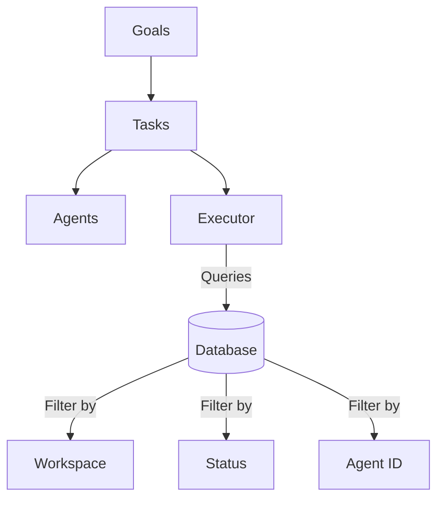
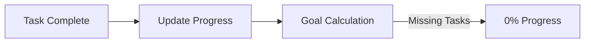
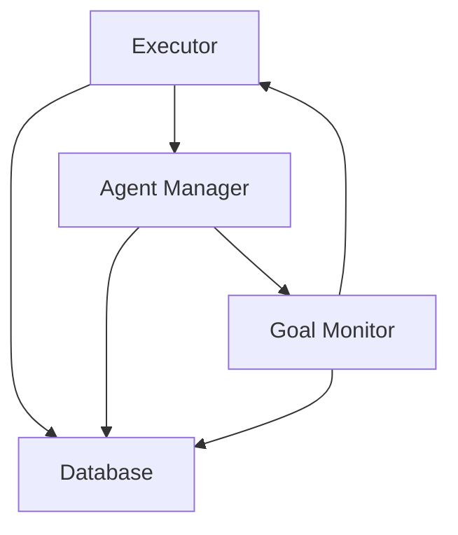
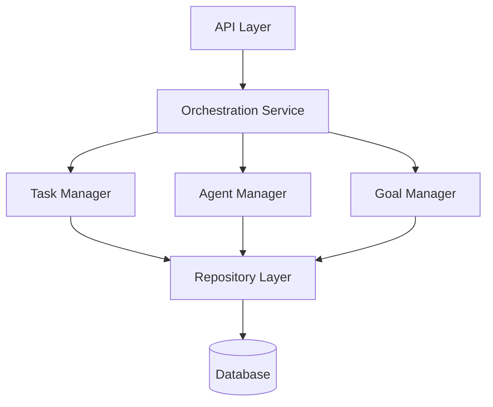

# Architectural Review: Goal Progress System

## Executive Summary

This architectural review examines the root causes behind the 0% goal progress issue in workspace `f79d87cc-b61f-491d-9226-4220e39e71ad`, focusing on systematic architectural patterns rather than quick fixes.

**Critical Finding**: The issue stemmed from missing agent assignments on tasks, revealing deeper architectural vulnerabilities in the goal→task→agent assignment flow.

## 1. Architecture Analysis: Goal → Task → Agent Assignment Flow

### Current Design



### Architectural Issues Identified

#### 1.1 Weak Contract Enforcement
- **Problem**: No database-level constraints ensuring tasks have agent assignments
- **Impact**: Tasks can exist in "orphaned" state without agents
- **Root Cause**: Schema allows nullable `agent_id` on tasks table

#### 1.2 Silent Failure Patterns
- **Problem**: Task executor queries silently skip tasks without agents
- **Impact**: Progress appears as 0% with no error signals
- **Root Cause**: Missing validation and error propagation in query layer

#### 1.3 Distributed State Management
- **Problem**: Task state split across multiple components without central coordination
- **Impact**: Inconsistent state transitions and assignment logic
- **Root Cause**: No single source of truth for task lifecycle

### Recommendation: Enforce Invariants at Schema Level

```sql
-- Add database constraint to prevent orphaned tasks
ALTER TABLE tasks 
ADD CONSTRAINT tasks_must_have_agent 
CHECK (
    (status = 'pending' AND agent_id IS NULL) OR 
    (status != 'pending' AND agent_id IS NOT NULL)
);

-- Add trigger to auto-assign agents when status changes
CREATE OR REPLACE FUNCTION assign_agent_on_status_change()
RETURNS TRIGGER AS $$
BEGIN
    IF NEW.status != 'pending' AND NEW.agent_id IS NULL THEN
        -- Auto-assign to appropriate agent based on task type
        NEW.agent_id := get_appropriate_agent(NEW.workspace_id, NEW.task_type);
    END IF;
    RETURN NEW;
END;
$$ LANGUAGE plpgsql;
```

## 2. Task Executor Query Logic Review

### Current Implementation Patterns

```python
# Current: Multiple filter conditions without validation
tasks = supabase.table("tasks")
    .select("*")
    .eq("workspace_id", workspace_id)
    .eq("status", "pending")
    .eq("agent_id", agent_id)  # Silent failure if NULL
    .execute()
```

### Architectural Weaknesses

#### 2.1 Implicit Assumptions
- Assumes all tasks have agents assigned
- No validation of query results
- No telemetry on filtered-out tasks

#### 2.2 Query Fragmentation
- Different components use different query patterns
- No centralized query builder with validation
- Inconsistent error handling across queries

### Recommendation: Centralized Query Service

```python
class TaskQueryService:
    """Centralized service for all task queries with validation"""
    
    async def get_executable_tasks(
        self, 
        workspace_id: str,
        validate: bool = True
    ) -> List[Task]:
        """Get tasks ready for execution with validation"""
        
        # Step 1: Get all pending tasks
        all_tasks = await self._get_pending_tasks(workspace_id)
        
        # Step 2: Validate agent assignments
        if validate:
            unassigned = [t for t in all_tasks if not t.agent_id]
            if unassigned:
                await self._handle_unassigned_tasks(unassigned)
                
        # Step 3: Return only executable tasks
        executable = [t for t in all_tasks if t.agent_id]
        
        # Step 4: Emit telemetry
        await self._emit_query_metrics(
            total=len(all_tasks),
            executable=len(executable),
            unassigned=len(all_tasks) - len(executable)
        )
        
        return executable
```

## 3. Progress Calculation Pipeline Analysis

### Current Flow



### Architectural Gaps

#### 3.1 No Progress Validation
- Progress updates don't validate prerequisites
- No checks for task-agent assignment integrity
- Silent failure when calculations fail

#### 3.2 Weak Observability
- No metrics on progress calculation failures
- Missing audit trail for progress changes
- No alerting on anomalous progress patterns

### Recommendation: Progress Pipeline with Validation

```python
class ProgressCalculationPipeline:
    """Robust pipeline for goal progress calculation"""
    
    async def calculate_progress(self, goal_id: str) -> ProgressResult:
        # Step 1: Validate prerequisites
        validation = await self._validate_prerequisites(goal_id)
        if not validation.is_valid:
            await self._emit_validation_failure(validation)
            return ProgressResult.invalid(validation.errors)
        
        # Step 2: Calculate with telemetry
        with self._measure_calculation():
            tasks = await self._get_goal_tasks(goal_id)
            completed = len([t for t in tasks if t.status == 'completed'])
            total = len(tasks)
            
        # Step 3: Detect anomalies
        if total > 0 and completed == 0:
            await self._investigate_zero_progress(goal_id, tasks)
            
        # Step 4: Audit trail
        await self._log_progress_calculation(
            goal_id=goal_id,
            completed=completed,
            total=total,
            percentage=(completed/total * 100) if total > 0 else 0
        )
        
        return ProgressResult(
            percentage=(completed/total * 100) if total > 0 else 0,
            completed=completed,
            total=total
        )
```

## 4. Component Dependencies & Coupling

### Current Coupling Issues



**Problems**:
- Circular dependencies between components
- Direct database access from multiple layers
- No clear separation of concerns

### Recommendation: Layered Architecture with Clear Boundaries



**Benefits**:
- Single point of database access
- Clear component responsibilities
- Testable boundaries
- Reduced coupling

## 5. Monitoring & Observability Patterns

### Current State

#### Strengths
- `TaskExecutionMonitor` provides execution tracing
- Stage-based tracking exists
- Hang detection implemented

#### Weaknesses
- No proactive anomaly detection
- Missing business-level metrics
- No correlation between failures and root causes
- Reactive rather than predictive monitoring

### Recommendation: Multi-Layer Observability

```python
class SystemHealthMonitor:
    """Comprehensive health monitoring system"""
    
    def __init__(self):
        self.layers = {
            'infrastructure': InfrastructureMonitor(),
            'application': ApplicationMonitor(),
            'business': BusinessMetricsMonitor(),
            'anomaly': AnomalyDetector()
        }
    
    async def monitor(self):
        """Multi-layer monitoring with correlation"""
        
        # Layer 1: Infrastructure
        infra_health = await self.layers['infrastructure'].check()
        
        # Layer 2: Application
        app_health = await self.layers['application'].check()
        
        # Layer 3: Business Metrics
        business_health = await self.layers['business'].check()
        
        # Layer 4: Anomaly Detection
        anomalies = await self.layers['anomaly'].detect(
            infra=infra_health,
            app=app_health,
            business=business_health
        )
        
        # Correlation & Root Cause Analysis
        if anomalies:
            root_cause = await self._analyze_root_cause(anomalies)
            await self._emit_alert(root_cause)
            
        return HealthStatus(
            healthy=not anomalies,
            layers={
                'infrastructure': infra_health,
                'application': app_health,
                'business': business_health
            },
            anomalies=anomalies
        )
```

## 6. Architectural Recommendations

### 6.1 Immediate Actions (Prevent Recurrence)

1. **Add Database Constraints**
   ```sql
   -- Ensure task integrity
   ALTER TABLE tasks ADD CONSTRAINT valid_task_state 
   CHECK (
       (agent_id IS NOT NULL) OR 
       (status = 'pending' AND agent_id IS NULL)
   );
   ```

2. **Implement Validation Service**
   ```python
   class TaskValidationService:
       async def validate_task_readiness(self, task_id: str) -> ValidationResult:
           """Validate task is ready for execution"""
           task = await self.get_task(task_id)
           
           validations = [
               self._has_agent_assigned(task),
               self._has_valid_goal(task),
               self._has_required_resources(task),
               self._no_circular_dependencies(task)
           ]
           
           return ValidationResult(
               is_valid=all(validations),
               failures=[v for v in validations if not v.passed]
           )
   ```

3. **Add Telemetry at Critical Points**
   ```python
   # In executor.py
   async def process_workspace_tasks(self, workspace_id: str):
       with telemetry.measure('workspace_task_processing'):
           tasks = await self.get_tasks(workspace_id)
           
           telemetry.record('tasks.total', len(tasks))
           telemetry.record('tasks.with_agents', 
                          len([t for t in tasks if t.agent_id]))
           
           if not all(t.agent_id for t in tasks):
               telemetry.alert('tasks.missing_agents', 
                              workspace_id=workspace_id)
   ```

### 6.2 Medium-term Improvements (System Resilience)

1. **Event-Driven Architecture**
   - Replace polling with event streams
   - Implement saga pattern for task lifecycle
   - Use event sourcing for audit trail

2. **Service Mesh Pattern**
   - Separate concerns into microservices
   - Implement circuit breakers
   - Add retry mechanisms with exponential backoff

3. **Observability Pipeline**
   - Structured logging with correlation IDs
   - Distributed tracing across components
   - Custom metrics for business KPIs

### 6.3 Long-term Architecture (Scale & Maintainability)

1. **Domain-Driven Design**
   ```
   /core
     /domain
       /goal (Goal aggregate root)
       /task (Task aggregate)
       /agent (Agent aggregate)
     /application
       /services (Use cases)
     /infrastructure
       /repositories (Data access)
   ```

2. **CQRS Pattern**
   - Separate read and write models
   - Optimize queries for specific views
   - Enable event replay and debugging

3. **Self-Healing Capabilities**
   ```python
   class SelfHealingSystem:
       async def detect_and_repair(self):
           """Automatically detect and fix common issues"""
           
           # Detect orphaned tasks
           orphaned = await self.find_orphaned_tasks()
           if orphaned:
               await self.assign_default_agents(orphaned)
               
           # Detect stuck workflows
           stuck = await self.find_stuck_workflows()
           if stuck:
               await self.restart_workflows(stuck)
               
           # Validate data integrity
           integrity = await self.validate_integrity()
           if not integrity.is_valid:
               await self.repair_integrity(integrity.issues)
   ```

## 7. Root Cause Analysis Summary

### Primary Causes
1. **Missing Invariant Enforcement**: No constraint ensuring tasks have agents
2. **Silent Query Failures**: Queries filter out unassigned tasks without warning
3. **Weak Validation**: No pre-execution validation of task readiness

### Contributing Factors
1. **Distributed State**: Task state spread across multiple components
2. **Implicit Assumptions**: Code assumes valid state without verification
3. **Poor Observability**: No visibility into filtered/skipped tasks

### Systemic Issues
1. **Reactive Design**: System reacts to failures rather than preventing them
2. **Tight Coupling**: Components directly depend on implementation details
3. **Missing Abstractions**: No service layer between business logic and data

## 8. Prevention Strategy

### Phase 1: Immediate Hardening (Week 1)
- Add database constraints for task integrity
- Implement validation service for task readiness
- Add comprehensive telemetry and alerting

### Phase 2: Architectural Improvements (Weeks 2-4)
- Introduce service layer abstraction
- Implement centralized query service
- Add progress calculation pipeline with validation

### Phase 3: System Evolution (Months 2-3)
- Migrate to event-driven architecture
- Implement self-healing capabilities
- Deploy comprehensive observability pipeline

## Conclusion

The 0% progress issue revealed fundamental architectural weaknesses in invariant enforcement, state management, and observability. While the immediate fix addressed the symptom, this review provides a roadmap for preventing similar issues through systematic architectural improvements.

**Key Principle**: Move from reactive fixes to proactive prevention through:
- Strong invariant enforcement at the schema level
- Comprehensive validation at service boundaries
- Observable systems with early warning capabilities
- Self-healing mechanisms for common failure modes

By implementing these recommendations, the system will be more resilient, maintainable, and capable of preventing similar issues before they impact users.