# 📊 WORKSPACE DATA ANALYSIS REPORT
**Workspace ID**: `5975922e-c943-4d99-ad1d-25c01a81da7d`  
**Workspace Name**: B2B Outbound Sales Lists  
**Analysis Date**: 2025-08-27  
**Status**: Active  

## 🎯 EXECUTIVE SUMMARY

**PROBLEMA IDENTIFICATO**: Il frontend mostra goal completati ma nessun deliverable leggibile perché la pipeline si interrompe tra `deliverables` e `asset_artifacts`. I deliverables esistono e contengono contenuto strutturato, ma non vengono processati in asset leggibili per l'utente.

## 📋 ANALISI DATI NEL DATABASE

### ✅ Goals Analysis (6 goals)
```
Goal 1: Email sequence 1 - Introduzione e valore (COMPLETED, 0% progress)
Goal 2: Raccogliere 50 contatti ICP (CMO/CTO di aziende SaaS europee) (ACTIVE, 0% progress)  
Goal 3: Istruzioni setup email marketing automation su HubSpot (COMPLETED, 0% progress)
Goal 4: Lista contatti ICP (COMPLETED, 0% progress)
Goal 5: Email sequence 2 - Case study e social proof (COMPLETED, 0% progress)
Goal 6: Email sequence 3 - Call to action e follow-up (COMPLETED, 0% progress)
```

**🚨 ANOMALIA**: Goals marcati come `completed` ma `progress_percentage = 0%`

### ✅ Tasks Analysis (6 completed tasks)
```
Task 1: Write Content for Istruzioni setup email marketing automation su HubSpot
  - Result length: 6,250 characters ✅
  - Content: Meaningful structured content ✅
  
Task 2: Write Content for Email sequence 3 - Call to action e follow-up  
  - Result length: 3,869 characters ✅
  - Content: Complete email sequence ✅
  
Task 3: Write Content for Email sequence 2 - Case study e social proof
  - Result length: 5,166 characters ✅
  - Content: Case studies and social proof content ✅
  
Task 4: Write Content for Email sequence 1 - Introduzione e valore
  - Result length: 4,269 characters ✅
  - Content: Introduction email content ✅
  
Task 5: Research Data for Lista contatti ICP
  - Result length: 3,849 characters ✅  
  - Content: Contact list in CSV format ✅
  
Task 6: Research Data for Raccogliere 50 contatti ICP (CMO/CTO di aziende SaaS europee)
  - Result length: 13,228 characters ✅
  - Content: Extensive contact list with 50 qualified contacts ✅
```

**📊 SUMMARY**: Tutti i task completati con successo e contenuto significativo.

### ⚠️ Deliverables Analysis (6 deliverables)

| ID | Title | Content Quality Score | Creation Confidence | Content Length | Status |
|----|-------|----------------------|-------------------|----------------|--------|
| b1f628c3... | Email sequence 2 - Case study e social proof | 79.67 | 20.0 | 1,113 chars | ✅ |
| 2854ea65... | Lista contatti ICP | 80.0 | 20.0 | 1,892 chars | ✅ |
| 690d9fd6... | Email sequence 3 - Call to action e follow-up | 66.67 | 20.0 | 1,830 chars | ✅ |
| c533e9c2... | Istruzioni setup email marketing automation | 80.0 | 20.0 | 1,796 chars | ✅ |
| 3ea90697... | Raccogliere 50 contatti ICP | 78.33 | 20.0 | 2,239 chars | ✅ |
| 1b18643e... | Email sequence 1 - Introduzione e valore | 0.0 | 0.0 | 2,027 chars | ⚠️ |

**🚨 PROBLEMI IDENTIFICATI**:
1. **Bassa Creation Confidence**: Tutti i deliverables hanno confidence = 20% (tranne uno a 0%)
2. **Contenuto con Placeholder**: Tutti contengono placeholder generici (`[Nome del Prodotto]`, `[Nome del Destinatario]`, `[Company Name]`)
3. **Struttura JSON**: Contenuto è strutturato ma generico

**📝 SAMPLE DELIVERABLE CONTENT**:
```json
{
  "company_name": "[Nome della Società]",
  "introductory_email_content": "Subject: Benvenuto a Bordo! Scopri il Valore di [Nome del Prodotto]...",
  "saas_cto_and_cmo_contact_list": "Ho compilato un elenco di 50 contatti qualificati..."
}
```

### ❌ Asset Artifacts Analysis (0 assets)
```
Total asset artifacts in database: 0
Asset artifacts for this workspace: 0
Goal asset requirements created: 0
```

**🚨 ROOT CAUSE**: Nessun asset artifact viene creato dai deliverables.

## 🔍 PIPELINE FLOW ANALYSIS

```mermaid
graph TD
    A[Goals Created] --> B[Tasks Generated]
    B --> C[Tasks Executed]
    C --> D[Deliverables Created]
    D --> E[Asset Artifacts Created]
    E --> F[Frontend Display]
    
    A -.->|✅ 6 goals| B
    B -.->|✅ 6 tasks| C  
    C -.->|✅ Meaningful content| D
    D -.->|❌ BROKEN| E
    E -.->|❌ No assets| F
    
    style E fill:#ff9999
    style F fill:#ff9999
```



**PIPELINE STATUS**:
1. ✅ **Goals → Tasks**: Working correctly
2. ✅ **Tasks → Deliverables**: Working correctly  
3. ❌ **Deliverables → Asset Artifacts**: **BROKEN**
4. ❌ **Asset Artifacts → Frontend**: No data to display

## 🎯 ROOT CAUSE ANALYSIS

### Primary Issues:
1. **Missing Asset Extraction Pipeline**: Deliverables are not being processed into `asset_artifacts`
2. **Placeholder Content**: Content contains generic placeholders instead of company-specific information
3. **Low Content Confidence**: System has low confidence in generated content (20%)
4. **Progress Calculation Bug**: Goals marked completed but progress = 0%

### Technical Analysis:
- **Database Schema**: ✅ All required tables exist and are properly structured
- **Task Execution**: ✅ Tasks complete successfully with meaningful output
- **Deliverable Creation**: ✅ Deliverables are created with structured content
- **Asset Processing**: ❌ **COMPLETELY MISSING** - No assets created from deliverables
- **Frontend Integration**: ❌ No readable assets to display to users

## 🔧 RECOMMENDED SOLUTIONS

### 🚨 CRITICAL FIXES (High Priority)

#### 1. Implement Asset Artifacts Creation Pipeline
```sql
-- Verify asset_artifacts table has correct structure
SELECT column_name, data_type, is_nullable 
FROM information_schema.columns 
WHERE table_name = 'asset_artifacts';
```

**Action Required**: Create/fix the pipeline that processes deliverable content into asset_artifacts.

#### 2. Fix Content Placeholder Replacement
**Issue**: All deliverables contain `[Nome del Prodotto]`, `[Company Name]` placeholders
**Fix**: Implement company-specific content generation using workspace context.

#### 3. Fix Goal Progress Calculation  
**Issue**: Goals marked `completed` but `progress_percentage = 0%`
**Fix**: Update progress calculation to reflect actual deliverable quality and completion.

### 🔧 MEDIUM PRIORITY FIXES

#### 4. Improve Content Quality Validation
- Reject content with excessive placeholders
- Require minimum content quality score > 70
- Increase creation confidence threshold

#### 5. Enhanced Asset Requirements Generation
- Create `goal_asset_requirements` entries for each goal
- Link deliverables to specific asset requirements

### 📊 MONITORING RECOMMENDATIONS

1. **Asset Creation Monitoring**: Track deliverable → asset_artifacts conversion rate
2. **Content Quality Tracking**: Monitor placeholder detection in deliverables  
3. **Progress Accuracy**: Ensure goal progress reflects actual deliverable readiness
4. **User Experience**: Track frontend deliverable visibility and usability

## 🎯 IMMEDIATE ACTION PLAN

### Phase 1: Critical Pipeline Fix (Day 1)
1. ✅ **COMPLETED**: Identify root cause (asset_artifacts creation missing)
2. 🔧 **NEXT**: Implement deliverable → asset_artifacts processing pipeline
3. 🔧 **NEXT**: Test with existing deliverables in workspace `5975922e-c943-4d99-ad1d-25c01a81da7d`

### Phase 2: Content Quality Enhancement (Day 2-3)  
1. Replace placeholder content with company-specific information
2. Improve content confidence scoring
3. Fix goal progress calculation

### Phase 3: Validation & Testing (Day 4-5)
1. End-to-end testing of complete pipeline
2. Frontend integration testing
3. User experience validation

## 📈 SUCCESS METRICS

- [ ] Asset artifacts created: **Target 6 assets from existing deliverables**
- [ ] Placeholder content eliminated: **Target 0% placeholder content**
- [ ] Content confidence improved: **Target >70% confidence**
- [ ] Goal progress accuracy: **Target accurate progress percentages**  
- [ ] Frontend deliverables visible: **Target 100% deliverable visibility**

---

**Report Generated**: 2025-08-27T14:30:00Z  
**Analysis Tool**: Claude Code Database Analysis  
**Database**: Supabase Production  
**Tables Analyzed**: 12 tables, 6 goals, 6 tasks, 6 deliverables, 0 assets