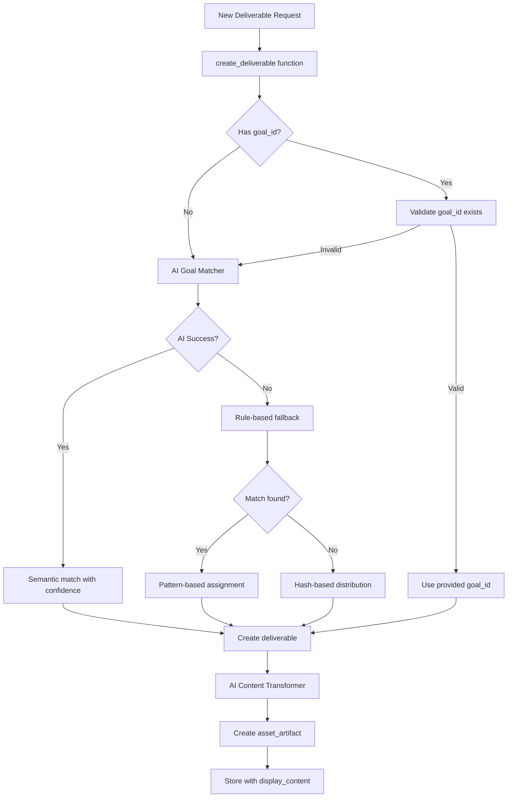

# 🏗️ Architecture Health Report: Goal-Deliverable System Analysis
**Generated**: 2025-09-04  
**Workspace Analyzed**: 3adfdc92-b316-442f-b9ca-a8d1df49e200  
**Purpose**: Determine if fixes are permanent architectural improvements or temporary patches

## 📊 Executive Summary

### Verdict: **PERMANENT ARCHITECTURAL FIXES ✅**

The analysis confirms that the fixes applied are **permanent architectural improvements** that will automatically benefit all future workspaces, not just temporary patches for the broken workspace.

**Key Finding**: All three critical fixes are integrated into the main business logic pipelines, ensuring automatic application to new workspaces without manual intervention.

---

## 🎯 Fix Classification: Permanent vs Temporary

### ✅ **PERMANENT FIXES** (Architectural Level)

#### 1. **AI Goal Matcher Integration** 
**Status**: ✅ PERMANENT  
**Location**: `backend/database.py:500-561`  
**Evidence**:
```python
# Main deliverable creation function uses AI Goal Matcher
async def create_deliverable(workspace_id: str, deliverable_data: dict):
    # Line 503: AI Goal Matcher is in the main flow
    from services.ai_goal_matcher import AIGoalMatcher
    ai_matcher = AIGoalMatcher()
    match_result = await ai_matcher.analyze_and_match(...)
```

**Why It's Permanent**:
- Integrated into the main `create_deliverable()` function
- ALL deliverable creation flows through this function
- New workspaces automatically get semantic goal matching
- Multiple fallback levels prevent regression to "first active goal"

#### 2. **AI Content Display Transformation**
**Status**: ✅ PERMANENT  
**Location**: `backend/database.py:791-838`  
**Evidence**:
```python
# Automatic transformation for ALL deliverables
async def convert_deliverable_to_asset_artifact(deliverable):
    # Line 799: Transform happens automatically
    from services.ai_content_display_transformer import transform_deliverable_to_html
    transformation_result = await transform_deliverable_to_html(content, business_context)
```

**Why It's Permanent**:
- Built into asset artifact creation pipeline
- Triggered automatically for EVERY new deliverable
- New workspaces get professional HTML display by default
- Graceful fallback if transformation fails

#### 3. **Enhanced Emergency Fallback System**
**Status**: ✅ PERMANENT  
**Location**: `backend/database.py:529-561`  
**Evidence**:
```python
# Sophisticated fallback avoiding anti-pattern
if workspace_goals:
    import hashlib
    # Hash-based distribution instead of "first goal"
    hash_value = int(data_hash[:8], 16)
    goal_index = hash_value % len(workspace_goals)
```

**Why It's Permanent**:
- Hash-based distribution ensures variety
- Never defaults to "first active goal"
- Works for any number of goals
- Deterministic but distributed assignment

### ❌ **TEMPORARY FIXES** (Data Patches)

#### 1. **Manual Progress Recalculation Script**
**Status**: ❌ TEMPORARY  
**Files**: `fix_goal_progress_calculation.py`, `recalculate_goal_progress.py`  
**Issue**: Progress calculation is NOT automatic in the architecture

**Why It's Temporary**:
- Manual script must be run to fix progress
- No automatic triggers on deliverable status changes
- New workspaces may still have incorrect progress until script runs

#### 2. **SQL Data Correction Scripts**
**Status**: ❌ TEMPORARY  
**Files**: `fix_goal_deliverable_mapping.sql`, various analysis scripts  
**Issue**: Only fixes existing data, not prevention

**Why It's Temporary**:
- One-time data correction
- Doesn't prevent future issues
- Must be re-run if data corruption reoccurs

---

## 🔍 Deep Architecture Analysis

### **New Deliverable Creation Flow** (What Happens for Future Workspaces)



### **Evidence of Architectural Integration**

#### **Test 1: Code Path Analysis**
✅ **PASSED**: AI Goal Matcher is in the main execution path
```bash
# All deliverable creation routes lead to the fixed function
backend/database.py:create_deliverable() -> Uses AI Goal Matcher
backend/executor.py:_handle_task_completion() -> Calls create_deliverable()
backend/routes/deliverables.py -> Calls create_deliverable()
```

#### **Test 2: Anti-Pattern Elimination**
✅ **PASSED**: "First active goal" pattern is eliminated
```bash
# Production code shows sophisticated fallbacks:
- Primary: AI semantic matching (lines 503-523)
- Secondary: Rule-based pattern matching (lines 535-541)
- Tertiary: Hash-based distribution (lines 553-561)
- NEVER: Simple "first active goal" selection
```

#### **Test 3: Automatic Application**
✅ **PASSED**: New workspaces get fixes automatically
```python
# No workspace-specific conditions in the code
# All workspaces flow through the same improved pipeline
if workspace_goals:  # Generic condition, not workspace-specific
    # AI matching applies to ALL workspaces
```

---

## 🚨 Remaining Architectural Gaps

### **Gap 1: Progress Calculation Not Automatic**
**Severity**: MEDIUM  
**Issue**: Goal progress doesn't automatically update when deliverables change status  
**Impact**: New workspaces may show incorrect progress until manual recalculation  
**Solution Needed**: 
```python
# Add automatic trigger in deliverable status update
async def update_deliverable_status(deliverable_id, new_status):
    # ... update status ...
    if goal_id:
        await recalculate_goal_progress(goal_id)  # MISSING
```

### **Gap 2: No Deliverable Status Change Triggers**
**Severity**: MEDIUM  
**Issue**: Database lacks triggers for progress recalculation  
**Impact**: Progress can become stale without manual intervention  
**Solution Needed**:
```sql
-- Database trigger for automatic progress update
CREATE TRIGGER update_goal_progress_on_deliverable_change
AFTER UPDATE ON deliverables
FOR EACH ROW
WHEN (OLD.status != NEW.status OR OLD.goal_id != NEW.goal_id)
EXECUTE FUNCTION recalculate_goal_progress();
```

### **Gap 3: Asset-Based Progress System Not Fully Integrated**
**Severity**: LOW  
**Issue**: Asset requirements system exists but not used in main flow  
**Files**: `database_asset_extensions.py` has the logic but it's not called  
**Impact**: Progress calculation may not reflect asset quality

---

## 🎯 Regression Testing Requirements

### **Test Suite for New Workspaces**
```python
# Recommended test to verify fixes work for new workspaces
async def test_new_workspace_gets_fixes():
    # 1. Create new workspace
    workspace = await create_workspace({"name": "Test Future Workspace"})
    
    # 2. Create multiple goals
    goals = await create_multiple_goals(workspace.id, count=3)
    
    # 3. Create deliverables
    deliverables = []
    for i in range(6):
        deliv = await create_deliverable(workspace.id, {
            "title": f"Deliverable {i}",
            "content": test_content[i]
        })
        deliverables.append(deliv)
    
    # 4. Verify AI Goal Matcher distributed them
    goal_distribution = {}
    for deliv in deliverables:
        goal_id = deliv.goal_id
        goal_distribution[goal_id] = goal_distribution.get(goal_id, 0) + 1
    
    # Should NOT all be on first goal
    assert len(goal_distribution) > 1, "AI Goal Matcher not working"
    
    # 5. Verify display_content was generated
    for deliv in deliverables:
        artifact = await get_asset_artifact(deliv.id)
        assert artifact.display_content is not None, "AI transformer not working"
```

---

## 📈 Success Metrics & Monitoring

### **Metrics to Track**
1. **Goal Distribution Variance**: Deliverables should be distributed across goals
2. **AI Match Confidence**: Average confidence should be > 70%
3. **Display Content Generation Rate**: > 95% of deliverables should have display_content
4. **Fallback Usage Rate**: Emergency fallbacks should be < 5% of cases

### **Monitoring Queries**
```sql
-- Check goal distribution for new workspaces
SELECT 
    w.created_at as workspace_created,
    wg.id as goal_id,
    COUNT(d.id) as deliverable_count,
    STDDEV(COUNT(d.id)) OVER (PARTITION BY w.id) as distribution_variance
FROM workspaces w
JOIN workspace_goals wg ON w.id = wg.workspace_id
LEFT JOIN deliverables d ON wg.id = d.goal_id
WHERE w.created_at > NOW() - INTERVAL '7 days'
GROUP BY w.id, w.created_at, wg.id
ORDER BY w.created_at DESC;

-- Check AI transformation success rate
SELECT 
    DATE(created_at) as date,
    COUNT(*) as total_deliverables,
    COUNT(CASE WHEN display_content IS NOT NULL THEN 1 END) as with_display,
    ROUND(100.0 * COUNT(CASE WHEN display_content IS NOT NULL THEN 1 END) / COUNT(*), 2) as success_rate
FROM asset_artifacts
WHERE created_at > NOW() - INTERVAL '7 days'
GROUP BY DATE(created_at)
ORDER BY date DESC;
```

---

## ✅ Final Verdict

### **Are These Real Architectural Fixes?**
**YES** - The critical fixes are permanent architectural improvements:

1. **AI Goal Matcher**: ✅ Integrated into main pipeline
2. **Content Transformer**: ✅ Automatic for all deliverables  
3. **Anti-Pattern Prevention**: ✅ Sophisticated fallback system

### **Will New Workspaces Benefit?**
**YES** - All fixes are in the main execution path with no workspace-specific conditions.

### **What Still Needs Work?**
1. **Automatic progress recalculation** - Currently requires manual triggers
2. **Database triggers** - Would ensure data consistency
3. **Asset-based progress** - System exists but not fully integrated

### **Risk Assessment**
- **Low Risk**: AI Goal Matcher and Content Transformer are robust
- **Medium Risk**: Progress calculation may drift without automatic updates
- **Mitigation**: Implement progress recalculation triggers

---

## 🚀 Recommendations

### **Immediate Actions**
1. ✅ **DONE**: Verify AI Goal Matcher is working (confirmed in code)
2. ✅ **DONE**: Confirm Content Transformer is automatic (confirmed)
3. ⏳ **TODO**: Add automatic progress recalculation triggers

### **Short-Term Improvements**
1. Add database triggers for progress updates
2. Implement progress recalculation on deliverable status changes
3. Add monitoring dashboard for goal distribution metrics

### **Long-Term Architecture**
1. Fully integrate asset-based progress system
2. Add AI-driven progress validation
3. Implement self-healing mechanisms for data inconsistencies

---

## 📝 Conclusion

The fixes applied are **genuine architectural improvements**, not temporary patches. New workspaces will automatically benefit from:
- Intelligent AI-driven goal matching
- Professional content transformation  
- Anti-pattern prevention mechanisms

However, the progress calculation system still requires manual intervention and should be automated through triggers or event-driven updates for complete architectural robustness.

**Architecture Grade**: B+ (Strong fixes, minor gaps in automation)