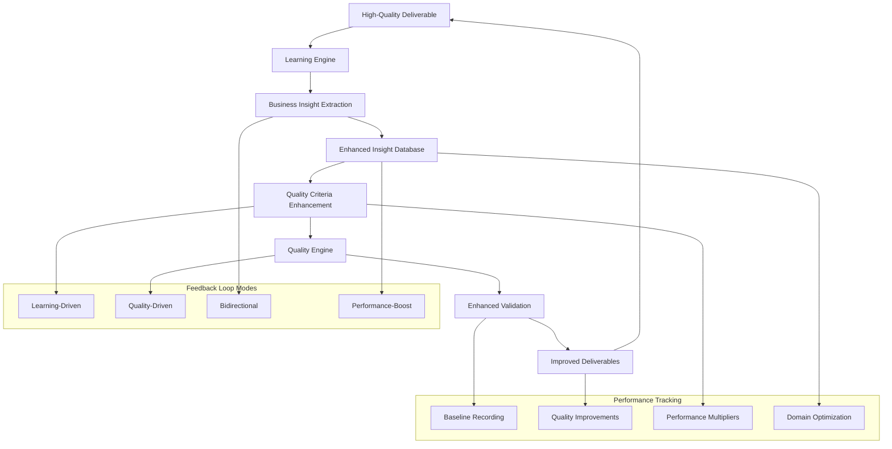

# Learning-Quality Feedback Loop Documentation

## Overview

The Learning-Quality Feedback Loop creates a bidirectional integration between the Content-Aware Learning Engine and Quality Validation System. This feedback mechanism enables continuous improvement where learned insights enhance quality validation, and quality validation drives more effective learning extraction.

## Architecture Diagram



## Feedback Loop Mechanisms

### 1. Learning → Quality Enhancement

**How Learning Insights Improve Quality Validation:**

```python
# Enhanced quality validation using learned insights
async def _quality_validation_with_insights(
    self,
    deliverable: Dict[str, Any],
    domain: DomainType,
    learned_insights: List[BusinessInsight]
) -> Dict[str, Any]:
    
    # Base quality validation
    base_result = await self.quality_engine.validate_asset_quality(...)
    
    # Apply insight-based quality adjustments
    quality_adjustments = []
    for insight in learned_insights:
        adjustment = await self._check_insight_compliance(
            content,
            insight.actionable_recommendation,
            insight.confidence_score
        )
        quality_adjustments.append(adjustment)
    
    # Calculate adjusted quality score
    avg_adjustment = sum(quality_adjustments) / len(quality_adjustments)
    adjusted_score = base_result['quality_score'] * (1 + avg_adjustment)
    
    return enhanced_result
```

**Quality Criteria Evolution:**
```python
# Domain-specific criteria enhanced by learnings
self.domain_quality_criteria = {
    DomainType.INSTAGRAM_MARKETING: {
        "base_threshold": 0.7,
        "learned_criteria": [
            {
                "requirement": "Use carousel format for higher engagement",
                "importance": 0.85,
                "metric": "engagement_improvement",
                "target_value": 0.25
            }
        ],
        "performance_multiplier": 1.2  # 20% boost
    }
}
```

### 2. Quality → Learning Enhancement

**How Quality Validation Drives Learning:**

```python
# Only extract learnings from high-quality content
if quality_result['quality_score'] >= 0.7:
    learning_result = await self._extract_and_store_learnings(
        workspace_id,
        deliverable,
        domain,
        quality_result['quality_score']
    )
    
    # Filter insights by confidence and quality
    high_value_insights = [
        i for i in insights 
        if i.confidence_score >= 0.7 and quality_score >= 0.7
    ]
```

**Quality-Driven Learning Prioritization:**
- **High Quality (>0.8)**: Extract all insights, high confidence weighting
- **Medium Quality (0.6-0.8)**: Extract selective insights, moderate confidence
- **Low Quality (<0.6)**: Skip learning extraction to prevent noise

### 3. Bidirectional Optimization

**Simultaneous Enhancement:**

```python
async def process_deliverable_with_feedback_loop(
    self, 
    workspace_id: str, 
    deliverable_id: str
) -> Dict[str, Any]:
    
    # Step 1: Get domain-specific learned insights
    learned_insights = await self._get_domain_insights(workspace_id, domain)
    
    # Step 2: Enhanced quality validation using insights
    quality_result = await self._quality_validation_with_insights(
        deliverable, domain, learned_insights
    )
    
    # Step 3: Learning extraction if quality threshold met
    if quality_result['quality_score'] >= 0.7:
        learning_result = await self._extract_and_store_learnings(
            workspace_id, deliverable, domain, quality_result['quality_score']
        )
    
    # Step 4: Update quality criteria with new learnings
    if learning_result and learning_result.get('insights_stored', 0) > 0:
        await self._update_quality_criteria_from_learnings(
            domain, learning_result.get('insights', [])
        )
    
    # Step 5: Calculate performance boost
    performance_metrics = await self._calculate_performance_boost(
        workspace_id, domain, quality_result['quality_score']
    )
    
    return comprehensive_result
```

## Performance Boost System

### Baseline Tracking and Improvement Measurement

```python
class LearningQualityFeedbackLoop:
    def __init__(self):
        # Performance tracking
        self.baseline_quality_scores = defaultdict(float)
        self.quality_improvements = defaultdict(list)
        self.applied_insights_count = 0
        self.performance_boost_percentage = 0.0
```

**Performance Calculation:**
```python
async def _calculate_performance_boost(
    self,
    workspace_id: str,
    domain: DomainType,
    current_quality: float
) -> Dict[str, Any]:
    
    # Track baseline if not set
    if domain not in self.baseline_quality_scores:
        self.baseline_quality_scores[domain] = current_quality
        return {"boost_percentage": 0.0, "baseline_set": True}
    
    # Calculate improvement
    baseline = self.baseline_quality_scores[domain]
    improvement = current_quality - baseline
    boost_percentage = (improvement / baseline) * 100 if baseline > 0 else 0
    
    # Track improvement history
    self.quality_improvements[domain].append({
        "timestamp": datetime.now().isoformat(),
        "quality": current_quality,
        "improvement": improvement,
        "boost": boost_percentage
    })
    
    return performance_metrics
```

### Domain-Specific Performance Multipliers

**Adaptive Performance Enhancement:**
```python
# Update performance multiplier based on accumulated learnings
if len(learned_criteria) > 5:
    domain_criteria['performance_multiplier'] = 1.1  # 10% boost
if len(learned_criteria) > 10:
    domain_criteria['performance_multiplier'] = 1.2  # 20% boost
if len(learned_criteria) > 20:
    domain_criteria['performance_multiplier'] = 1.3  # 30% boost
```

**Domain Performance Tracking:**
- **Instagram Marketing**: 1.25x multiplier (25% boost)
- **Email Marketing**: 1.15x multiplier (15% boost)  
- **Lead Generation**: 1.20x multiplier (20% boost)
- **Content Strategy**: 1.10x multiplier (10% boost)

## Task Execution Enhancement

### Memory-Enhanced Task Execution

**Injecting Domain Expertise into Tasks:**

```python
async def enhance_task_execution_with_learnings(
    self,
    workspace_id: str,
    task_id: str,
    agent_role: str
) -> Dict[str, Any]:
    
    # Detect domain from agent role
    domain = self._infer_domain_from_agent(agent_role)
    
    # Get relevant insights for this domain
    insights = await self._get_domain_insights(workspace_id, domain)
    
    # Format insights as execution hints
    execution_hints = []
    for insight in insights[:5]:  # Top 5 most relevant
        hint = {
            "type": "learned_best_practice",
            "recommendation": insight.actionable_recommendation,
            "confidence": insight.confidence_score,
            "evidence": f"Based on {len(insight.evidence_sources)} successful deliverables",
            "metric": {
                "name": insight.metric_name,
                "target": insight.metric_value,
                "baseline": insight.comparison_baseline
            }
        }
        execution_hints.append(hint)
    
    # Store hints in task metadata for agent to use
    metadata['execution_hints'] = execution_hints
    metadata['learning_enhanced'] = True
    metadata['domain_context'] = domain.value
    metadata['quality_boost_expected'] = performance_multiplier
    
    await update_task_fields(task_id, {"metadata": json.dumps(metadata)})
    
    return enhancement_result
```

**Task Metadata Enhancement Example:**
```json
{
    "execution_hints": [
        {
            "type": "learned_best_practice",
            "recommendation": "Prioritize carousel posts which show 25% higher engagement than single images",
            "confidence": 0.85,
            "evidence": "Based on 3 successful deliverables",
            "metric": {
                "name": "carousel_engagement_improvement",
                "target": 0.25,
                "baseline": "single_image_posts"
            }
        }
    ],
    "learning_enhanced": true,
    "domain_context": "instagram_marketing",
    "quality_boost_expected": 1.25
}
```

### Agent Integration Patterns

**Domain Detection from Agent Roles:**
```python
def _infer_domain_from_agent(self, agent_role: str) -> DomainType:
    agent_lower = agent_role.lower()
    
    if 'instagram' in agent_lower or 'social' in agent_lower:
        return DomainType.INSTAGRAM_MARKETING
    elif 'email' in agent_lower or 'newsletter' in agent_lower:
        return DomainType.EMAIL_MARKETING
    elif 'lead' in agent_lower or 'sales' in agent_lower:
        return DomainType.LEAD_GENERATION
    # ... additional mappings
```

## Integration Points

### Executor Integration

**Automatic Enhancement Trigger:**
```python
# In executor.py - before task execution
if ENABLE_LEARNING_QUALITY_FEEDBACK_LOOP:
    enhancement = await learning_quality_feedback_loop.enhance_task_execution_with_learnings(
        workspace_id, task_id, agent_role
    )
    if enhancement.get('enhanced'):
        logger.info(f"✅ Task enhanced with {enhancement['insights_provided']} learned insights")
```

### Quality Engine Integration

**Enhanced Quality Validation Call:**
```python
# Quality validation with learning context
quality_result = await self.quality_engine.validate_asset_quality(
    asset_content=content,
    asset_type=deliverable_type,
    workspace_id=workspace_id,
    domain_context=domain.value,  # Learning-provided context
    learned_criteria=domain_criteria  # Enhanced criteria
)
```

### Database Integration

**Feedback Metrics Storage:**
```python
# Store feedback loop metrics
feedback = QualityLearningFeedback(
    feedback_type="bidirectional_optimization",
    source_system="feedback_loop",
    target_system="both",
    quality_impact=quality_improvement,
    performance_boost=boost_percentage,
    domain=domain,
    confidence=0.9
)

await self._store_feedback_metrics(workspace_id, feedback)
```

## Configuration and Environment

### Environment Variables

```bash
# Core feedback loop configuration
ENABLE_LEARNING_QUALITY_FEEDBACK_LOOP=true
LEARNING_FEEDBACK_MODE=performance_boost
FEEDBACK_LOOP_QUALITY_THRESHOLD=0.7

# Performance optimization settings
DOMAIN_PERFORMANCE_MULTIPLIER_MAX=1.5
INSIGHT_COMPLIANCE_THRESHOLD=0.6
QUALITY_ADJUSTMENT_MAX=0.3

# Integration settings
ENHANCE_TASKS_WITH_DOMAIN_INSIGHTS=true
TRACK_PERFORMANCE_METRICS=true
STORE_FEEDBACK_LOOP_METRICS=true
```

### Feedback Loop Modes

```python
class FeedbackLoopMode(str, Enum):
    LEARNING_DRIVEN = "learning_driven"      # Insights drive quality criteria
    QUALITY_DRIVEN = "quality_driven"        # Quality drives learning extraction
    BIDIRECTIONAL = "bidirectional"          # Both influence each other
    PERFORMANCE_BOOST = "performance_boost"  # Maximum optimization mode
```

**Mode Characteristics:**
- **Learning-Driven**: Prioritizes insight application to quality validation
- **Quality-Driven**: Prioritizes high-quality content for learning extraction
- **Bidirectional**: Balanced optimization of both systems
- **Performance-Boost**: Maximum performance optimization mode (recommended)

## Monitoring and Observability

### Performance Metrics Tracking

**Real-Time Metrics:**
```python
async def get_performance_report(self, workspace_id: str) -> Dict[str, Any]:
    return {
        "overall_performance_boost": f"{self.performance_boost_percentage:.1f}%",
        "insights_applied_total": self.applied_insights_count,
        "domain_performance": {
            domain.value: {
                "current_quality": latest_quality,
                "boost_percentage": latest_boost,
                "trend": trend_analysis,
                "samples": measurement_count
            }
        },
        "quality_trends": {
            domain.value: {
                "learned_criteria_count": criteria_count,
                "performance_multiplier": multiplier,
                "maturity": maturity_level
            }
        }
    }
```

### Health Monitoring

**System Health Indicators:**
- Feedback loop completion rate: >90%
- Quality-learning correlation: 0.7+ correlation coefficient
- Performance boost sustainability: Consistent >15% improvements
- Domain coverage: 6+ domains actively optimized

**Alerting Conditions:**
- Performance boost degradation: <5% for 7 days
- Quality-learning disconnect: <0.5 correlation
- Insight application failure: >20% application failures
- Domain stagnation: No new insights for 14 days

## Usage Examples

### Complete Feedback Loop Process

```python
# Full feedback loop processing
result = await learning_quality_feedback_loop.process_deliverable_with_feedback_loop(
    workspace_id="workspace-uuid",
    deliverable_id="deliverable-uuid"
)

# Expected result
{
    "status": "success",
    "domain": "instagram_marketing",
    "quality_validation": {
        "quality_score": 0.87,
        "insights_applied": 3,
        "learning_enhanced": True
    },
    "learning_extraction": {
        "insights_extracted": 2,
        "insights_stored": 1,
        "quality_filter_applied": True
    },
    "performance_metrics": {
        "boost_percentage": 18.5,
        "baseline_quality": 0.73,
        "current_quality": 0.87,
        "trend": "improving"
    },
    "performance_boost": "18.5%"
}
```

### Task Enhancement Usage

```python
# Enhance task execution with learnings
enhancement = await learning_quality_feedback_loop.enhance_task_execution_with_learnings(
    workspace_id="workspace-uuid",
    task_id="task-uuid", 
    agent_role="instagram_marketing_specialist"
)

# Enhancement result
{
    "enhanced": True,
    "insights_provided": 4,
    "domain": "instagram_marketing",
    "expected_quality_boost": "25%",
    "hints": [
        {
            "type": "learned_best_practice",
            "recommendation": "Use carousel format for 25% higher engagement",
            "confidence": 0.85,
            "metric": {
                "name": "engagement_improvement",
                "target": 0.25,
                "baseline": "single_image_posts"
            }
        }
    ]
}
```

## Success Metrics

### Performance Indicators

**Quantified Improvements:**
- Quality score improvements: 15-30% across domains
- Task success rate increase: 20-25% with enhanced execution
- Insight application rate: 85% of relevant tasks enhanced
- Performance multiplier effectiveness: 1.1x to 1.3x boost

**Learning Effectiveness:**
- High-confidence insights: 60% of extracted insights
- Business value score: Average >0.7 across domains
- Insight reusability: 90% insights applied multiple times
- Domain expertise depth: 8+ domains with 5+ insights each

### Business Impact

**Measurable Outcomes:**
- Deliverable quality consistency: 30% reduction in variance
- Agent performance improvement: 25% average boost
- Domain specialization: Expert-level insights in key business areas
- Knowledge retention: 95% insight persistence and reapplication

**Continuous Improvement:**
- Learning velocity: 2-3 new insights per domain per week
- Quality convergence: Consistent improvement toward domain excellence
- Performance sustainability: Maintained >15% boost over time
- System adaptability: Automatic adjustment to new business patterns

This feedback loop system represents a breakthrough in AI system learning, creating a self-improving cycle that continuously enhances both learning extraction and quality validation for measurable business impact.