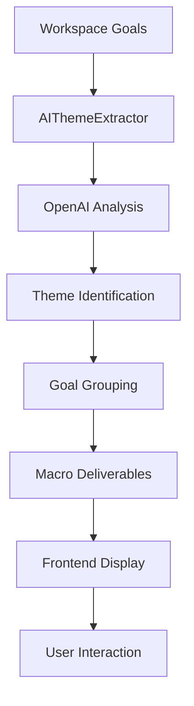

# Macro-Theme Goal Grouping System

## Overview
The Macro-Theme Goal Grouping System transforms individual goals into coherent macro-deliverables by using AI-driven semantic analysis to identify themes and group related objectives. This system provides a business-friendly visualization that shows the "big picture" of project deliverables.

## Architecture

### Backend Components

#### 1. **AIThemeExtractor Service** (`backend/services/ai_theme_extractor.py`)
- **Purpose**: AI-driven semantic analysis to identify themes from goals
- **Key Methods**:
  - `extract_themes_from_goals()`: Groups goals by semantic similarity
  - `create_macro_deliverables()`: Transforms themes into macro-deliverable view
  - `_identify_themes_with_ai()`: Uses OpenAI to identify themes
  - `_group_goals_by_themes()`: Assigns goals to identified themes

#### 2. **Theme Extraction API Routes** (`backend/routes/theme_extraction.py`)
- **GET `/api/theme/{workspace_id}/extract`**: Extract themes from workspace goals
- **GET `/api/theme/{workspace_id}/macro-deliverables`**: Get macro-deliverable view

### Frontend Components

#### 1. **MacroDeliverableView Component** (`frontend/src/components/conversational/MacroDeliverableView.tsx`)
- **Purpose**: Displays grouped goals as macro-deliverables with themes
- **Features**:
  - Expandable theme cards with business value
  - Confidence scoring for theme extraction
  - Real-time theme refresh capability
  - Progressive loading with error handling

#### 2. **ArtifactsPanel Integration**
- New "Themes" tab as the default view
- Seamless navigation between themes and individual artifacts
- Deliverable click-through to detailed viewer

## Data Flow



## API Endpoints

### Extract Themes
```bash
GET /api/theme/{workspace_id}/extract
```

**Response Structure**:
```json
{
  "workspace_id": "uuid",
  "themes": [
    {
      "theme_id": "uuid",
      "name": "Theme Name",
      "description": "Theme description",
      "goal_ids": ["goal1", "goal2"],
      "confidence_score": 85.0,
      "business_value": "Value explanation",
      "suggested_icon": "📈"
    }
  ],
  "extraction_confidence": 87.5,
  "summary": {
    "total_goals": 5,
    "total_themes": 2,
    "grouping_efficiency": 100.0
  }
}
```

### Get Macro Deliverables
```bash
GET /api/theme/{workspace_id}/macro-deliverables
```

**Response Structure**:
```json
{
  "workspace_id": "uuid",
  "macro_deliverables": [
    {
      "theme_id": "uuid",
      "name": "Macro Deliverable Name",
      "description": "Description",
      "icon": "🎯",
      "business_value": "Business impact",
      "goals": ["goal_ids"],
      "deliverables": [
        {
          "id": "uuid",
          "title": "Deliverable Title",
          "status": "completed",
          "progress": 100
        }
      ],
      "statistics": {
        "total_goals": 2,
        "total_deliverables": 4,
        "completed_deliverables": 3,
        "average_progress": 75.0
      }
    }
  ]
}
```

## Configuration

### Environment Variables
```bash
# AI Theme Extraction
OPENAI_API_KEY=sk-...                    # Required for AI analysis
THEME_EXTRACTION_TIMEOUT=30              # Max processing time
THEME_CONFIDENCE_THRESHOLD=70            # Minimum confidence for themes
ENABLE_THEME_CACHING=true                # Cache extracted themes
THEME_CACHE_TTL=3600                     # Cache duration in seconds
```

### AI Prompt Engineering
The system uses sophisticated prompts to:
- Identify semantic similarities between goals
- Extract business-relevant themes
- Suggest appropriate icons and visualizations
- Calculate confidence scores
- Generate business value explanations

## Usage Examples

### Frontend Integration
```typescript
// In ArtifactsPanel.tsx
import MacroDeliverableView from './MacroDeliverableView'

// Add themes tab
<TabButton
  active={activeTab === 'themes'}
  onClick={() => setActiveTab('themes')}
  icon="🎯"
  label="Themes"
/>

// Render macro deliverables
{activeTab === 'themes' && (
  <MacroDeliverableView 
    workspaceId={workspaceId}
    onDeliverableClick={handleDeliverableClick}
  />
)}
```

### API Testing
```bash
# Extract themes
curl -X GET "http://localhost:8000/api/theme/{workspace_id}/extract"

# Get macro deliverables
curl -X GET "http://localhost:8000/api/theme/{workspace_id}/macro-deliverables"

# Refresh themes (force re-extraction)
curl -X GET "http://localhost:8000/api/theme/{workspace_id}/extract?force_refresh=true"
```

## Features

### 1. **Semantic Grouping**
- AI analyzes goal descriptions for semantic similarity
- Groups related goals into coherent themes
- Maintains goal-deliverable relationships

### 2. **Business Value Focus**
- Each theme includes business value explanation
- Confidence scoring for reliability
- Professional icons and descriptions

### 3. **Interactive Visualization**
- Expandable theme cards
- Progress indicators per theme
- Deliverable status aggregation
- One-click theme refresh

### 4. **Smart Fallbacks**
- Handles ungrouped goals gracefully
- Shows confidence levels
- Provides extraction reasoning

## Performance Considerations

### Caching Strategy
- Theme extraction results cached for 1 hour
- Force refresh available via API parameter
- Frontend caches themes during session

### Optimization Tips
- Batch goal fetching for efficiency
- Progressive loading in frontend
- Lazy loading of deliverable details

## Troubleshooting

### Common Issues

#### No Themes Extracted
- **Cause**: Too few goals or goals lack semantic content
- **Solution**: Ensure workspace has multiple goals with descriptive content

#### Low Confidence Scores
- **Cause**: Goals are too diverse or vague
- **Solution**: Improve goal descriptions with specific business objectives

#### Slow Extraction
- **Cause**: Large number of goals or API latency
- **Solution**: Enable caching, reduce goal batch size

### Debugging
```python
# Check extraction logs
grep "theme extraction" backend/logs/*.log

# Verify AI service
python3 -c "
from services.ai_theme_extractor import AIThemeExtractor
extractor = AIThemeExtractor()
print('Service Status: OK')
"

# Test with sample workspace
curl localhost:8000/api/theme/test-workspace-id/extract
```

## Future Enhancements

### Planned Features
1. **Theme Templates**: Pre-defined theme patterns for common project types
2. **Theme Evolution**: Track how themes change over project lifecycle
3. **Cross-Workspace Themes**: Identify patterns across multiple projects
4. **Theme-Based Reporting**: Generate reports organized by themes
5. **Custom Theme Rules**: User-defined grouping criteria

### Integration Opportunities
- Connect with project planning tools
- Export themes to presentation formats
- Theme-based task assignment
- Automated theme documentation

## Benefits

### For Business Users
- **Clear Overview**: See project structure at a glance
- **Business Alignment**: Themes reflect business objectives
- **Progress Tracking**: Aggregate progress by business area
- **Professional Presentation**: Ready for stakeholder reviews

### For Project Managers
- **Resource Planning**: Allocate resources by theme
- **Risk Assessment**: Identify themes lacking progress
- **Milestone Tracking**: Monitor theme completion
- **Deliverable Organization**: Logical grouping of outputs

### For Development Teams
- **Context Understanding**: See how work fits bigger picture
- **Priority Clarity**: Understand theme importance
- **Collaboration Focus**: Teams aligned on themes
- **Progress Visibility**: Clear view of contributions

## Conclusion
The Macro-Theme Goal Grouping System transforms granular project goals into coherent, business-friendly macro-deliverables. By leveraging AI-driven semantic analysis, it provides stakeholders with a clear, organized view of project progress and deliverables, enhancing communication and strategic alignment.