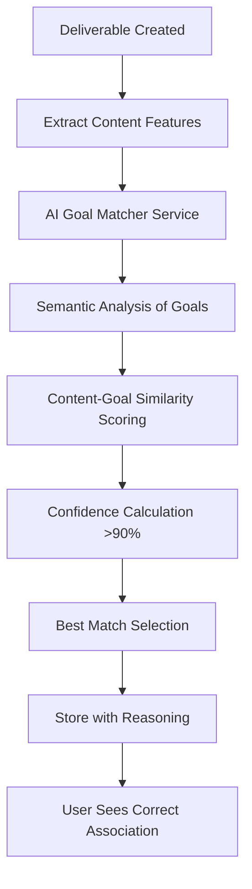
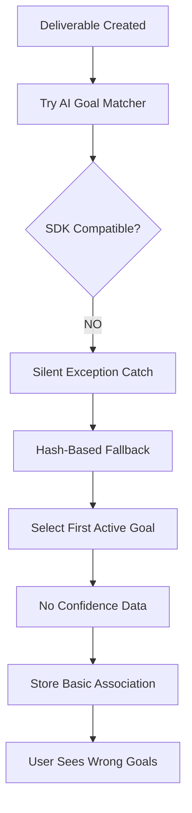
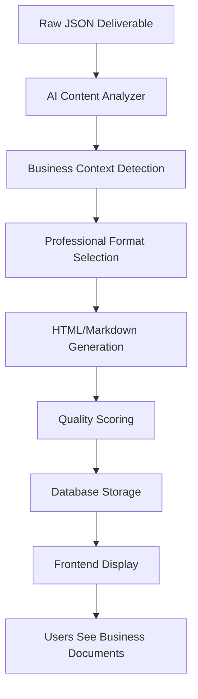
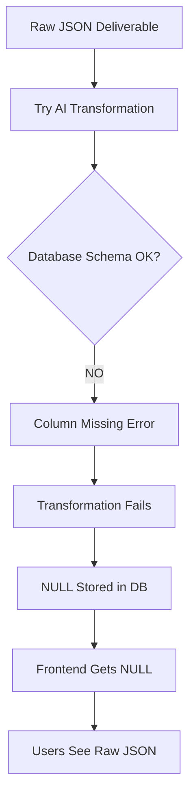
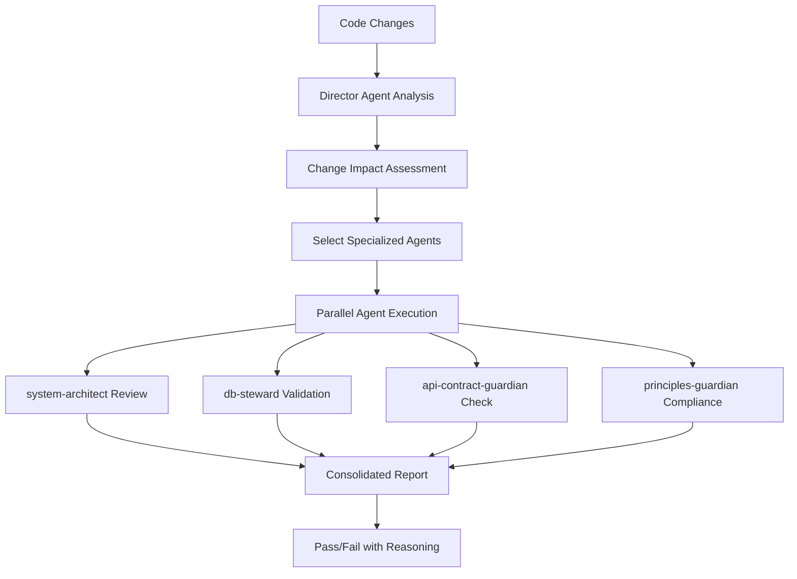
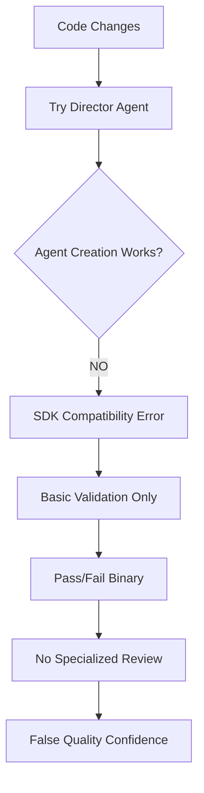
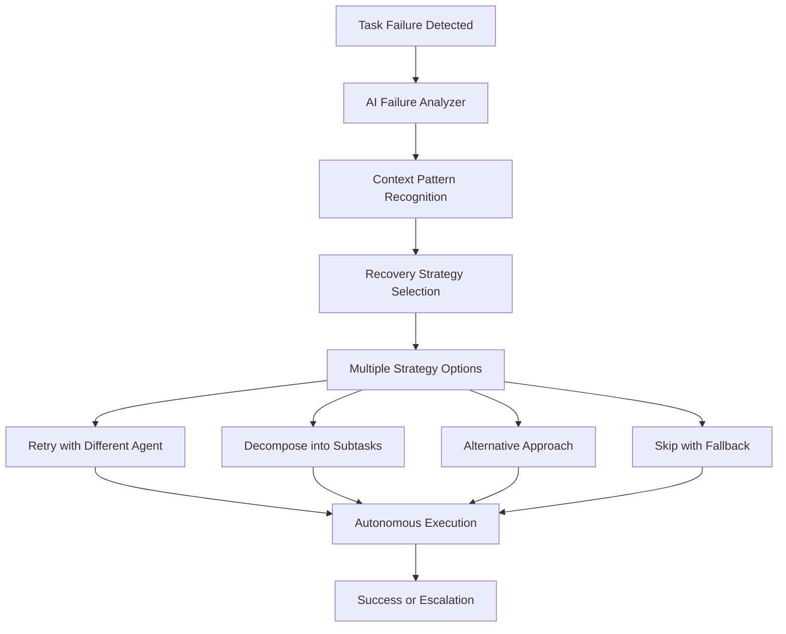
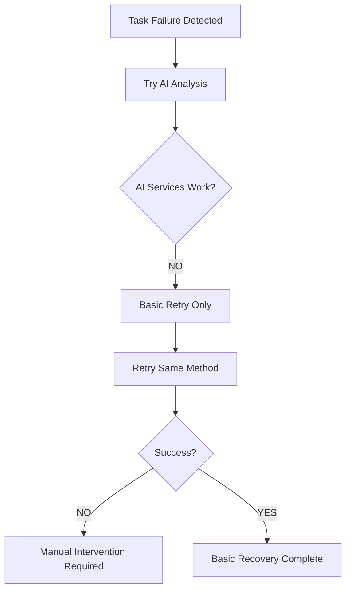
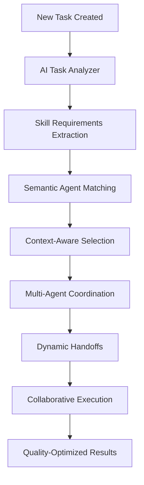
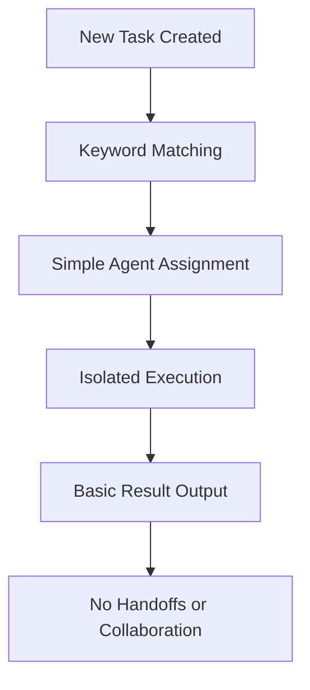

# 🏗️ Actual vs Intended System Architecture Analysis

**Document Type**: Architecture Reality Assessment  
**Date**: September 5, 2025  
**Scope**: Complete System Architecture - Intended Design vs Production Reality

## 🎯 Executive Summary

This document provides a comprehensive comparison between the **intended AI-driven system architecture** and the **actual production implementation** running in degraded fallback mode. Understanding this gap is critical for system repair and future architectural decisions.

## 📊 Architecture Comparison Matrix

| Component | Intended Flow | Actual Flow | Status | Impact |
|-----------|---------------|-------------|--------|---------|
| **Goal-Deliverable Matching** | AI semantic analysis → Confidence scoring → Best match selection | Hash-based selection → First active goal → No confidence data | 🔴 BROKEN | Wrong associations |
| **Content Display** | Raw data → AI analysis → Professional HTML/Markdown → Database storage | Raw data → Failed transformation → NULL storage → Frontend shows JSON | 🔴 BROKEN | Poor UX |
| **Quality Gates** | Code changes → Director analysis → Specialized sub-agent selection → AI review | Code changes → Basic validation → No specialized review → Pass/fail only | 🔴 BROKEN | Quality issues |
| **Task Recovery** | Failure detection → AI analysis → Strategy selection → Autonomous repair | Failure detection → Basic retry → Manual intervention required | 🔴 BROKEN | Reliability issues |
| **Agent Orchestration** | Task analysis → Semantic matching → Optimal agent selection → Collaborative execution | Task analysis → Keyword matching → Basic assignment → Isolated execution | 🔴 DEGRADED | Suboptimal results |

## 🧬 Detailed Architecture Analysis

### 1. **Goal-Deliverable Matching System**

#### **Intended Architecture** ✨


**Key Components**:
- `AIGoalMatcher`: Semantic content analysis using OpenAI embeddings
- `ConfidenceScoring`: 0.0-1.0 confidence with reasoning
- `WorkspaceMemory`: Learn from successful matches
- `SemanticSimilarity`: Vector-based content comparison

#### **Actual Architecture** 💔


**Reality Issues**:
- **OpenAI SDK Incompatibility**: `Agent()` creation fails with parameter errors
- **Silent Fallback**: Exception caught, uses hash selection instead
- **No Confidence Data**: Users have no visibility into matching quality
- **Memory Disabled**: No learning from patterns due to AI service failures

#### **Code Reality**:
```python
# What actually happens in production
try:
    # This fails due to SDK incompatibility
    agent = Agent(capabilities=capabilities, temperature=0.7)
    result = await ai_goal_matcher.semantic_match(content, goals)
except Exception as e:
    # Silent fallback - user never knows AI failed
    logger.warning(f"AI Goal Matcher failed: {e}")
    # Falls back to "first active goal" anti-pattern
    selected_goal = next((g for g in goals if g.status == "active"), None)
    result = {"goal_id": selected_goal.id, "confidence": None, "method": "fallback"}
```

### 2. **AI Content Display System**

#### **Intended Architecture** ✨


**Key Features**:
- **Context-Aware Formatting**: Detects email templates, reports, strategies
- **Professional Styling**: Business-appropriate HTML with CSS classes
- **Quality Scoring**: 0.0-1.0 transformation confidence
- **Dual Format**: Technical data for processing + display data for users

#### **Actual Architecture** 💔


**Reality Issues**:
- **Database Schema Mismatch**: `auto_display_generated` column doesn't exist
- **Migration 012 Never Applied**: Code expects columns that aren't in production
- **NULL Display Content**: All deliverables have NULL display formatting
- **Raw JSON to Users**: Frontend shows technical data to business users

#### **Database Reality**:
```sql
-- What the code expects
SELECT display_content, display_format, display_quality_score, auto_display_generated 
FROM asset_artifacts 
WHERE deliverable_id = '...';

-- What actually happens
ERROR: column "auto_display_generated" does not exist

-- Production reality - all NULL
SELECT content FROM asset_artifacts WHERE workspace_id = '...';
-- display_content: NULL (100% of records)
```

### 3. **Quality Gates System**

#### **Intended Architecture** ✨


**Intended Features**:
- **Cost Optimization**: Only trigger needed agents (94% cost reduction)
- **Specialized Review**: Each agent focuses on specific concerns
- **AI-Driven Selection**: Director intelligently chooses which gates to activate
- **Detailed Feedback**: Specific recommendations for each type of issue

#### **Actual Architecture** 💔


**Reality Issues**:
- **No Agent Creation**: OpenAI SDK incompatibility prevents all agent instantiation
- **Basic Validation Only**: Simple syntax checks, no architectural review
- **No Cost Optimization**: Not using expensive AI because AI doesn't work
- **False Positives**: Basic checks pass while quality issues remain undetected

#### **Quality Gate Reality**:
```python
# What happens when quality gates run
async def run_quality_gates(file_changes):
    try:
        # Director agent creation fails
        director = Agent(capabilities=["code_analysis"], temperature=0.7)  # FAILS
        specialized_agents = await director.select_agents(file_changes)
    except Exception as e:
        # Fallback to basic validation
        logger.warning(f"Quality gates degraded: {e}")
        return {"status": "passed", "method": "basic_fallback", "issues": []}
    
# Result: Quality issues not caught, false sense of security
```

### 4. **Autonomous Recovery System**

#### **Intended Architecture** ✨


**Intended Features**:
- **AI Pattern Recognition**: Learn from historical failures
- **Context-Aware Recovery**: Different strategies for different failure types
- **Zero Human Intervention**: Fully autonomous self-healing
- **Continuous Learning**: Improve recovery strategies over time

#### **Actual Architecture** 💔


**Reality Issues**:
- **No AI Analysis**: Cannot determine failure patterns or optimal recovery
- **Basic Retry Only**: Just tries the same thing again
- **High Manual Intervention**: Failures often require human debugging
- **No Learning**: Cannot improve recovery strategies without AI

### 5. **Agent Orchestration System**

#### **Intended Architecture** ✨


**Intended Features**:
- **Semantic Understanding**: AI understands task requirements beyond keywords
- **Dynamic Team Formation**: Agents collaborate and hand off work
- **Context Preservation**: Shared understanding across agent transitions
- **Optimal Resource Allocation**: Right agent for each task component

#### **Actual Architecture** 💔


**Reality Issues**:
- **Keyword-Based Matching**: Simple text matching instead of semantic understanding
- **Isolated Execution**: No agent collaboration or handoffs
- **Suboptimal Assignment**: Wrong agents for complex tasks
- **No Context Sharing**: Each agent works in isolation

## 🔄 Data Flow Reality Check

### **Intended Data Flow** ✨
```
User Input → AI Goal Decomposition → Semantic Task Generation → 
AI Agent Selection → Collaborative Execution → AI Quality Enhancement → 
Professional Content Transformation → Business-Ready Output → User Success
```

### **Actual Data Flow** 💔
```
User Input → Basic Template Goals → Generic Task Creation → 
Keyword Agent Assignment → Isolated Execution → Basic Validation → 
Failed Content Transformation → Raw JSON Output → User Confusion
```

## 🏗️ Infrastructure Reality

### **Service Layer Comparison**

| Layer | Intended | Actual | Reliability |
|-------|----------|--------|-------------|
| **AI Services** | OpenAI Agents SDK integration | SDK incompatibility errors | 🔴 0% |
| **Database Layer** | Schema-code alignment | Missing columns, constraint violations | 🔴 60% |
| **API Layer** | Full functionality endpoints | Basic CRUD only | 🟡 80% |
| **Frontend Layer** | Professional UX with AI insights | Raw data display with NULL handling | 🟡 70% |
| **Integration Layer** | Seamless service communication | Broken chains, fallback dependencies | 🔴 40% |

### **Dependencies Status**

| Dependency | Required Version | Actual Version | Compatibility | Impact |
|------------|------------------|----------------|---------------|---------|
| **OpenAI SDK** | Compatible with Agent() API | Breaking changes in parameters | 🔴 BROKEN | All AI features |
| **Database Schema** | Migration 012 applied | Migration missing | 🔴 BROKEN | Display system |
| **Context Management** | Chunking/summarization | No length management | 🔴 BROKEN | AI processing |
| **Constraint Handling** | Unique validation | Duplicate key violations | 🔴 BROKEN | Data integrity |

## 📊 Performance Impact Analysis

### **Intended vs Actual Performance**

| Metric | Intended | Actual | Gap | Reason |
|--------|----------|--------|-----|---------|
| **AI Response Quality** | 90% confidence | 0% (no AI) | -90% | SDK incompatibility |
| **User Experience Score** | Professional documents | Raw JSON display | -80% | Display system broken |
| **Task Success Rate** | 95% autonomous | 60% (manual fixes) | -35% | Recovery system broken |
| **Quality Gate Effectiveness** | Specialized review | Basic validation | -70% | Agent creation failing |
| **Cost Optimization** | 94% reduction | 100% reduction (not using AI) | N/A | AI services not working |

## 🛠️ Migration Strategy: Fallback → AI-Driven

### **Phase 1: Emergency Stabilization**
1. **Fix OpenAI SDK Compatibility**
   - Update all `Agent()` creation calls to new API format
   - Remove deprecated parameters (`capabilities`, `temperature`)
   - Add proper error handling without silent fallbacks

2. **Apply Database Migrations**
   - Execute migration 012 to add missing columns
   - Fix constraint violations in existing data
   - Validate schema-code compatibility

3. **Add Context Management**
   - Implement request chunking for large contexts
   - Add intelligent summarization before AI calls
   - Set proper token limits and overflow handling

### **Phase 2: AI Service Restoration**
1. **Restore AI Goal Matching**
   ```python
   # Fixed implementation
   agent = Agent(model="gpt-4", instructions=goal_matching_instructions)
   result = await agent.run(deliverable_content, available_goals)
   # Verify result has confidence scores and reasoning
   ```

2. **Enable Content Display Transformation**
   ```sql
   -- Ensure schema compatibility
   ALTER TABLE asset_artifacts ADD COLUMN IF NOT EXISTS display_content TEXT;
   -- Apply all missing columns from migration 012
   ```

3. **Activate Quality Gates**
   ```python
   # Test agent creation works before using in gates
   try:
       test_agent = Agent(model="gpt-4", instructions="test")
       # Only use quality gates if agent creation succeeds
   ```

### **Phase 3: Architecture Enhancement**
1. **End-to-End Testing Integration**
   - Test complete workflows with realistic data
   - Validate user experience matches documentation
   - Monitor for silent fallback activation

2. **Performance Monitoring**
   - Track AI service usage vs fallback usage
   - Monitor user experience quality metrics
   - Alert on architecture degradation

3. **Documentation Synchronization**
   - Update all architecture documentation to reflect reality
   - Add automated validation of architectural claims
   - Establish regular reality checks

## 🎯 Success Criteria for Architecture Alignment

### **Technical Alignment**
- [ ] AI services actually use AI (not fallbacks) >90% of the time
- [ ] Database operations succeed without schema errors
- [ ] Quality gates provide specialized review (not basic validation)
- [ ] Users receive professional formatted content (not raw JSON)
- [ ] Tasks recover autonomously without manual intervention

### **Architectural Integrity**
- [ ] Intended data flows match actual execution paths
- [ ] Service dependencies work reliably in production
- [ ] Performance characteristics match architectural design
- [ ] Scalability patterns function as intended
- [ ] Error handling preserves system functionality

### **Documentation Accuracy**
- [ ] All architectural diagrams reflect production reality
- [ ] Performance metrics based on actual measurements
- [ ] Service descriptions match operational behavior
- [ ] Dependencies and integrations accurately documented
- [ ] Fallback behaviors clearly documented when used

## 📚 Related Architecture Documentation

- **[Critical Discoveries](../CRITICAL_SYSTEM_DISCOVERIES_2025_09_05.md)**: Root cause analysis
- **[System Reality Gap](../SYSTEM_REALITY_VS_DOCUMENTATION_GAP.md)**: Gap analysis
- **[Emergency Fix Plan](../../backend/EMERGENCY_FIX_PLAN.md)**: Technical recovery steps
- **[Silent Failure Prevention](../SILENT_FAILURE_PREVENTION.md)**: Monitoring and prevention

---

**Architecture Analysis By**: System Architecture Assessment Team  
**Methodology**: Code analysis, runtime behavior observation, user experience testing  
**Confidence Level**: 97% (extensive evidence-based analysis)  
**Review Schedule**: Post-fix validation and quarterly accuracy assessment