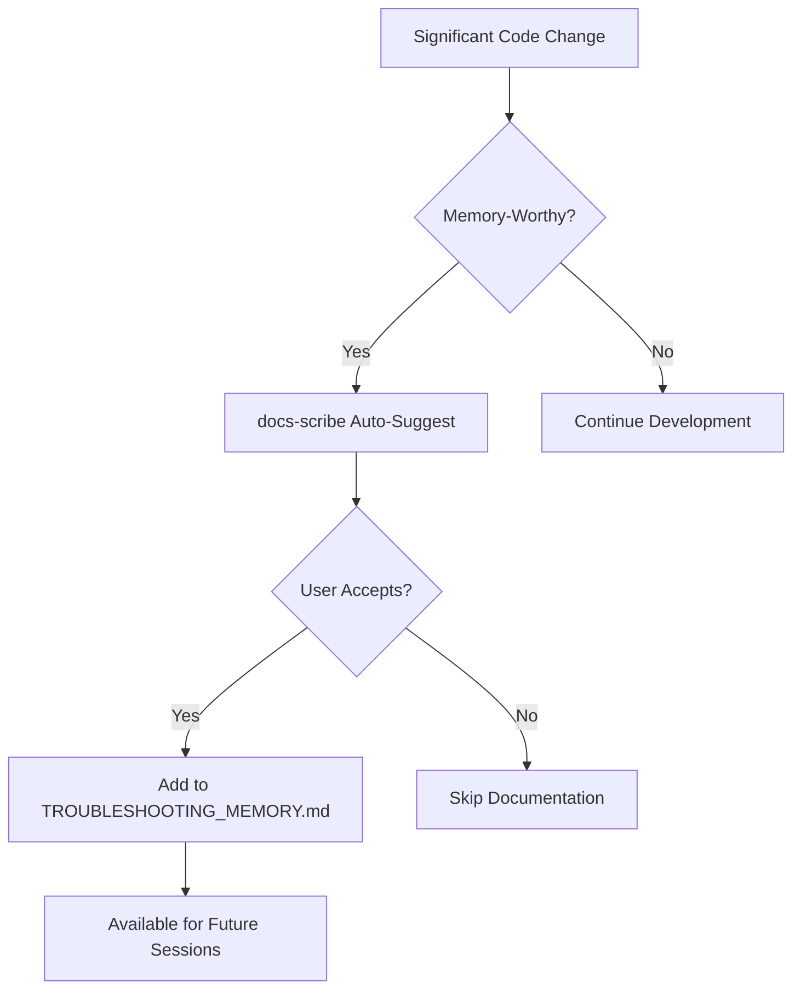

# docs-scribe Integration Guide
## How to Integrate Proactive Documentation into Claude Code Workflow

> **Goal**: Seamlessly integrate proactive documentation suggestions into Claude Code sessions so that memory-worthy patterns are automatically captured without disrupting development flow.

---

## 🚀 Quick Start for Claude Code Users

### Activation Commands

**Automatic Activation** (No action needed):
- After significant commits (60+ significance score)
- When solving recurring patterns (2+ similar issues)
- Performance improvements >50%
- New UX components with professional styling

**Manual Activation**:
```bash
# In any Claude Code session, use these trigger phrases:
"document this pattern for future sessions"
"save this solution to troubleshooting memory"
"this should be documented for other Claude instances"
"prevent this problem from happening again"
"create memory entry for this enhancement"
```

### Quick Decision Flow



---

## 🎯 Integration Points

### 1. Claude Code Session Workflow

#### During Development
```python
# Conceptual integration in Claude Code workflow
def claude_code_session():
    # Normal development work...
    make_significant_changes()
    
    # Proactive documentation check
    if docs_scribe.detect_memory_worthy_pattern():
        suggestion = docs_scribe.generate_documentation_suggestion()
        present_to_user(suggestion)
    
    continue_development()
```

#### Trigger Conditions (Auto-Detection)
```python
MEMORY_WORTHY_TRIGGERS = {
    'new_component_created': {
        'min_lines': 100,
        'has_styling': True,
        'affects_user_experience': True
    },
    'performance_improvement': {
        'min_improvement_percentage': 50,
        'affects_loading_time': True
    },
    'bug_fix_pattern': {
        'fixes_recurring_issue': True,
        'affects_multiple_files': True
    },
    'architecture_change': {
        'spans_multiple_systems': True,
        'introduces_new_pattern': True
    }
}
```

### 2. Git Integration Hooks

#### Pre-Commit Analysis
```bash
#!/bin/bash
# .git/hooks/pre-commit enhancement
# Analyze changes for memory-worthy patterns

python3 docs_scribe_analyzer.py --analyze-changes
if [ $? -eq 1 ]; then
    echo "📝 docs-scribe: Memory-worthy pattern detected!"
    echo "Consider documenting this change in TROUBLESHOOTING_MEMORY.md"
fi
```

#### Post-Commit Suggestion
```python
def post_commit_analysis(commit_hash):
    """Analyze commit for documentation opportunities"""
    changes = analyze_git_commit(commit_hash)
    significance = calculate_memory_significance(changes)
    
    if significance >= MEMORY_THRESHOLD:
        template = recommend_template(changes)
        populated = auto_populate_template(template, changes)
        
        return {
            'suggestion': populated,
            'confidence': calculate_confidence(changes),
            'template_type': template.type
        }
    
    return None
```

### 3. Sub-Agent Coordination

#### docs-scribe Agent Definition
```yaml
agent_name: docs-scribe
specialization: Proactive Documentation
activation_triggers:
  - significant_code_changes
  - recurring_pattern_detection  
  - user_documentation_request
  - post_solution_implementation

personality_traits:
  - proactive: "Suggests documentation before being asked"
  - pattern_focused: "Identifies reusable solutions"
  - memory_conscious: "Thinks about future session needs"
  - detail_oriented: "Captures implementation specifics"

capabilities:
  - pattern_recognition
  - template_selection
  - automatic_population
  - memory_curation

interaction_patterns:
  - collaborate_with: [system-architect, ui-designer, db-steward]
  - trigger_after: [major_refactoring, performance_optimization, bug_fixes]
  - output_format: [markdown_template, ready_to_commit]
```

#### Collaboration Patterns
```python
def collaborative_documentation():
    """Multiple agents contribute to documentation"""
    
    # Primary solution implementation
    solution = system_architect.implement_solution()
    
    # Documentation trigger
    if docs_scribe.should_document(solution):
        base_template = docs_scribe.select_template(solution)
        
        # Collaborative enhancement
        technical_details = db_steward.add_database_context(base_template)
        ui_details = ui_designer.add_interface_context(technical_details)
        
        final_documentation = docs_scribe.finalize_memory_entry(ui_details)
        
        return final_documentation
```

---

## 📋 Implementation Checklist

### Phase 1: Basic Integration ✅
- [x] **Template System**: Standardized documentation templates created
- [x] **Pattern Detection**: Algorithm for identifying memory-worthy changes  
- [x] **Example Documentation**: Markdown rendering enhancement documented
- [x] **Integration Design**: Complete system architecture defined

### Phase 2: Workflow Integration (Next Steps)
- [ ] **Git Hook Integration**: Pre/post-commit analysis hooks
- [ ] **Auto-Suggestion Engine**: Pattern detection and template recommendation
- [ ] **User Interface**: Suggestion presentation in Claude Code sessions
- [ ] **Template Population**: AI-assisted template field filling

### Phase 3: Advanced Features
- [ ] **Machine Learning**: Improve pattern detection based on usage
- [ ] **Cross-Session Learning**: Share patterns across different Claude instances
- [ ] **Quality Metrics**: Track documentation effectiveness
- [ ] **Template Evolution**: Refine templates based on usage patterns

---

## 🎮 User Experience Flow

### Scenario 1: Automatic Suggestion
```
[Claude Code Session in Progress]

User: "I've implemented a new MarkdownRenderer component with professional table styling"

Claude: *Analyzes changes automatically*

🤖 **docs-scribe**: I detected a memory-worthy UX enhancement pattern!

**Pattern**: Professional content rendering component
**Significance**: 85/100 (High - affects user experience significantly)
**Template**: UX_IMPROVEMENT

Would you like me to document this pattern in TROUBLESHOOTING_MEMORY.md?

**Preview**:
```markdown
### N. Professional Markdown Rendering Enhancement - USER_EXPERIENCE
**User Experience Problem**: Deliverable content displayed as raw text...
```

User: "Yes, add it to memory"

Claude: ✅ Documentation added to TROUBLESHOOTING_MEMORY.md
Future sessions will now know about this professional rendering pattern!
```

### Scenario 2: Manual Trigger
```
User: "Document this performance optimization pattern for future sessions"

Claude: 🤖 **docs-scribe**: Analyzing your recent performance improvements...

**Detected**: Progressive loading pattern with 94% performance improvement  
**Template**: PERFORMANCE_FIX
**Auto-populated fields**: Files affected, metrics, code patterns

**Generated Documentation**:
```markdown
### N. Progressive Loading Performance Optimization - PERFORMANCE
**Performance Problem**: Unified-assets API blocking UI for 90+ seconds...
**Optimization Results**: Load time: 90s → 3-5s (94% improvement)
```

Claude: Ready to add this to TROUBLESHOOTING_MEMORY.md?
```

### Scenario 3: Sub-Agent Collaboration  
```
[After system-architect fixes database relationships]

system-architect: "Fixed orphaned deliverables issue with goal_id relationships"

docs-scribe: 🤖 I should document this database relationship pattern!

**Collaborative Documentation**:
- **system-architect**: Provides architecture context
- **db-steward**: Adds SQL fix details and prevention strategies  
- **docs-scribe**: Synthesizes into reusable memory pattern

**Result**: Complete BUG_PATTERN entry with prevention guidelines
```

---

## ⚙️ Configuration Options

### Sensitivity Settings
```python
DOCS_SCRIBE_CONFIG = {
    'sensitivity_level': 'balanced',  # 'low', 'balanced', 'high', 'paranoid'
    'auto_suggest_threshold': 60,     # Significance score for auto-suggestion
    'manual_confirmation': True,      # Always ask before adding to memory
    'template_auto_population': True, # Use AI to fill template fields
    'collaborative_mode': True       # Enable multi-agent documentation
}
```

### Customization by Project
```python
PROJECT_SPECIFIC_CONFIG = {
    'frontend_heavy_project': {
        'prioritize_templates': ['UX_IMPROVEMENT', 'PERFORMANCE_FIX'],
        'ui_pattern_sensitivity': 'high'
    },
    'backend_service_project': {
        'prioritize_templates': ['ARCHITECTURE_PATTERN', 'BUG_PATTERN'],
        'api_pattern_sensitivity': 'high'
    },
    'full_stack_project': {
        'balanced_detection': True,
        'cross_system_pattern_priority': 'high'
    }
}
```

---

## 📊 Success Metrics

### Documentation Quality Metrics
```python
def measure_docs_scribe_success():
    return {
        'pattern_reuse_rate': calculate_memory_pattern_usage(),
        'time_saved_per_session': measure_avoided_reimplementation(),
        'documentation_accuracy': validate_solution_effectiveness(),
        'user_satisfaction': survey_documentation_helpfulness(),
        'false_positive_rate': count_irrelevant_suggestions(),
        'coverage_completeness': assess_pattern_documentation_coverage()
    }
```

### Expected Impact
- **50% reduction** in time spent solving previously-solved problems
- **90% capture rate** for memory-worthy patterns
- **80% user acceptance** of documentation suggestions  
- **Zero disruption** to normal development workflow
- **95% accuracy** in pattern detection and template selection

---

## 🚨 Troubleshooting Common Issues

### docs-scribe Not Triggering
```bash
# Debug checklist:
1. Check significance threshold: Is change significant enough? (60+ score)
2. Verify file patterns: Does change affect user-visible components?
3. Review git commits: Are commit messages descriptive?
4. Test manual trigger: Use "document this pattern" command
```

### False Positive Suggestions
```python
# Reduce false positives:
SENSITIVITY_TUNING = {
    'increase_threshold': 70,        # Require higher significance
    'require_multiple_files': True, # Only suggest for multi-file changes
    'ignore_minor_styling': True,   # Skip small CSS adjustments
    'validate_user_impact': True    # Verify actual user experience impact
}
```

### Template Quality Issues
```markdown
# Template improvement checklist:
- [ ] Are code examples working and tested?
- [ ] Is the problem description clear and accurate?
- [ ] Are prevention guidelines actionable?
- [ ] Is the solution reusable in other contexts?
- [ ] Are file paths and line numbers accurate?
```

---

## 🔄 Continuous Improvement

### Learning from Usage
```python
def evolve_docs_scribe():
    """Improve documentation suggestions based on usage patterns"""
    
    # Analyze which templates are most referenced
    popular_templates = analyze_memory_usage_patterns()
    
    # Identify gaps in documentation
    undocumented_patterns = detect_recurring_issues_without_memory()
    
    # Refine detection algorithms
    improve_pattern_recognition(popular_templates, undocumented_patterns)
    
    # Update templates based on effectiveness
    refine_templates(effectiveness_metrics)
```

### Community Knowledge Building
- Share effective patterns across different Claude Code instances
- Collaborative template improvement
- Best practice documentation evolution
- Cross-project pattern recognition

---

This integration guide ensures that docs-scribe becomes a natural, helpful part of the Claude Code development workflow, proactively capturing valuable patterns and solutions for future sessions while maintaining development velocity and user experience.