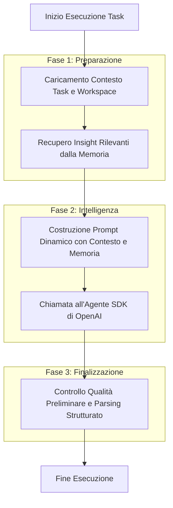

### **Capitolo 2: Il Primo Agente – L'Architettura di un Esecutore Specializzato (`SpecialistAgent`)**

**Data:** 22 Luglio

Con i nostri 15 Pilastri a farci da guida, era il momento di creare la nostra prima entità intelligente: l'agente esecutore. La tentazione iniziale, comune a molti progetti AI, è quella di creare un unico, onnipotente "super-agente" generalista. Un unico prompt che cerca di fare tutto. Abbiamo scartato questa idea quasi subito, perché viola un principio fondamentale dell'ingegneria del software e, come abbiamo scoperto, anche dell'ingegneria dei sistemi AI: il **Principio di Singola Responsabilità**.

#### **La Decisione Architetturale: Specialisti vs. Generalisti**

La nostra tesi era semplice: un team di specialisti altamente competenti nel proprio campo supererà sempre le performance di un singolo generalista che cerca di fare tutto. Questa decisione era un'applicazione diretta del nostro **Pilastro #2 (AI-Driven, zero hard-coding)**.

Invece di scrivere una logica complessa per gestire decine di casistiche, abbiamo deciso di creare una classe `Agent` generica, il cui comportamento specifico sarebbe stato definito non dal codice, ma dai **dati di configurazione** caricati dal database. In pratica, abbiamo creato un "attore" AI capace di interpretare qualsiasi "ruolo".

Il ruolo non è definito da una serie di `if/else` nel codice, ma da un prompt di sistema che dice all'LLM: *"Dimentica di essere un assistente generico. Da questo momento, tu sei Marco Bianchi, un Lead Developer con 10 anni di esperienza in architetture a microservizi. Il tuo compito è analizzare i problemi con un approccio tecnico e pragmatico."*

Questo approccio ci ha permesso di creare non un solo agente, ma una **fabbrica di agenti specializzati**.

| Vantaggi dell'Approccio a Specialisti | Descrizione | Pilastro di Riferimento |
| :--- | :--- | :--- |
| **Scalabilità** | Possiamo aggiungere nuovi ruoli (es. "Data Scientist") senza modificare il codice, semplicemente aggiungendo una nuova configurazione nel database. | #4 (Scalabile & Auto-apprendente) |
| **Manutenibilità** | È molto più semplice fare il debug e migliorare il prompt di un "Email Copywriter" che modificare un prompt monolitico di 2000 righe. | #10 (Codice Production-Ready) |
| **Performance AI** | Un LLM a cui viene dato un ruolo e un contesto specifici ("Tu sei un esperto di finanza...") produce risultati di qualità nettamente superiore rispetto a un prompt generico. | #2 (AI-Driven) |
| **Riusabilità** | Lo stesso `SpecialistAgent` può essere istanziato con diverse configurazioni in diversi workspace, promuovendo il riutilizzo del codice. | #4 (Componenti Riusabili) |

#### **Anatomia di uno `SpecialistAgent`**

Per dare concretezza a questa idea, abbiamo definito una struttura dati chiara e robusta utilizzando Pydantic. Questo modello non è solo un contenitore di dati, ma il nostro **"contratto"** che definisce cosa sia un agente all'interno del nostro sistema.

*Codice di riferimento: `backend/models.py`*
```python
class Agent(BaseModel):
    id: UUID = Field(default_factory=uuid4)
    workspace_id: UUID
    name: str
    role: str
    seniority: str
    status: str = "active"
    
    # Campi che definiscono la "personalità" e le competenze
    system_prompt: Optional[str] = None
    llm_config: Optional[Dict[str, Any]] = None
    tools: Optional[List[Dict[str, Any]]] = []
    
    # Dettagli per un'intelligenza più profonda
    hard_skills: Optional[List[Dict]] = []
    soft_skills: Optional[List[Dict]] = []
    background_story: Optional[str] = None
```

La logica di esecuzione, invece, risiede nel modulo `specialist_enhanced.py`. La funzione `execute` è il cuore pulsante dell'agente. Non contiene logica di business, ma orchestra le fasi del "ragionamento" di un agente.

**Flusso di Ragionamento di un Agente (`execute` method):**



#### **"War Story": Il Primo Crash – Oggetto vs. Dizionario**

Il nostro primo `SpecialistAgent` era pronto. Abbiamo lanciato il primo test di integrazione e, quasi subito, il sistema è andato in crash.

*Logbook del Disastro (22 Luglio):*
```
ERROR: 'Task' object has no attribute 'get'
File "/app/backend/ai_agents/tools.py", line 123, in get_memory_context_for_task
  task_name = current_task.get("name", "N/A")
AttributeError: 'Task' object has no attribute 'get'
```

Questo errore, apparentemente banale, nascondeva una delle lezioni più importanti di tutto il nostro percorso. Il problema non era un dato mancante, ma un **disallineamento di "tipo" tra i componenti del sistema**.

| Componente | Tipo di Dato Gestito | Problema |
| :--- | :--- | :--- |
| **Executor** | Oggetto Pydantic `Task` | Passava un oggetto strutturato e tipizzato. |
| **Tool `get_memory_context`** | Dizionario Python `dict` | Si aspettava un semplice dizionario per poter usare il metodo `.get()`. |

La soluzione immediata fu semplice, ma la lezione fu profonda.

*Codice di riferimento della Correzione: `backend/ai_agents/tools.py`*
```python
# Il task corrente potrebbe essere un oggetto Pydantic o un dizionario
if isinstance(current_task, Task):
    # Se è un oggetto Pydantic, lo convertiamo in un dizionario
    # per garantire la compatibilità con le funzioni a valle.
    current_task_dict = current_task.dict() 
else:
    # Se è già un dizionario, lo usiamo direttamente.
    current_task_dict = current_task

# Da qui in poi, usiamo sempre current_task_dict
task_name = current_task_dict.get("name", "N/A")
```

#### **La Lezione Appresa: L'Importanza dei Contratti Dati e delle Interfacce**

Quel primo crash ci ha insegnato che in un sistema complesso, specialmente uno che orchestra più agenti, **i confini tra i componenti devono essere protetti da "contratti dati" espliciti**.

1.  **Pydantic è la Nostra Legge:** Da quel momento, abbiamo stabilito che i modelli Pydantic sono la "source of truth" per la struttura dei dati. Ogni componente deve sapere esattamente che tipo di oggetto sta ricevendo e restituendo.
2.  **Validazione ai Confini (Anti-Corruption Layer):** La validazione e la trasformazione dei dati non devono avvenire in modo casuale, ma ai confini di ogni servizio o agente. Quando un dato entra in un componente, è responsabilità del componente stesso assicurarsi che sia nel formato corretto.
3.  **Test di Integrazione Espliciti:** I nostri test non dovevano più verificare solo la logica interna di un agente, ma anche la sua "firma" di input/output, assicurandosi che fosse compatibile con il resto del sistema.

Questa lezione è un'applicazione diretta del **Pilastro #10 (Codice sempre production-ready & testato)**. Un codice non è "production-ready" solo perché non ha bug evidenti; lo è quando le sue interazioni con gli altri componenti sono ben definite, prevedibili e testate.

> **Approfondimento: Il Vero Significato di "Production-Ready"**
>
> Questa esperienza ha cristallizzato la nostra filosofia: un sistema AI non è "production-ready" solo perché l'agente produce un output corretto in isolamento. La sua robustezza emerge dall'**affidabilità delle sue interconnessioni**. Il nostro target di lettori—architetti e senior developer—sa bene che la complessità non risiede nei singoli componenti, ma nelle loro interazioni. L'errore `AttributeError: 'Task' object has no attribute 'get'` non era un semplice bug, ma un sintomo di un'architettura con confini deboli. La lezione chiave che vogliamo trasmettere è questa: **l'intelligenza di un sistema complesso non è la somma delle sue parti, ma il prodotto della coerenza delle sue interfacce.** Avere "contratti dati" solidi come i modelli Pydantic non è burocrazia, ma il fondamento che permette a decine di agenti non-deterministici di collaborare in modo prevedibile, trasformando un insieme di solisti di talento in un'orchestra sinfonica.

---

**Conclusione del Capitolo**

Alla fine di questa prima fase, avevamo un singolo agente esecutore. Era robusto, testabile e affidabile. Ma era un solista. Poteva suonare la sua parte alla perfezione, ma non poteva ancora suonare in un'orchestra. La sua intelligenza era confinata all'interno del suo singolo task.

La prossima, inevitabile domanda era: *come facciamo a far suonare insieme decine di questi agenti senza creare una cacofonia?*

Questo ci ha portato direttamente alla sfida successiva: la creazione di un **Orchestratore**.
