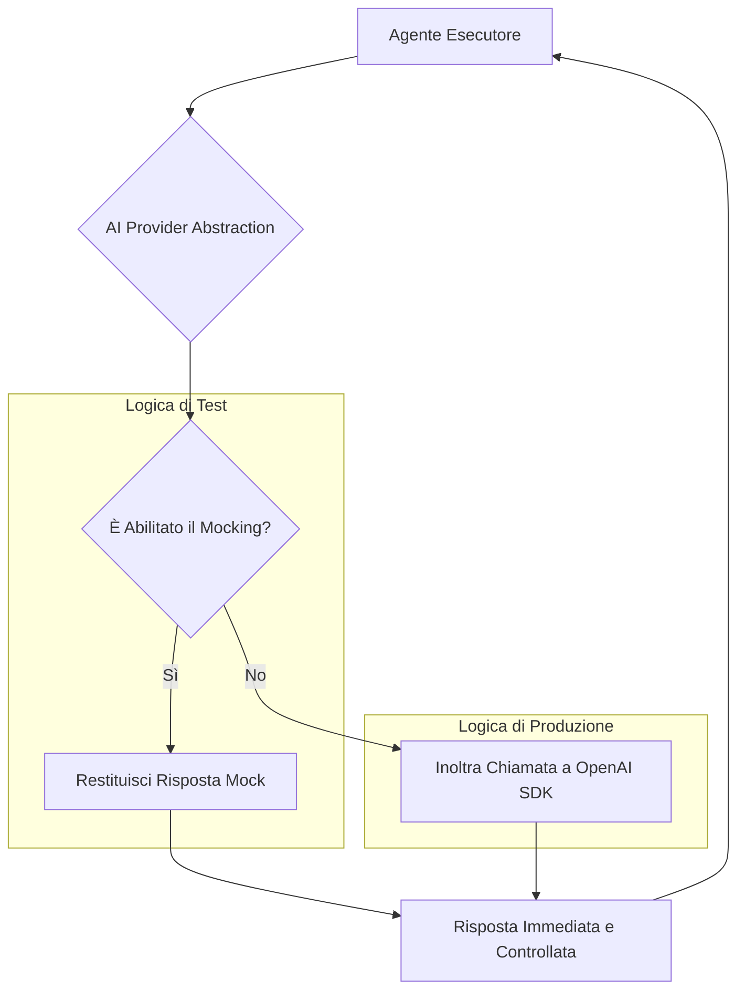

### **Capitolo 3: Isolare l'Intelligenza – L'Arte di Mockare un LLM**

**Data:** 23 Luglio

Avevamo un `SpecialistAgent` ben definito, un'architettura pulita e un contratto dati robusto. Eravamo pronti a costruire il resto del sistema. Ma ci siamo subito scontrati con un problema tanto banale quanto bloccante: **come si testa un sistema il cui cuore è una chiamata a un servizio esterno, imprevedibile e costoso come un LLM?**

Ogni esecuzione dei nostri test di integrazione avrebbe comportato:
1.  **Costi Monetari:** Chiamate reali alle API di OpenAI.
2.  **Lentezza:** Attese di secondi, a volte minuti, per una risposta.
3.  **Non-Determinismo:** Lo stesso input poteva produrre output leggermente diversi, rendendo i test inaffidabili.

Era chiaro che non potevamo costruire un flusso di Continuous Integration (CI) robusto in queste condizioni. Dovevamo trovare un modo per **isolare l'intelligenza** del nostro sistema, per testare tutta la logica di orchestrazione, validazione e gestione dei dati *attorno* all'LLM, senza dipendere dall'LLM stesso.

La soluzione è una tecnica fondamentale nell'ingegneria del software applicata al mondo AI: il **Mocking**.

#### **La Decisione Architetturale: Creare un "AI Abstraction Layer"**

Invece di far chiamare direttamente le API di OpenAI ai nostri agenti, abbiamo deciso di introdurre un livello di astrazione: l'**AI Provider Abstraction Layer**.

*Codice di riferimento: `backend/ai_provider_abstraction.py`*

Questo componente agisce come un "centralino telefonico" per tutte le chiamate AI. La sua responsabilità non è solo quella di inoltrare la chiamata, ma di gestirla in modo intelligente.

**Flusso di una Chiamata AI tramite l'Abstraction Layer:**



Questa architettura ci ha dato un controllo totale. Tramite una semplice variabile d'ambiente (`USE_MOCK_AI_PROVIDER`), potevamo decidere se il sistema dovesse parlare con la vera AI di OpenAI o con un nostro "simulatore" locale.

#### **Anatomia di un "AI Mock Provider"**

Il nostro mock provider non era un semplice pezzo di codice che restituiva una stringa statica. Lo abbiamo progettato per essere uno strumento di debug potente, capace di simulare diversi scenari.

*Codice di riferimento: `backend/tests/mocks/mock_ai_provider.py` (ipotetico, basato sulla logica che abbiamo implementato)*

```python
class MockAIProvider:
    def __init__(self, behavior_config: dict):
        self.behavior = behavior_config

    async def call_ai(self, prompt: str, context: dict) -> dict:
        # Simula la latenza di rete
        if self.behavior.get("simulate_latency", True):
            await asyncio.sleep(0.1)

        # Simula un fallimento dell'API
        if self.behavior.get("should_fail", False):
            raise Exception("Simulated API Error: 503 Service Unavailable")

        # Simula una risposta malformattata
        if self.behavior.get("return_malformed_json", False):
            return {"response": "Questo non è un JSON valido {"}

        # Restituisce una risposta predefinita basata sul contesto
        task_type = context.get("task_type", "generic")
        if task_type == "email_generation":
            return {"response": "Ecco una bozza di email..."}
        else:
            return {"response": "Ecco un risultato generico..."}
```

Questo approccio ci ha permesso di scrivere test che verificassero scenari altrimenti impossibili da replicare in modo affidabile.

| Scenario di Test | Come lo abbiamo testato con il Mocking | Pilastro di Riferimento |
| :--- | :--- | :--- |
| **Gestione degli Errori API** | Abbiamo configurato il mock per simulare un errore 503 e verificato che il nostro `Executor` gestisse l'eccezione correttamente, mettendo il task in stato di "retry". | #10 (Production-Ready) |
| **Robustezza del Parsing** | Abbiamo istruito il mock a restituire JSON malformattato e verificato che il nostro sistema di parsing non andasse in crash, ma gestisse l'errore in modo controllato. | #10 (Production-Ready) |
| **Logica di Business Complessa** | Abbiamo potuto testare flussi complessi con decine di chiamate AI in pochi secondi, simulando risposte coerenti e immediate, senza costi e senza attese. | #1 (SDK Nativo) |

#### **"War Story": Il Commit che ha Salvato il Budget (e il Progetto)**

*Evidenza dal Log di Git: `f7627da (Fix stubs and imports for tests)`*

Questa modifica, apparentemente innocua, è stata una delle più importanti della fase iniziale. Prima di questo commit, i nostri primi test di integrazione, eseguiti in un ambiente di CI, facevano **chiamate reali alle API di OpenAI**.

Il primo giorno, abbiamo esaurito una parte significativa del nostro budget di sviluppo in poche ore, semplicemente perché ogni push su un branch avviava una serie di test che chiamavano `gpt-4` decine di volte.

**Il Contesto Finanziario: L'AI come Voce di Bilancio**

La nostra non era solo una preoccupazione tecnica. Era una crisi finanziaria incombente. Come evidenzia l'analisi di Tunguz, l'AI sta rapidamente diventando una delle principali voci di spesa in R&D, potendo raggiungere facilmente il 10-15% del budget totale. I costi non sono solo le sottoscrizioni, ma l'uso imprevedibile delle API. Nei nostri primi giorni, stavamo vedendo fatture che suggerivano costi di migliaia di euro al mese, solo per i test.

**La lezione è stata brutale ma fondamentale:** *Un sistema AI che non può essere testato in modo economico e affidabile è un sistema che non può essere sviluppato in modo sostenibile.* Un'architettura che non considera i costi delle API come una variabile di primo livello è destinata a fallire.

L'implementazione dell'AI Abstraction Layer e del Mock Provider non è stata quindi solo una best practice di testing; è stata una **decisione di sopravvivenza economica**. Ha trasformato lo sviluppo da un'attività a costo variabile e imprevedibile a un'operazione a costo fisso e controllato. I nostri test di CI sono diventati:
*   **Gratuiti:** 99% dei test ora girano senza costi API.
*   **Veloci:** Un'intera suite di test che prima richiedeva 10 minuti ora ne impiega 30 secondi.
*   **Affidabili:** I test sono diventati deterministici, producendo sempre lo stesso risultato a parità di input.

Solo un set molto ristretto di test end-to-end, eseguiti manualmente prima di un rilascio, viene eseguito con le chiamate reali per una validazione finale.

---

**Conclusione del Capitolo**

Isolare l'intelligenza è stato il passo che ci ha permesso di passare da "sperimentare con l'AI" a "fare ingegneria del software con l'AI". Ci ha dato la fiducia e gli strumenti per costruire il resto dell'architettura su fondamenta solide e testabili.

Con un singolo agente robusto e un ambiente di test affidabile, eravamo finalmente pronti ad affrontare la sfida successiva: far collaborare più agenti. Questo ci ha portato alla creazione dell'**Orchestratore**, il cuore pulsante del nostro team AI.
