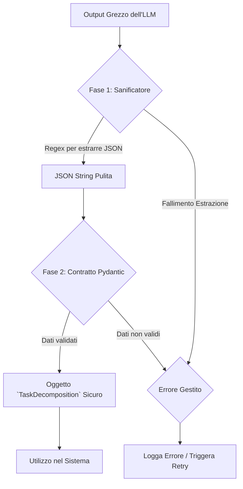

### **Capitolo 4: "War Story" – Il Dramma del Parsing e la Nascita del "Contratto AI"**

**Data:** 24 Luglio

Avevamo un agente testabile e un ambiente di test robusto. Eravamo pronti a iniziare a costruire funzionalità di business reali. Il nostro primo obiettivo era semplice: far sì che un agente, dato un obiettivo, potesse scomporlo in una lista di task strutturati.

Sembrava facile. Il prompt era chiaro, l'agente rispondeva. Ma quando abbiamo provato a usare l'output, il sistema ha iniziato a fallire in modi imprevedibili e frustranti. Benvenuti nel **Dramma del Parsing**.

#### **Il Problema: L'Illusione della Struttura**

Chiedere a un LLM di rispondere in formato JSON è una pratica comune. Il problema è che un LLM **non genera JSON, genera testo che *assomiglia* a JSON**. Questa sottile differenza è la fonte di innumerevoli bug e notti insonni.

**Una Galleria degli Orrori JSON dai Nostri Log**

I nostri log erano un museo degli orrori del parsing. Ecco alcuni esempi reali che abbiamo affrontato:

*   **La Virgola Traditrice (Trailing Comma):**
    ```
    ERROR: json.decoder.JSONDecodeError: Trailing comma: line 8 column 2 (char 123)
    {"tasks": [{"name": "Task 1"}, {"name": "Task 2"},]}
    ```

*   **L'Apostrofo Ribelle (Single Quotes):**
    ```
    ERROR: json.decoder.JSONDecodeError: Expecting property name enclosed in double quotes
    {'tasks': [{'name': 'Task 1'}]}
    ```

*   **L'Allucinazione Strutturale:**
    ```
    "Certamente, ecco il JSON che hai richiesto:
    [
        {"task": "Analisi del mercato"}
    ]
    Spero che questo sia d'aiuto per il tuo progetto!"
    ```

*   **Il Fallimento Silenzioso (The Null Response):**
    ```
    ERROR: 'NoneType' object is not iterable
    # L'AI, non sapendo cosa rispondere, ha restituito 'null'.
    ```

Questi non erano casi isolati; erano la norma. Abbiamo capito che non potevamo costruire un sistema affidabile se il nostro livello di comunicazione con l'AI era così fragile.

#### **La Soluzione Architetturale: Un "Sistema Immunitario" per l'Input AI**

Abbiamo smesso di considerare questi errori come bug da correggere uno per uno. Li abbiamo visti come un problema sistemico che richiedeva una soluzione architetturale: un **"Anti-Corruption Layer"** per proteggere il nostro sistema dall'imprevedibilità dell'AI.

Questa soluzione si basa su due componenti che lavorano in tandem:

**Fase 1: Il "Sanificatore" di Output (`IntelligentJsonParser`)**

Abbiamo creato un servizio dedicato non solo a parsare, ma a **isolare, pulire e correggere** l'output grezzo dell'LLM.

*Codice di riferimento: `backend/utils/json_parser.py` (ipotetico)*
```python
import re
import json

class IntelligentJsonParser:
    
    def extract_and_parse(self, raw_text: str) -> dict:
        """
        Estrae, pulisce e parsa un blocco JSON da una stringa di testo.
        """
        try:
            # 1. Estrazione: Trova il blocco JSON, ignorando il testo circostante.
            json_match = re.search(r'\{.*\}|\[.*\]', raw_text, re.DOTALL)
            if not json_match:
                raise ValueError("Nessun blocco JSON trovato nel testo.")
            
            json_string = json_match.group(0)
            
            # 2. Pulizia: Rimuove errori comuni come le trailing commas.
            # (Questa è una semplificazione; la logica reale è più complessa)
            json_string = re.sub(r',\s*([\}\]])', r'\1', json_string)
            
            # 3. Parsing: Converte la stringa pulita in un oggetto Python.
            return json.loads(json_string)

        except Exception as e:
            logger.error(f"Parsing fallito: {e}")
            # Qui potrebbe partire una logica di "retry"
            raise
```

**Fase 2: Il "Contratto Dati" Pydantic**

Una volta ottenuto un JSON sintatticamente valido, dovevamo garantirne la **validità semantica**. La struttura e i tipi di dati erano corretti? Per questo, abbiamo usato Pydantic come un "contratto" inflessibile.

*Codice di riferimento: `backend/models.py`*
```python
from pydantic import BaseModel, Field
from typing import List, Literal

class SubTask(BaseModel):
    task_name: str = Field(..., description="Il nome del sotto-task.")
    description: str
    priority: Literal["low", "medium", "high"]

class TaskDecomposition(BaseModel):
    tasks: List[SubTask]
    reasoning: str
```
Qualsiasi JSON che non rispettasse esattamente questa struttura veniva scartato, generando un errore controllato invece di un crash imprevedibile a valle.

**Flusso di Validazione Completo:**



#### **La Lezione Appresa: L'AI è un Collaboratore, non un Compilatore**

Questa esperienza ha cambiato radicalmente il nostro modo di interagire con gli LLM e ha rafforzato diversi dei nostri pilastri:

*   **Pilastro #10 (Production-Ready):** Un sistema non è pronto per la produzione se non ha meccanismi di difesa contro input inaffidabili. Il nostro parser è diventato parte del nostro "sistema immunitario".
*   **Pilastro #14 (Service-Layer Modulare):** Invece di spargere logica di parsing `try-except` in tutto il codice, abbiamo creato un servizio centralizzato e riutilizzabile.
*   **Pilastro #2 (AI-Driven):** Paradossalmente, creando queste rigide barriere di validazione, abbiamo reso il nostro sistema *più* AI-Driven. Potevamo ora delegare task sempre più complessi all'AI, sapendo di avere una rete di sicurezza in grado di gestire i suoi output imperfetti.

Abbiamo imparato a trattare l'AI come un **collaboratore incredibilmente talentuoso ma a volte distratto**. Il nostro compito come ingegneri non è solo "chiedere", ma anche "verificare, validare e, se necessario, correggere" il suo lavoro.

---
> **Key Takeaways del Capitolo:**
>
> *   **Mai fidarsi dell'output di un LLM.** Trattalo sempre come un input utente non attendibile.
> *   **Separare il parsing dalla validazione.** Prima ottieni un JSON sintatticamente corretto, poi valida la sua struttura e i suoi tipi con un modello (come Pydantic).
> *   **Centralizza la logica di parsing.** Crea un servizio dedicato invece di ripetere la logica di gestione degli errori in tutto il codebase.
> *   **Un sistema robusto permette una maggiore delega all'AI.** Più le tue barriere sono solide, più puoi permetterti di affidare compiti complessi all'intelligenza artificiale.
---

**Conclusione del Capitolo**

Con un sistema di parsing e validazione affidabile, avevamo finalmente un modo per dare istruzioni complesse all'AI e ricevere in cambio dati strutturati su cui potevamo contare. Avevamo trasformato l'output dell'AI da una fonte di bug a una risorsa affidabile.

Eravamo pronti per il passo successivo: iniziare a costruire un vero e proprio team di agenti. Ma questo ci ha portato a una domanda fondamentale: dovevamo costruire il nostro sistema di orchestrazione da zero o affidarci a uno strumento esistente? La risposta a questa domanda avrebbe definito l'intera architettura del nostro progetto.
