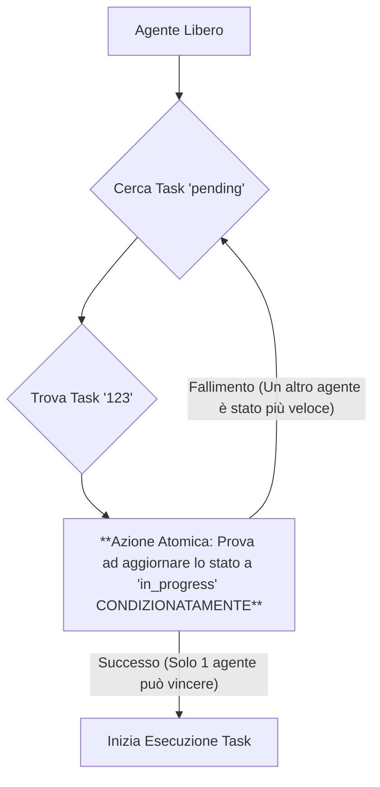

### **Capitolo 6: L'Agente e il suo Ambiente – Progettare le Interazioni Fondamentali**

**Data:** 25 Luglio

Un agente AI, per quanto intelligente, è inutile se non può **percepire e agire** sul mondo che lo circonda. Il nostro `SpecialistAgent` era come un cervello in una vasca: poteva pensare, ma non poteva né leggere dati né scrivere risultati.

Questo capitolo descrive come abbiamo costruito le "braccia" e le "gambe" dei nostri agenti: le interazioni fondamentali con il database, che rappresentava il loro ambiente di lavoro.

#### **La Decisione Architetturale: Un Database come "Stato del Mondo" Condiviso**

La nostra prima grande decisione è stata quella di usare un database (Supabase, in questo caso) non solo come un semplice archivio, ma come la **fonte unica della verità sullo "stato del mondo"**. Ogni informazione rilevante per il progetto – task, obiettivi, deliverable, insight della memoria – sarebbe stata memorizzata lì.

Questo approccio, noto come **"Shared State"**, ha diversi vantaggi in un sistema multi-agente:

*   **Coordinamento Implicito:** Due agenti non hanno bisogno di parlarsi direttamente. Se l'Agente A completa un task e aggiorna il suo stato su "completed" nel database, l'Agente B può vedere questo cambiamento e iniziare il task successivo che dipendeva dal primo.
Il database diventa il loro "tabellone di lavoro" condiviso.
*   **Persistenza e Resilienza:** Se un agente va in crash, il suo lavoro non viene perso. Lo stato del mondo è salvato in modo persistente. Al riavvio, un altro agente (o lo stesso) può riprendere esattamente da dove si era interrotto.
*   **Tracciabilità e Audit:** Ogni azione e ogni cambiamento di stato viene registrato. Questo è fondamentale per il debug, per l'analisi delle performance e per la trasparenza richiesta dal nostro **Pilastro #13 (Trasparenza & Explainability)**.

#### **Le Interazioni Fondamentali: I "Verbi" dei Nostri Agenti**

Abbiamo definito un set di interazioni base, dei "verbi" che ogni agente doveva essere in grado di compiere. Per ognuno di questi, abbiamo creato una funzione dedicata nel nostro `database.py`, che agiva come un **Data Access Layer (DAL)**, un altro livello di astrazione per proteggerci dai dettagli specifici di Supabase.

*Codice di riferimento: `backend/database.py`*

| Verbo dell'Agente | Funzione Corrispondente nel DAL | Scopo Strategico |
| :--- | :--- | :--- |
| **Leggere un Task** | `get_task(task_id)` | Permette a un agente di capire qual è il suo compito attuale. |
| **Aggiornare lo Stato di un Task** | `update_task_status(...)` | Comunica al resto del sistema che un task è in corso, completato o fallito. |
| **Creare un Nuovo Task** | `create_task(...)` | Permette a un agente di delegare o scomporre il lavoro (fondamentale per la pianificazione). |
| **Salvare un Insight** | `store_insight(...)` | L'azione fondamentale per l'apprendimento. Permette a un agente di contribuire alla memoria collettiva. |
| **Leggere la Memoria** | `get_relevant_context(...)` | Permette a un agente di imparare dalle esperienze passate prima di agire. |
| **Creare un Deliverable** | `create_deliverable(...)` | L'azione finale che produce valore per l'utente. |

#### **"War Story": Il Pericolo delle "Race Conditions" e il Pessimistic Locking**

Con più agenti che lavoravano in parallelo, ci siamo scontrati con un problema classico dei sistemi distribuiti: le **race conditions**.

*Logbook del Disastro (25 Luglio):*
```
WARNING: Agent A started task '123', but Agent B had already started it 50ms earlier.
ERROR: Duplicate entry for key 'PRIMARY' on table 'goal_progress_logs'.
```

**Cosa stava succedendo?** Due agenti, vedendo lo stesso task "pending" nel database, cercavano di prenderlo in carico contemporaneamente. Entrambi lo aggiornavano a "in_progress", e entrambi, una volta finito, cercavano di aggiornare il progresso dello stesso obiettivo, causando un conflitto.

La soluzione è stata implementare una forma di **"Pessimistic Locking" a livello applicativo**.

**Flusso di Acquisizione di un Task (Corretto):**



*Codice di riferimento della Correzione (logica concettuale in `Executor`):*
```python
# Questa è una transazione atomica a livello di database
# Tenta di aggiornare lo stato SOLO SE lo stato attuale è ancora 'pending'
update_result = supabase.table("tasks") \
    .update({"status": "in_progress", "agent_id": self.id}) \
    .eq("id", task_id) \
    .eq("status", "pending") \
    .execute()

# Se la riga aggiornata è 1, allora abbiamo "vinto" il lock
if len(update_result.data) == 1:
    # Procedi con l'esecuzione
    execute_task(task_id)
else:
    # Un altro agente ha preso il task, torna a cercare
    logger.info(f"Task {task_id} già preso da un altro agente. Cerco un altro task.")
```
Questa logica ha garantito che un task potesse essere preso in carico da **un solo agente alla volta**, risolvendo il problema alla radice e rendendo il nostro sistema di esecuzione distribuita molto più robusto.

#### **La Lezione Appresa: L'Autonomia Richiede Regole di Convivenza**

Costruire un sistema multi-agente non significa solo creare agenti intelligenti, ma anche definire le **regole di interazione e di accesso alle risorse condivise**.

*   **Pilastro #14 (Tool/Service-Layer Modulare):** Il nostro `database.py` è diventato l'unica porta di accesso allo "stato del mondo". Nessun agente poteva modificare il database direttamente, ma doveva passare attraverso le funzioni del nostro DAL, dove potevamo implementare logiche complesse come il locking.
*   **Pilastro #10 (Production-Ready):** Un sistema che non gestisce correttamente la concorrenza non è production-ready. Questa lezione ci ha costretto a pensare ai problemi tipici dei sistemi distribuiti fin dall'inizio.

---
> **Key Takeaways del Capitolo:**
>
> *   **Usa il Database come Stato Condiviso:** È un pattern semplice e potente per il coordinamento implicito in sistemi multi-agente.
> *   **Crea un Data Access Layer (DAL):** Astrai le interazioni con il database in un servizio dedicato. Questo ti permette di aggiungere logiche complesse (caching, locking, retry) in un unico posto.
> *   **Pensa alla Concorrenza fin dal Giorno Zero:** Se più agenti possono agire sulla stessa risorsa, devi implementare una strategia di locking per prevenire le race conditions.
---

**Conclusione del Capitolo**

Con un ambiente definito e regole di interazione chiare, i nostri agenti erano pronti a lavorare insieme. Avevamo le fondamenta per un vero team.

Ma un team ha bisogno di una guida. Ha bisogno di qualcuno che decida *cosa* fare, *quando* farlo e *chi* deve farlo. Era il momento di costruire il cervello del nostro sistema: l'**Orchestratore**.

```