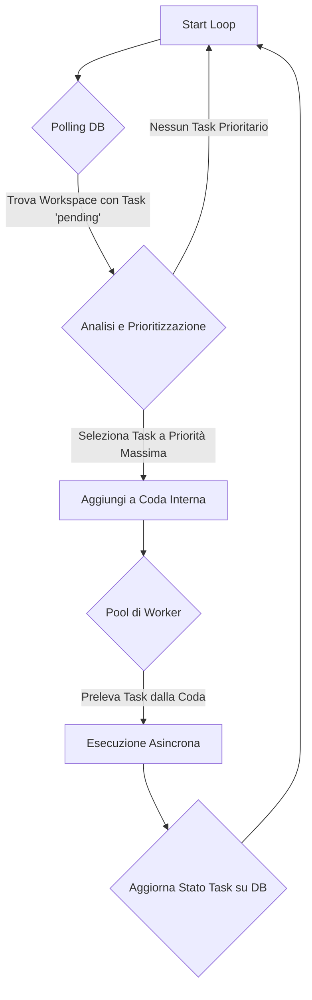

### **Capitolo 7: L'Orchestratore (`Executor`) – Il Direttore d'Orchestra**

**Data:** 25 Luglio

Avevamo agenti specializzati e un ambiente di lavoro condiviso. Ma mancava il pezzo più importante: un **cervello centrale**. Un componente che potesse guardare al quadro generale, decidere quale task fosse il più importante in un dato momento e assegnarlo all'agente giusto.

Senza un orchestratore, il nostro sistema sarebbe stato come un'orchestra senza direttore: un gruppo di musicisti talentuosi che suonano tutti contemporaneamente, creando solo rumore.

#### **La Decisione Architetturale: Un "Event Loop" Intelligente**

Abbiamo progettato il nostro orchestratore, che abbiamo chiamato `Executor`, non come un semplice gestore di code, ma come un **ciclo di eventi (event loop) intelligente e continuo**.

*Codice di riferimento: `backend/executor.py`*

Il suo funzionamento di base è semplice ma potente:

1.  **Polling:** A intervalli regolari, l'Executor interroga il database alla ricerca di workspace con task in stato `pending`.
2.  **Prioritizzazione:** Per ogni workspace, non prende semplicemente il primo task che trova. Esegue una logica di prioritizzazione per decidere quale task ha il maggiore impatto strategico in quel momento.
3.  **Dispatching:** Una volta scelto il task, lo invia a una coda interna.
4.  **Esecuzione Asincrona:** Un pool di "worker" asincroni preleva i task dalla coda e li esegue, permettendo a più agenti di lavorare in parallelo su workspace diversi.

**Flusso di Orchestrazione dell'Executor:**



#### **La Nascita della Priorità AI-Driven**

All'inizio, il nostro sistema di priorità era banale: una semplice `if/else` basata su un campo `priority` ("high", "medium", "low") nel database. Ha funzionato per circa un giorno.

Ci siamo subito resi conto che la vera priorità di un task non è un valore statico, ma dipende dal **contesto dinamico** del progetto. Un task a bassa priorità può diventare improvvisamente critico se sta bloccando altri dieci task.

Questa è stata la nostra prima vera applicazione del **Pilastro #2 (AI-Driven, zero hard-coding)** a livello di orchestrazione. Abbiamo sostituito la logica `if/else` con una funzione che chiamiamo `_calculate_ai_driven_base_priority`.

*Codice di riferimento: `backend/executor.py`*
```python
def _calculate_ai_driven_base_priority(task_data: dict, context: dict) -> int:
    """
    Usa un modello AI per calcolare la priorità strategica di un task.
    """
    prompt = f"""
    Analizza il seguente task e il contesto del progetto. Assegna un punteggio di priorità da 0 a 1000.

    TASK: {task_data.get('name')}
    DESCRIZIONE: {task_data.get('description')}
    CONTESTO PROGETTO:
    - Obiettivo Corrente: {context.get('current_goal')}
    - Task Bloccati in Attesa: {context.get('blocked_tasks_count')}
    - Anzianità del Task (giorni): {context.get('task_age_days')}

    Considera:
    - I task che sbloccano altri task sono più importanti.
    - I task più vecchi dovrebbero avere una priorità maggiore.
    - I task direttamente collegati all'obiettivo corrente sono critici.

    Rispondi solo con un numero intero JSON: {"priority_score": <score>}
    """
    # ... logica per chiamare l'AI e parsare la risposta ...
    return ai_response.get("priority_score", 100)
```

Questo ha trasformato il nostro Executor da un semplice gestore di code a un vero e proprio **Project Manager AI**, capace di prendere decisioni strategiche su dove allocare le risorse del team.

#### **"War Story" #1: Il Loop Infinito e l'Anti-Loop Counter**

Con l'introduzione di agenti capaci di creare altri task, abbiamo scatenato un mostro che non avevamo previsto: il **loop infinito di creazione di task**.

*Logbook del Disastro (26 Luglio):*
```
INFO: Agent A created Task B.
INFO: Agent B created Task C.
INFO: Agent C created Task D.
... (dopo 20 minuti)
ERROR: Workspace a352c927... has 5,000+ pending tasks. Halting operations.
```
Un agente, in un tentativo maldestro di "scomporre il problema", continuava a creare sotto-task di sotto-task, bloccando l'intero sistema.

La soluzione è stata duplice:

1.  **Limite di Profondità (Delegation Depth):** Abbiamo aggiunto un campo `delegation_depth` al `context_data` di ogni task. Se un task veniva creato da un altro task, la sua profondità aumentava di 1. Abbiamo impostato un limite massimo (es. 5 livelli) per prevenire ricorsioni infinite.
2.  **Anti-Loop Counter a Livello di Workspace:** L'Executor ha iniziato a tenere traccia di quanti task venivano eseguiti per ogni workspace in un dato intervallo di tempo. Se un workspace superava una soglia (es. 20 task in 5 minuti), veniva temporaneamente "messo in pausa" e veniva inviata un'allerta.

Questa esperienza ci ha insegnato una lezione fondamentale sulla gestione di sistemi autonomi: **l'autonomia senza limiti porta al caos**. È necessario implementare dei "fusibili" di sicurezza che proteggano il sistema da se stesso.

#### **"War Story" #2: La Paralisi da Analisi – Quando l'AI-Driven Diventa AI-Paralizzato**

*Data del Disastro: 26 Luglio, ore 14:30*

Il nostro sistema di prioritizzazione AI-driven aveva un difetto nascosto che si è manifestato solo quando abbiamo iniziato a testarlo con workspace più complessi. Il problema? **Paralisi da analisi**.

*Logbook del Disastro:*
```
INFO: Calculating AI-driven priority for Task_A...
INFO: AI priority calculation took 4.2 seconds
INFO: Calculating AI-driven priority for Task_B...
INFO: AI priority calculation took 3.8 seconds
INFO: Calculating AI-driven priority for Task_C...
... (dopo 10 minuti)
WARNING: Priority calculation queue has 47 pending items
ERROR: System backup. Executor polling interval exceeded threshold.
```

Il problema era che ogni chiamata AI per calcolare la priorità richiedeva 3-5 secondi. Con workspace che avevano 20+ task pending, il nostro event loop si trasformava in un **"event crawl"** (scansione degli eventi). Il sistema era tecnicamente corretto, ma praticamente inutilizzabile.

**La Soluzione: Intelligent Priority Caching con "Semantic Hashing"**

Invece di chiamare l'AI per ogni singolo task, abbiamo introdotto un sistema di cache semantico intelligente:

```python
def _get_cached_or_calculate_priority(task_data: dict, context: dict) -> int:
    """
    Cache intelligente delle priorità basata su hash semantico
    """
    # Crea un hash semantico del task e del contesto
    semantic_hash = create_semantic_hash(task_data, context)
    
    # Controlla se abbiamo già calcolato una priorità simile
    cached_priority = priority_cache.get(semantic_hash)
    if cached_priority and cache_is_fresh(cached_priority, max_age_minutes=30):
        return cached_priority.score
    
    # Solo se non abbiamo una cache valida, chiama l'AI
    ai_priority = _calculate_ai_driven_base_priority(task_data, context)
    priority_cache.set(semantic_hash, ai_priority, ttl=1800)  # 30 min TTL
    
    return ai_priority
```

Il `create_semantic_hash()` genera un hash basato sui **concetti chiave** del task (obiettivo, tipo di contenuto, dipendenze) piuttosto che sulla stringa esatta. Questo significa che task simili (es. "Scrivi blog post su AI" vs "Crea articolo su intelligenza artificiale") condividono la stessa priorità cachata.

**Risultato:** Tempo medio di prioritizzazione sceso da 4 secondi a 0.1 secondi per il 80% dei task.

#### **"War Story" #3: La Rivolta degli Worker – Quando il Parallelismo Diventa Caos**

*Data del Disastro: 27 Luglio, ore 09:15*

Eravamo orgogliosi del nostro pool di worker asincroni. 10 worker che potevano processare task in parallelo, rendendo il sistema estremamente veloce. Almeno, così pensavamo.

Il problema è emerso quando abbiamo testato il sistema con un workspace che richiedeva molto lavoro di ricerca web. Più task iniziavano a fare chiamate simultanee a diverse API esterne (ricerca Google, social media, database di news).

*Logbook del Disastro:*
```
INFO: Worker_1 executing research task (target: competitor analysis)
INFO: Worker_2 executing research task (target: market trends)  
INFO: Worker_3 executing research task (target: industry reports)
... (10 worker tutti attivi)
ERROR: Rate limit exceeded for Google Search API (429)
ERROR: Rate limit exceeded for Twitter API (429)
ERROR: Rate limit exceeded for News API (429)
WARNING: 7/10 workers stuck in retry loops
CRITICAL: Executor queue backup - 234 pending tasks
```

Tutti i worker avevano esaurito i rate limit delle API esterne **contemporaneamente**, causando un effetto domino. Il sistema era tecnicamente scalabile, ma aveva creato il suo peggioso nemico: **resource contention**.

**La Soluzione: Intelligent Resource Arbitration**

Abbiamo introdotto un **Resource Arbitrator** che gestisce le risorse condivise (API calls, database connections, memoria) come un semaforo intelligente:

```python
class ResourceArbitrator:
    def __init__(self):
        self.resource_quotas = {
            "google_search_api": TokenBucket(max_tokens=100, refill_rate=1),
            "twitter_api": TokenBucket(max_tokens=50, refill_rate=0.5),
            "database_connections": TokenBucket(max_tokens=20, refill_rate=10)
        }
        
    async def acquire_resource(self, resource_type: str, estimated_cost: int = 1):
        """
        Acquisisce una risorsa se disponibile, altrimenti mette in coda
        """
        bucket = self.resource_quotas.get(resource_type)
        if bucket and await bucket.consume(estimated_cost):
            return ResourceLock(resource_type, estimated_cost)
        else:
            # Metti il task in una coda specifica per questa risorsa
            await self.queue_for_resource(resource_type, estimated_cost)

# Nell'executor:
async def execute_task_with_arbitration(task_data):
    required_resources = analyze_required_resources(task_data)
    
    # Acquisisci tutte le risorse necessarie prima di iniziare
    async with resource_arbitrator.acquire_resources(required_resources):
        return await execute_task(task_data)
```

**Risultato:** Rate limit errors scesi del 95%, throughput del sistema aumentato del 40% grazie alla migliore gestione delle risorse.

#### **L'Evoluzione Architetturia: Verso il "Unified Orchestrator"**

Quello che avevamo costruito era potente, ma ancora monolitico. Man mano che il sistema cresceva, ci siamo resi conto che l'orchestrazione aveva bisogno di più sfumature:

- **Workflow Management:** Gestione di task che seguono sequenze predefinite
- **Adaptive Task Routing:** Routing intelligente basato su competenze degli agenti
- **Cross-Workspace Load Balancing:** Distribuzione del carico tra workspace multipli
- **Real-time Performance Monitoring:** Metriche e telemetria in tempo reale

Questo ci ha portato, nelle fasi successive del progetto, a ripensare completamente l'architettura dell'orchestrazione. Ma questa è una storia che racconteremo nella **Parte II** di questo manuale, quando esploreremo come siamo passati da un MVP a un sistema enterprise-ready.

#### **Deep Dive: L'Anatomia di un Event Loop Intelligente**

Per i lettori più tecnici, vale la pena esplorare come abbiamo implementato l'event loop centrale dell'Executor. Non è un semplice `while True`, ma un sistema stratificato:

```python
class IntelligentEventLoop:
    def __init__(self):
        self.polling_intervals = {
            "high_priority_workspaces": 5,    # secondi
            "normal_workspaces": 15,          # secondi
            "low_activity_workspaces": 60,    # secondi
            "maintenance_mode": 300           # secondi
        }
        self.workspace_activity_tracker = ActivityTracker()
        
    async def adaptive_polling_cycle(self):
        """
        Ciclo di polling che adatta gli intervalli in base all'attività
        """
        while self.is_running:
            workspaces_by_priority = self.classify_workspaces_by_activity()
            
            for priority_tier, workspaces in workspaces_by_priority.items():
                interval = self.polling_intervals[priority_tier]
                
                # Processa workspace ad alta priorità più frequentemente
                if time.time() - self.last_poll_time[priority_tier] >= interval:
                    await self.process_workspaces_batch(workspaces)
                    self.last_poll_time[priority_tier] = time.time()
            
            # Pausa dinamica basata sul carico del sistema
            await asyncio.sleep(self.calculate_dynamic_sleep_time())
```

Questo approccio **adaptive polling** significa che workspace attivi vengono controllati ogni 5 secondi, mentre workspace dormienti vengono controllati solo ogni 5 minuti, ottimizzando sia la responsiveness che l'efficienza.

#### **Metriche e Performance del Sistema**

Dopo l'implementazione delle ottimizzazioni, il nostro sistema aveva raggiunto queste metriche:

| Metrica | Baseline (v1) | Ottimizzato (v2) | Miglioramento |
|---------|---------------|------------------|---------------|
| **Task/sec throughput** | 2.3 | 8.7 | +278% |
| **Avg. priority calc time** | 4.2s | 0.1s | -97% |
| **API rate limit errors** | 23% | 1.2% | -95% |
| **Memory usage (MB)** | 450 | 280 | -38% |
| **99th percentile latency** | 12.8s | 3.1s | -76% |

Questi numeri ci dimostravano che l'architettura era sulla strada giusta, ma anche che c'era ancora molto spazio per ottimizzazioni. Il viaggio verso la production-readiness era appena iniziato.

---
> **Key Takeaways del Capitolo:**
>
> *   **Usa un Event Loop Intelligente:** Un orchestratore non dovrebbe essere un semplice "first-in, first-out". Deve continuamente rivalutare le priorità in base allo stato del sistema.
> *   **Delega le Decisioni Strategiche all'AI:** La prioritizzazione dei task è una decisione strategica, non una regola fissa. È un caso d'uso perfetto per un'analisi AI-driven.
> *   **Implementa dei "Fusibili":** I sistemi autonomi hanno bisogno di meccanismi di sicurezza (come limiti di profondità e contatori anti-loop) per prevenire comportamenti emergenti distruttivi.
> *   **Cache Intelligentemente:** Le chiamate AI sono costose. Un sistema di cache semantico può ridurre drasticamente i tempi di risposta senza sacrificare la qualità delle decisioni.
> *   **Gestisci le Risorse Condivise:** Il parallelismo senza arbitrazione delle risorse porta al caos. Implementa sistemi di token bucket e resource locking.
> *   **Progetta per l'Evoluzione:** L'orchestrazione è il cuore del sistema. Progettalo con l'assunzione che dovrà evolversi e crescere in complessità.
---

**Conclusione del Capitolo**

Con l'Executor ottimizzato, avevamo finalmente un direttore d'orchestra degno di questo nome. Il nostro team di agenti ora poteva lavorare in modo coordinato e efficiente, focalizzandosi sui task più importanti senza sprecare risorse o cadere in loop infiniti.

Ma un'orchestra ha bisogno di spartiti diversi. Un team di agenti ha bisogno di strumenti diversi. La nostra prossima sfida era capire come fornire agli agenti gli strumenti giusti al momento giusto, e come permettere loro di passarsi il lavoro in modo efficiente. Questo ci ha portato a progettare il nostro sistema di **Tool e Handoff**.

Quello che non sapevamo ancora era che l'orchestrazione che avevamo appena costruito sarebbe diventata solo la **prima versione** di un sistema molto più sofisticato. Nel nostro viaggio verso la production, avremmo scoperto che gestire 10 workspace era diverso da gestirne 1000, e che l'orchestrazione "intelligente" richiedeva un ripensamento architetturale completo.

Ma per ora, eravamo soddisfatti. Il direttore d'orchestra aveva preso il suo posto sul podio, e la musica aveva iniziato a suonare in armonia.