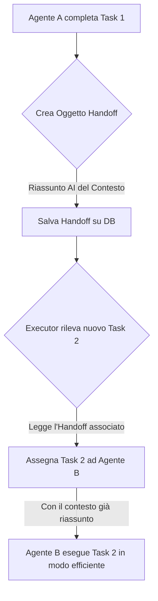

### **Capitolo 8: "War Story" – La Staffetta Mancata e la Nascita degli Handoff**

**Data:** 26 Luglio

Il nostro Executor funzionava. I task venivano prioritizzati e assegnati. Ma abbiamo notato un pattern preoccupante: i progetti si bloccavano. Un task veniva completato, ma quello successivo, che dipendeva dal primo, non partiva mai. Era come una staffetta dove il primo corridore finiva la sua corsa, ma non c'era nessuno a prendere il testimone.

#### **Il Problema: La Collaborazione Implicita non Basta**

Inizialmente, avevamo ipotizzato che il coordinamento implicito tramite il database (il pattern "Shared State") fosse sufficiente. L'Agente A finisce il task, lo stato cambia in `completed`, l'Agente B vede il cambiamento e parte.

Questo funzionava per flussi di lavoro semplici e lineari. Ma falliva miseramente in scenari più complessi:

*   **Dipendenze Complesse:** Cosa succede se il Task C dipende sia dal Task A che dal Task B? Chi decide quando è il momento giusto per partire?
*   **Trasferimento di Contesto:** L'Agente A, un ricercatore, produceva un'analisi di mercato di 20 pagine. L'Agente B, un copywriter, doveva estrarre da quell'analisi i 3 punti chiave per una campagna email. Come faceva l'Agente B a sapere *esattamente* cosa guardare in quel muro di testo? Il contesto andava perso nel passaggio.
*   **Assegnazione Inefficiente:** L'Executor assegnava i task in base alla disponibilità e al ruolo generico. Ma a volte, il miglior agente per un task specifico era quello che aveva appena completato il task precedente, perché aveva già tutto il contesto "in testa".

La nostra architettura mancava di un meccanismo esplicito per la **collaborazione e il trasferimento di conoscenza**.

#### **La Soluzione Architetturale: Gli "Handoff"**

Ispirandoci alle primitive dell'SDK di OpenAI, abbiamo creato il nostro concetto di **Handoff**. Un Handoff non è solo un'assegnazione di task; è un **passaggio di consegne formale e ricco di contesto** tra due agenti.

*Codice di riferimento: `backend/database.py` (funzione `create_handoff`)*

Un Handoff è un oggetto specifico nel nostro database che contiene:

| Campo dell'Handoff | Descrizione | Scopo Strategico |
| :--- | :--- | :--- |
| `source_agent_id` | L'agente che ha completato il lavoro. | Tracciabilità. |
| `target_agent_id` | L'agente che deve ricevere il lavoro. | Assegnazione esplicita. |
| `task_id` | Il nuovo task che viene creato come parte dell'handoff. | Collega il passaggio di consegne a un'azione concreta. |
| `context_summary` | Un riassunto **generato dall'AI** del `source_agent` che dice: "Ho fatto X, e la cosa più importante che devi sapere per il tuo prossimo task è Y". | **Questo è il cuore della soluzione.** Risolve il problema del trasferimento di contesto. |
| `relevant_artifacts` | Un elenco di ID dei deliverable o degli asset prodotti dal `source_agent`. | Fornisce al `target_agent` un link diretto ai materiali su cui deve lavorare. |

**Flusso di Lavoro con Handoff:**

#### **Il Test di Handoff: Verificare la Collaborazione**

Per assicurarci che questo sistema funzionasse, abbiamo creato un test specifico.

*Codice di riferimento: `tests/test_tools_and_handoffs.py`*

Questo test non verificava un singolo output, ma un'intera **sequenza di collaborazione**:

1.  **Setup:** Crea un Task 1 e lo assegna all'Agente A (un "Ricercatore").
2.  **Esecuzione:** Esegue il Task 1. L'Agente A produce un report di analisi e, come parte del suo risultato, specifica che il prossimo passo è per un "Copywriter".
3.  **Validazione dell'Handoff:** Verifica che, al completamento del Task 1, venga creato un oggetto `Handoff` nel database.
4.  **Validazione del Contesto:** Verifica che il campo `context_summary` dell'Handoff contenga un riassunto intelligente e non sia vuoto.
5.  **Validazione dell'Assegnazione:** Verifica che l'Executor crei un Task 2 e lo assegni correttamente all'Agente B (il "Copywriter"), come specificato nell'Handoff.

#### **La Lezione Appresa: La Collaborazione Deve Essere Progettata, non Sperata**

Affidarsi a un meccanismo implicito come lo stato condiviso per la collaborazione è una ricetta per il fallimento in sistemi complessi.

*   **Pilastro #1 (SDK Nativo):** L'idea di Handoff è direttamente ispirata alle primitive degli SDK per agenti, che riconoscono la delega come una capacità fondamentale.
*   **Pilastro #6 (Memory System):** Il `context_summary` è una forma di "memoria a breve termine" passata tra agenti. È un insight specifico per il task successivo, che completa la memoria a lungo termine del workspace.
*   **Pilastro #14 (Service-Layer Modulare):** La logica di creazione e gestione degli Handoff è stata centralizzata nel nostro `database.py`, rendendola una capacità riutilizzabile del sistema.

Abbiamo imparato che la collaborazione efficace tra agenti AI, proprio come tra gli esseri umani, richiede **comunicazione esplicita e un trasferimento di contesto efficiente**. Il sistema di Handoff ha fornito esattamente questo.

---
> **Key Takeaways del Capitolo:**
>
> *   **Non affidarti solo allo stato condiviso.** Per flussi di lavoro complessi, hai bisogno di meccanismi di comunicazione espliciti tra agenti.
> *   **Il contesto è re.** La parte più preziosa di un passaggio di consegne non è il risultato, ma il riassunto del contesto che permette all'agente successivo di essere immediatamente produttivo.
> *   **Progetta per la collaborazione.** Pensa al tuo sistema non come a una serie di task, ma come a una rete di collaboratori. Come si passano le informazioni? Come si assicurano che il lavoro non cada "tra le sedie"?
---

**Conclusione del Capitolo**

Con un orchestratore per la gestione strategica e un sistema di handoff per la collaborazione tattica, il nostro "team" di agenti stava iniziando a sembrare un vero team.

Ma chi decideva la composizione di questo team? Fino a quel momento, eravamo noi a definire manualmente i ruoli. Per raggiungere la vera autonomia e scalabilità, dovevamo delegare anche questa responsabilità all'AI. Era il momento di creare il nostro **Recruiter AI**.
