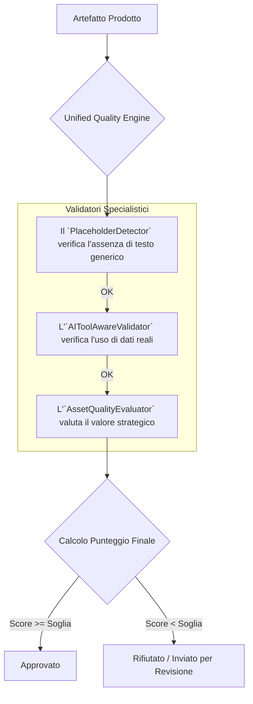

### **Capitolo 12: Il Quality Gate e il "Human-in-the-Loop" come Onore**

**Data:** 27 Luglio

I nostri agenti ora usavano tool per raccogliere dati reali. I risultati erano diventati più ricchi, più specifici e ancorati alla realtà. Ma questo ha fatto emergere un problema più sottile e pericoloso: **la differenza tra un contenuto *corretto* e un contenuto di *valore*.**

Un agente poteva usare `websearch` per produrre un riassunto di 20 pagine su un argomento, tecnicamente corretto e privo di errori. Ma era utile? Era azionabile? O era solo un "data dump" che lasciava all'utente il vero lavoro di estrarre valore?

Abbiamo capito che, per rispettare il nostro **Pilastro #11 (Deliverable Concreti e Azionabili)**, dovevamo smettere di pensare alla qualità come a una semplice "assenza di errori". Dovevamo iniziare a misurarla in termini di **valore di business**.

#### **La Decisione Architetturale: Un Motore di Qualità Unificato**

Invece di spargere controlli di qualità in vari punti del sistema, abbiamo deciso di centralizzare tutta questa logica in un unico, potente componente: l'**`UnifiedQualityEngine`**.

*Codice di riferimento: `backend/ai_quality_assurance/unified_quality_engine.py`*

Questo motore è diventato il "guardiano" del nostro flusso di produzione. Nessun artefatto (un risultato di un task, un deliverable, un'analisi) poteva passare alla fase successiva senza prima aver superato la sua valutazione.

Il `UnifiedQualityEngine` non è un singolo agente, ma un **orchestratore di validatori specializzati**. Questo ci permette di avere un sistema di QA multi-livello.

**Flusso di Validazione del Quality Engine:**



#### **Il Cuore del Sistema: Misurare il Valore di Business**

La parte più difficile non era costruire il motore, ma definire i criteri di valutazione. Come si insegna a un'AI a riconoscere il "valore di business"?

La risposta, ancora una volta, è stata nel prompt engineering strategico. Abbiamo creato un prompt per il nostro `AssetQualityEvaluator` che lo costringeva a pensare come un esigente manager di prodotto, non come un semplice correttore di bozze.

*Evidenza: `test_unified_quality_engine.py` e il prompt analizzato nel Capitolo 28.*

Il prompt non chiedeva "Ci sono errori?", ma poneva domande strategiche:

*   **Actionability (0-100):** "Un utente può prendere una decisione di business immediata basandosi su questo contenuto, o ha bisogno di fare ulteriore lavoro?"
*   **Specificity (0-100):** "Il contenuto è specifico per il contesto del progetto (es. 'aziende SaaS europee') o è generico e applicabile a chiunque?"
*   **Data-Driven (0-100):** "Le affermazioni sono supportate da dati reali (provenienti dai tool) o sono opinioni non verificate?"

Ogni artefatto riceveva un punteggio su queste metriche. Solo quelli che superavano una soglia minima (es. 75/100) potevano procedere.

#### **"War Story": Il Paradosso della Qualità e il Rischio del Perfezionismo**

Con il nostro nuovo Quality Gate in funzione, la qualità dei risultati è schizzata alle stelle. Ma abbiamo creato un nuovo problema: **il sistema si era bloccato.**

*Logbook del Disastro (28 Luglio):*
```
INFO: Task '123' completed. Quality Score: 72/100. Status: needs_revision.
INFO: Task '124' completed. Quality Score: 68/100. Status: needs_revision.
INFO: Task '125' completed. Quality Score: 74/100. Status: needs_revision.
WARNING: 0 tasks have passed the quality gate in the last hour. Project stalled.
```

Avevamo impostato la soglia di qualità a 75, ma la maggior parte dei task si fermava appena sotto. Gli agenti entravano in un ciclo infinito di "esegui -> revisiona -> riesegui", senza mai far progredire il progetto. Avevamo creato un sistema di **QA perfezionista che impediva al lavoro di essere fatto**.

**La Lezione Appresa: La Qualità Deve Essere Adattiva.**

Una soglia di qualità fissa è un errore. La qualità richiesta per una prima bozza non è la stessa richiesta per un deliverable finale.

La soluzione è stata rendere le nostre soglie **adattive e contestuali**, un'altra applicazione del **Pilastro #2 (AI-Driven)**.

*Codice di riferimento: `backend/quality_system_config.py` (logica `get_adaptive_quality_thresholds`)*

Abbiamo implementato una logica che abbassava dinamicamente la soglia di qualità in base a diversi fattori:

*   **Fase del Progetto:** Nelle fasi iniziali di "Ricerca", una soglia più bassa (es. 60) era accettabile. Nelle fasi finali di "Deliverable", la soglia si alzava a 85.
*   **Criticità del Task:** Un task esplorativo poteva passare con un punteggio inferiore, mentre un task che produceva un artefatto per il cliente doveva superare un controllo molto più rigido.
*   **Performance Storica:** Se un workspace continuava a fallire, il sistema poteva decidere di abbassare leggermente la soglia e creare un task di "revisione manuale" per l'utente, invece di bloccarsi.

Questo ha reso il nostro Quality Gate non più un muro invalicabile, ma un **filtro intelligente** che garantisce standard elevati senza sacrificare il progresso.

#### **"War Story" #2: L'Agente Troppo Sicuro di Sé**

Poco dopo aver implementato le soglie adattive, ci siamo imbattuti in un problema opposto. Un agente doveva generare una strategia di investimento per un cliente fittizio. L'agente ha usato i suoi tool, ha raccolto dati e ha prodotto una strategia che, sulla carta, sembrava plausibile. Il `UnifiedQualityEngine` le ha dato un punteggio di 85/100, superando la soglia. Il sistema era pronto ad approvarla e a pacchettizzarla come deliverable finale.

Ma noi, guardando il risultato, abbiamo notato un'assunzione di rischio molto alta che non era stata adeguatamente evidenziata. Se fosse stato un cliente reale, questo avrebbe potuto avere conseguenze negative. Il sistema, pur essendo tecnicamente corretto, mancava di **giudizio e di consapevolezza del rischio**.

**La Lezione Appresa: L'Autonomia non è Abdicazione.**

Un sistema completamente autonomo che prende decisioni ad alto impatto senza alcuna supervisione è pericoloso. Questo ci ha portato a implementare il **Pilastro #8 (Quality Gates + Human-in-the-Loop “onore”)** in modo molto più sofisticato.

La soluzione non era abbassare la qualità o richiedere l'approvazione umana per tutto, il che avrebbe distrutto l'efficienza. La soluzione è stata insegnare al sistema a **riconoscere quando *non* sa abbastanza** e a richiedere una supervisione strategica.

**Implementazione del "Human-in-the-Loop come Onore":**

Abbiamo aggiunto una nuova dimensione all'analisi del nostro `HolisticQualityAssuranceAgent`: il **"Confidence Score"** e il **"Risk Assessment"**.

*Codice di riferimento: Logica aggiunta al prompt del `HolisticQualityAssuranceAgent`*
```python
# Aggiunta al prompt di QA
"""
**Passo 4: Valutazione del Rischio e della Confidenza.**
- Valuta il rischio potenziale di questo artefatto se venisse usato per una decisione di business critica (da 0 a 100).
- Valuta la tua confidenza nella completezza e accuratezza delle informazioni (da 0 a 100).
- **Risultato Passo 4 (JSON):** {{"risk_score": <0-100>, "confidence_score": <0-100>}}
"""
```

E abbiamo modificato la logica del `UnifiedQualityEngine`:

```python
# Logica nel UnifiedQualityEngine
if final_score >= quality_threshold:
    # L'artefatto è di alta qualità, ma è anche rischioso o l'AI non è sicura?
    if risk_score > 80 or confidence_score < 70:
        # Invece di approvare, scala all'umano.
        create_human_review_request(
            artifact_id,
            reason="High-risk/Low-confidence content requires strategic oversight."
        )
        return "pending_human_review"
    else:
        return "approved"
else:
    return "rejected"
```

Questo ha trasformato l'interazione con l'utente. Invece di essere un "fastidio" per correggere errori, l'intervento umano è diventato un **"onore"**: il sistema si rivolge all'utente solo per le decisioni più importanti, trattandolo come un partner strategico, un supervisore a cui chiedere consiglio quando la posta in gioco è alta.

---
> **Key Takeaways del Capitolo:**
>
> *   **Definisci la Qualità in Termini di Valore:** Non limitarti a controllare gli errori. Crea metriche che misurino il valore di business, l'azionabilità e la specificità.
> *   **Centralizza la Logica di QA:** Un "motore di qualità" unificato è più facile da mantenere e migliorare rispetto a controlli sparsi nel codice.
> *   **La Qualità Deve Essere Adattiva:** Le soglie di qualità fisse sono fragili. Un sistema robusto adatta i suoi standard al contesto del progetto e alla criticità del task.
> *   **Non Lasciare che il Perfetto sia Nemico del Buono:** Un sistema di QA troppo rigido può bloccare il progresso. Bilancia il rigore con la necessità di andare avanti.
> *   **Insegna all'AI a Conoscere i Propri Limiti:** Un sistema veramente intelligente non è quello che ha sempre la risposta, ma quello che sa quando non averla. Implementa metriche di confidenza e rischio.
> *   **Il "Human-in-the-Loop" non è un Segno di Fallimento:** Usalo come un meccanismo di escalation per le decisioni strategiche. Questo trasforma l'utente da un semplice validatore a un partner nel processo decisionale.
---

**Conclusione del Capitolo**

Con un Quality Gate intelligente, adattivo e consapevole dei propri limiti, avevamo finalmente la fiducia che il nostro sistema stesse producendo non solo "valore", ma che lo stesse facendo in modo **responsabile**.

Ma questo ha sollevato una nuova domanda. Se un task produce un pezzo di valore (un "asset"), come lo colleghiamo al deliverable finale? Come gestiamo la relazione tra i piccoli pezzi di lavoro e il prodotto finito? Questo ci ha portato a sviluppare il concetto di **"Asset-First Deliverable"**.