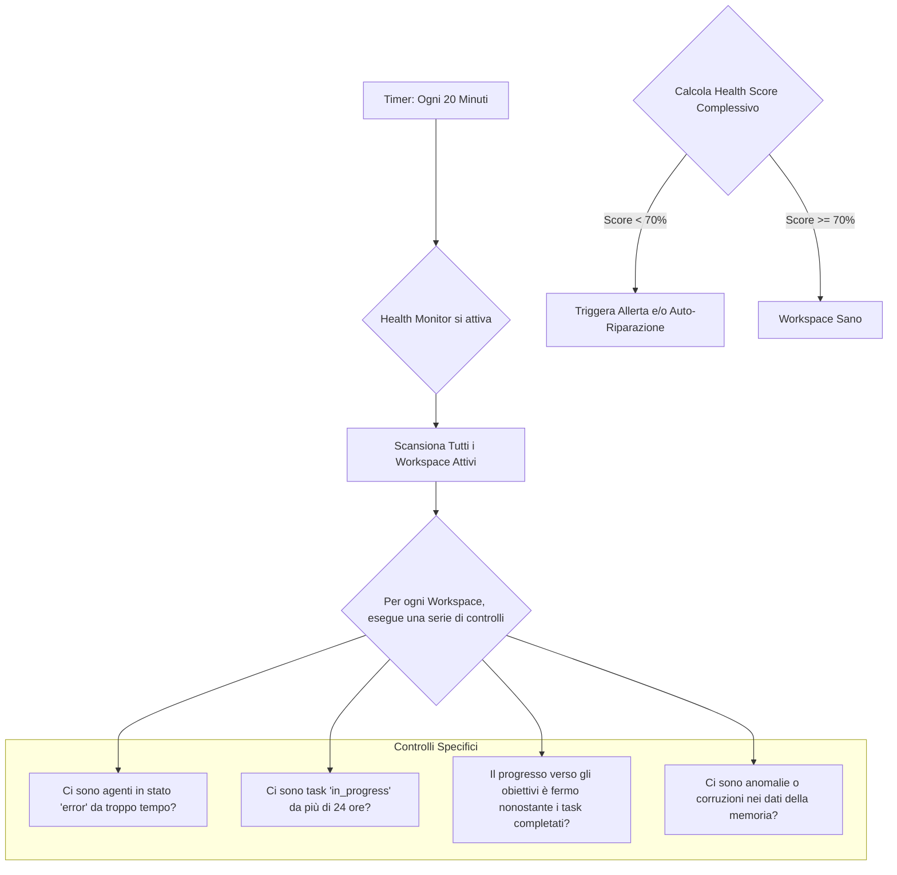

### **Capitolo 16: Il Monitoraggio Autonomo – Il Sistema si Controlla da Solo**

**Data:** 28 Luglio

Il nostro sistema era diventato un organismo complesso e dinamico. Agenti venivano creati, task venivano eseguiti in parallelo, la memoria cresceva, e il sistema si auto-correggieva. Ma con la complessità arriva il rischio. Cosa succederebbe se un bug sottile causasse un "blocco" silenzioso in un workspace? O se un agente entrasse in un ciclo di fallimenti senza che nessuno se ne accorgesse?

Un sistema autonomo non può dipendere da un operatore umano che guarda costantemente i log per assicurarsi che tutto funzioni. Deve avere un proprio **"sistema immunitario"**, un meccanismo di monitoraggio proattivo in grado di auto-diagnosticare problemi e, idealmente, di auto-ripararsi.

#### **La Decisione Architetturale: Un "Health Monitor" Dedicato**

Abbiamo creato un nuovo servizio in background, l'`AutomatedGoalMonitor`, che agisce come il "medico" del nostro sistema.

*Codice di riferimento: `backend/automated_goal_monitor.py`*

Questo monitor non fa parte del flusso di esecuzione dei task. È un processo indipendente che, a intervalli regolari (es. ogni 20 minuti), esegue un check-up completo di tutti i workspace attivi.

**Flusso del Check-up di Salute:**



#### **Pattern Architetturali Applicati**

La progettazione del nostro Health Monitor non è casuale, ma si basa su due pattern architetturali consolidati per la gestione di sistemi complessi:

1.  **Health Check API Pattern:** Invece di aspettare che il sistema fallisca, esponiamo (internamente) degli endpoint che permettono di interrogare attivamente lo stato di salute dei vari componenti. Il nostro monitor agisce come un client che "chiama" questi endpoint a intervalli regolari. Questo è un approccio proattivo, non reattivo.
2.  **Sidecar Pattern (concettuale):** Sebbene non sia un "sidecar" in senso stretto (come in un'architettura a container), il nostro monitor agisce concettualmente in modo simile. È un processo separato che "osserva" l'applicazione principale (l'Executor e i suoi agenti) senza essere parte della sua logica di business critica. Questo disaccoppiamento è fondamentale: se l'applicazione principale rallenta o ha problemi, il monitor può continuare a funzionare in modo indipendente per diagnosticarla e, se necessario, riavviarla.

#### **"War Story": L'Agente "Fantasma"**

Durante un test di lunga durata, abbiamo notato che un workspace aveva smesso di fare progressi. I log non mostravano errori evidenti, ma nessun nuovo task veniva completato.

*Logbook del Disastro (28 Luglio, pomeriggio):*
```
HEALTH REPORT: Workspace a352c... Health Score: 65/100.
ISSUES:
- 1 agent in stato 'busy' da 48 ore.
- 0 task completati nelle ultime 24 ore.
```
Il nostro `Health Monitor` aveva rilevato il problema: un agente era rimasto bloccato in uno stato `busy` a causa di un'eccezione non gestita in un sotto-processo, diventando un "agente fantasma". Non stava lavorando, ma l'Executor lo considerava ancora occupato e non gli assegnava nuovi task. Poiché era l'unico agente con un certo set di skill, l'intero progetto si era fermato.

**La Lezione Appresa: L'Auto-Riparazione è il Livello Successivo dell'Autonomia.**

Rilevare il problema non era abbastanza. Il sistema doveva essere in grado di risolverlo. Abbiamo quindi implementato una serie di **routine di auto-riparazione**, applicando un altro pattern classico.

**Pattern Applicato: Circuit Breaker (adattato)**

Il nostro sistema di auto-riparazione agisce come un "interruttore automatico".

1.  **Rilevamento (Circuito Chiuso):** L'Health Monitor rileva un agente in stato `busy` per un tempo superiore alla soglia massima.
2.  **Diagnosi (Apertura del Circuito):** Il sistema "apre il circuito" per quell'agente. Tenta una diagnosi (es. verificare se il processo esiste ancora).
3.  **Azione Correttiva (Reset del Circuito):** Se la diagnosi conferma l'anomalia, il sistema forza il reset dello stato dell'agente (da `busy` a `available`), di fatto "resettando il circuito" e permettendo al flusso di riprendere.

*Codice di riferimento: `backend/workspace_recovery_system.py`*

Questa logica ha permesso al sistema di "sbloccare" l'agente e di riprendere le normali operazioni senza alcun intervento umano, incarnando perfettamente il **Pilastro #13 (Course-Correction Automatico)**, applicato questa volta non alla strategia di progetto, ma alla salute del sistema stesso.

---
> **Key Takeaways del Capitolo:**
>
> *   **L'Autonomia Richiede Auto-Monitoraggio:** Un sistema complesso e autonomo deve avere un "sistema immunitario" in grado di rilevare proattivamente i problemi.
> *   **Applica Pattern Architetturali Consolidati:** Non reinventare la ruota. Pattern come `Health Check API` e `Circuit Breaker` sono soluzioni testate per costruire sistemi resilienti.
> *   **Disaccoppia il Monitoraggio dalla Logica Principale:** Un monitor che fa parte dello stesso processo che sta monitorando può fallire insieme ad esso. Un processo separato (o "sidecar") è molto più robusto.
> *   **Progetta per l'Auto-Riparazione:** Il vero obiettivo non è solo rilevare i problemi, ma dare al sistema la capacità di risolverli in autonomia, almeno per i casi più comuni.
---

**Conclusione del Capitolo**

Con un sistema di monitoraggio e auto-riparazione, avevamo costruito una rete di sicurezza fondamentale. Questo ci ha dato la fiducia necessaria per affrontare la fase successiva: sottoporre l'intero sistema a test end-to-end sempre più complessi, spingendolo ai suoi limiti per scoprire eventuali debolezze nascoste prima che potessero impattare un utente reale. Era il momento di passare dai test sui singoli componenti ai **test "comprensivi" sull'intero organismo AI**.
