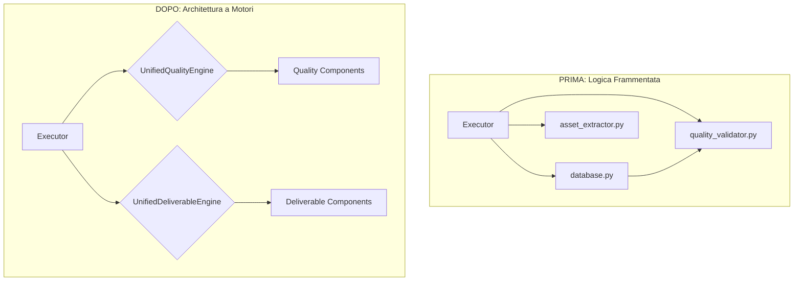

### **Capitolo 17: Il Test di Consolidamento – Semplificare per Scalare**

**Data:** 28 Luglio

Il nostro sistema era diventato potente. Avevamo agenti dinamici, un orchestratore intelligente, una memoria che apprendeva, un quality gate adattivo e un monitor di salute. Ma con la potenza era arrivata la **complessità**.

Guardando la nostra codebase, abbiamo notato un "code smell" preoccupante: la logica relativa alla qualità e quella relativa ai deliverable erano sparse in più moduli. C'erano funzioni in `database.py`, `executor.py`, e in vari file all'interno di `ai_quality_assurance` e `deliverable_system`. Sebbene ogni pezzo funzionasse, il quadro generale stava diventando difficile da capire e da mantenere.

Stavamo violando uno dei principi fondamentali dell'ingegneria del software: **Don't Repeat Yourself (DRY)** e il **Single Responsibility Principle**. Era il momento di fermarsi, non per aggiungere nuove feature, ma per **rifattorizzare e consolidare**.

#### **La Decisione Architetturale: Creare "Motori" di Servizio Unificati**

La nostra strategia è stata quella di identificare le responsabilità chiave che erano sparse e di consolidarle in "motori" di servizio dedicati. Un "motore" è una classe di alto livello che orchestra una specifica capacità di business dall'inizio alla fine.

Abbiamo identificato due aree critiche per il consolidamento:

1.  **Qualità:** La logica di validazione, assessment e quality gate era distribuita.
2.  **Deliverable:** La logica di estrazione degli asset, assemblaggio e creazione dei deliverable era frammentata.

Questo ci ha portato a creare due nuovi componenti centrali:

*   **`UnifiedQualityEngine`:** L'unico punto di riferimento per *tutte* le operazioni relative alla qualità.
*   **`UnifiedDeliverableEngine`:** L'unico punto di riferimento per *tutte* le operazioni relative alla creazione di deliverable.

*Codice di riferimento del commit: `a454b34 (feat: Complete consolidation of QA and Deliverable systems)`*

**Architettura Prima e Dopo il Consolidamento:**



#### **Il Processo di Refactoring: Un Esempio Pratico**

Prendiamo la creazione di un deliverable. Prima del refactoring, il nostro `Executor` doveva:
1.  Chiamare `database.py` per ottenere i task completati.
2.  Chiamare `concrete_asset_extractor.py` per estrarre gli asset.
3.  Chiamare `deliverable_assembly.py` per assemblare il contenuto.
4.  Chiamare `unified_quality_engine.py` per validare il risultato.
5.  Infine, chiamare di nuovo `database.py` per salvare il deliverable.

L'Executor conosceva troppi dettagli implementativi. Era un'architettura fragile.

Dopo il refactoring, il processo è diventato incredibilmente più semplice e robusto:

*Codice di riferimento: `backend/executor.py` (logica semplificata)*
```python
# DOPO IL REFACTORING
from deliverable_system import unified_deliverable_engine

async def handle_completed_goal(workspace_id, goal_id):
    """
    L'Executor ora deve solo fare una chiamata a un singolo motore.
    Tutta la complessità è nascosta dietro questa semplice interfaccia.
    """
    try:
        await unified_deliverable_engine.create_goal_specific_deliverable(
            workspace_id=workspace_id,
            goal_id=goal_id
        )
        logger.info(f"Deliverable creation for goal {goal_id} successfully triggered.")
    except Exception as e:
        logger.error(f"Failed to trigger deliverable creation: {e}")
```
Tutta la logica complessa di estrazione, assemblaggio e validazione è ora contenuta all'interno del `UnifiedDeliverableEngine`, completamente invisibile all'Executor.

#### **Il Test di Consolidamento: Verificare le Interfacce, non l'Implementazione**

Il nostro approccio ai test è dovuto cambiare. Invece di testare ogni piccolo pezzo in isolamento, abbiamo iniziato a scrivere test di integrazione che si focalizzavano sull'**interfaccia pubblica** dei nostri nuovi motori.

*Codice di riferimento: `tests/test_deliverable_system_integration.py`*

Il test non chiamava più `test_asset_extractor` e `test_assembly` separatamente. Invece, faceva una sola cosa:
1.  **Setup:** Creava un workspace con alcuni task completati che contenevano degli asset.
2.  **Esecuzione:** Chiamava l'unico metodo pubblico: `unified_deliverable_engine.create_goal_specific_deliverable(...)`.
3.  **Validazione:** Verificava che, alla fine del processo, un deliverable completo e corretto fosse stato creato nel database.

Questo approccio ha reso i nostri test più resilienti ai cambiamenti interni. Potevamo cambiare completamente il modo in cui gli asset venivano estratti o assemblati; finché l'interfaccia pubblica del motore funzionava come previsto, i test continuavano a passare.

#### **La Lezione Appresa: Semplificare è un Lavoro Attivo**

La complessità in un progetto software non è un evento, è un processo. Tende ad aumentare naturalmente con il tempo, a meno che non si intraprendano azioni deliberate per combatterla.

*   **Pilastro #14 (Tool/Service-Layer Modulare):** Questo refactoring è stata l'incarnazione di questo pilastro. Abbiamo trasformato una serie di script e funzioni sparse in veri e propri "servizi" con responsabilità chiare.
*   **Pilastro #4 (Componenti Riusabili):** I nostri motori sono diventati i componenti di più alto livello e più riutilizzabili del nostro sistema.
*   **Principio di Progettazione "Facade":** I nostri "motori" agiscono come una "facciata" (Facade design pattern), fornendo un'interfaccia semplice a un sottosistema complesso.

Abbiamo imparato che il refactoring non è qualcosa da fare "quando si ha tempo". È un'attività di manutenzione essenziale, come cambiare l'olio a una macchina. Fermarsi per consolidare e semplificare l'architettura ci ha permesso di accelerare lo sviluppo futuro, perché ora avevamo fondamenta molto più stabili e comprensibili su cui costruire.

---
> **Key Takeaways del Capitolo:**
>
> *   **Combatti Attivamente la Complessità:** Pianifica sessioni di refactoring regolari per consolidare la logica e ridurre il debito tecnico.
> *   **Pensa in Termini di "Motori" o "Servizi":** Raggruppa le funzionalità correlate in classi di alto livello con interfacce semplici. Nascondi la complessità, non esporla.
> *   **Testa le Interfacce, non i Dettagli:** Scrivi test di integrazione che si concentrino sul comportamento pubblico dei tuoi servizi. Questo rende i test più robusti e meno fragili ai cambiamenti interni.
> *   **La Semplificazione è un Prerequisito per la Scalabilità:** Non puoi scalare un sistema che è diventato troppo complesso da capire e da modificare.
---

**Conclusione del Capitolo**

Con un'architettura consolidata e motori di servizio puliti, il nostro sistema era ora non solo potente, ma anche elegante e manutenibile. Eravamo pronti per l'esame di maturità finale: i test "comprensivi", progettati per stressare l'intero sistema e verificare che tutte le sue parti, ora ben organizzate, potessero lavorare in armonia per raggiungere un obiettivo complesso dall'inizio alla fine.
