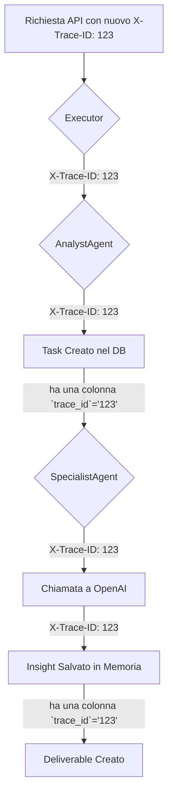

### **Capitolo 29: La Sala di Controllo – Observability per un Team AI**

**Data:** 30 Luglio

Un sistema che funziona in laboratorio è una cosa. Un sistema che funziona in modo affidabile in produzione, 24/7, mentre decine di agenti non-deterministici eseguono task in parallelo, è una sfida completamente diversa. L'ultima grande lezione del nostro viaggio non riguarda la costruzione dell'intelligenza, ma la capacità di **osservarla, misurarla e diagnosticarla** quando le cose vanno male.

Senza un sistema di observability robusto, gestire un'orchestra di agenti AI è come dirigere un'orchestra al buio, con le orecchie tappate. Si può solo sperare che stiano suonando la sinfonia giusta.

#### **Il Problema: Diagnosticare un Fallimento in un Sistema Distribuito**

Immagina questo scenario, che abbiamo vissuto sulla nostra pelle: un deliverable finale per un cliente ha un punteggio di qualità basso. Qual è stata la causa?

*   L'`AnalystAgent` ha pianificato male i task?
*   L'`ICPResearchAgent` ha usato male il tool `websearch` e ha raccolto dati spazzatura?
*   Il `WorkspaceMemory` ha fornito un insight sbagliato che ha sviato il `CopywriterAgent`?
*   C'è stata una latenza di rete durante una chiamata critica che ha portato a un timeout parziale?

Senza una tracciabilità end-to-end, rispondere a questa domanda è impossibile. Si finisce per passare ore a spulciare decine di log disconnessi, cercando un ago in un pagliaio.

#### **La Soluzione Architetturale: Il Tracciamento Distribuito (`X-Trace-ID`)**

La soluzione a questo problema è un pattern ben noto nell'architettura a microservizi: il **Tracciamento Distribuito**.

L'idea è semplice: ogni "azione" che entra nel nostro sistema (una richiesta API dell'utente, un trigger del monitor) riceve un **ID di traccia unico (`X-Trace-ID`)**. Questo ID viene poi propagato religiosamente attraverso ogni singolo componente che partecipa alla gestione di quell'azione.

*Codice di riferimento: Implementazione di un middleware FastAPI e aggiornamento delle chiamate ai servizi.*

**Flusso di un `X-Trace-ID`:**

**Implementazione Pratica:**

1.  **Middleware FastAPI:** Abbiamo creato un middleware che intercetta ogni richiesta in arrivo, genera un `trace_id` se non esiste, e lo inietta nel contesto della richiesta.
2.  **Colonne `trace_id` nel Database:** Abbiamo aggiunto una colonna `trace_id` a tutte le nostre tabelle principali (`tasks`, `asset_artifacts`, `workspace_insights`, `deliverables`, etc.).
3.  **Propagazione:** Ogni funzione nei nostri service layer è stata aggiornata per accettare un `trace_id` opzionale e passarlo a ogni chiamata successiva, sia ad altri servizi che al database.
4.  **Logging Strutturato:** Abbiamo configurato il nostro logger per includere automaticamente il `trace_id` in ogni messaggio di log.

Ora, per diagnosticare il problema del deliverable di bassa qualità, non dobbiamo più cercare tra i log. Ci basta una singola query:

`SELECT * FROM unified_logs WHERE trace_id = '123' ORDER BY timestamp ASC;`

Questa singola query ci restituisce l'intera storia di quel deliverable, in ordine cronologico, attraverso ogni agente e servizio che lo ha toccato. Il tempo di debug è passato da ore a minuti.

---
> **Key Takeaways del Capitolo:**
>
> *   **L'Observability non è un Lusso, è una Necessità:** In un sistema di agenti distribuito e non-deterministico, è impossibile sopravvivere senza un robusto sistema di logging e tracing.
> *   **Implementa il Tracciamento Distribuito fin dal Giorno Zero:** Aggiungere un `trace_id` a posteriori è un lavoro immenso e doloroso. Progetta la tua architettura perché ogni azione abbia un ID unico fin dall'inizio.
> *   **Usa il Logging Strutturato:** Loggare semplici stringhe non è abbastanza. Usa un formato strutturato (come JSON) che includa sempre metadati chiave come `trace_id`, `agent_id`, `workspace_id`, etc. Questo rende i tuoi log interrogabili e analizzabili.
---

**Conclusione del Capitolo**

Con una "sala di controllo" robusta, avevamo finalmente la fiducia di poter operare il nostro sistema in produzione in modo sicuro e diagnosticabile. Avevamo costruito un motore potente e ora avevamo anche il cruscotto per pilotarlo.

L'ultimo pezzo del puzzle era l'utente. Come potevamo progettare un'esperienza che permettesse a un essere umano di collaborare in modo intuitivo e produttivo con un team di colleghi digitali così complesso e potente?